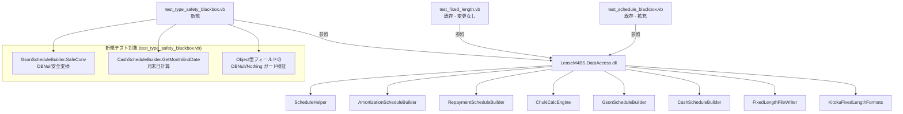

# 設計書: blackbox-type-safety

## 1. 設計方針

### 既存アーキテクチャとの整合性

- 既存テスト (`test_schedule_blackbox.vb`, `test_fixed_length.vb`) は `Module` + `Sub/Function Test_XXX()` 形式のスタンドアロン VB.NET コンソールアプリ
- コンパイルは `vbc /r:LeaseM4BS.DataAccess.dll /r:System.Data.dll <ファイル名>.vb` で行う（MSTest 等のフレームワーク不使用）
- `passCount` / `failCount` / `skipCount` カウンタと `AssertEqual` / `Pass` / `Fail` / `Skip` ヘルパーを踏襲する
- 新規テストは既存ファイルへの追記または新ファイル追加の 2 択とする

### 採用する設計パターン

**ゴールデンマスターテスト（Characterization Testing）**

- Access版 VBA コードを手計算・コードリーディングで検証した値を「ゴールデンデータ」として直書きする
- VB.NET版に同入力を与えて出力を比較し、差分ゼロを確認する
- DBNull / Nothing を意図的に挿入して型安全性を検証するテストを追加する

### 技術的判断の根拠

- テストフレームワークを導入しない理由: 既存の `test_schedule_blackbox.vb` が vbc 単体コンパイルで動作しており、依存ライブラリを増やすと CI/ビルド環境への影響が生じる
- 新ファイル `test_type_safety_blackbox.vb` に型安全性テストを分離する理由: 既存ファイルのスコープ（計算ロジック検証）と明確に分けることで保守性を維持するため
- `GsonScheduleBuilder.BuildFromRows` は DB 不使用のため `DataRowCollection` を直接構築してテスト可能

---

## 2. コンポーネント構成図



---

## 3. ファイル構成

### 新規作成ファイル

| ファイルパス | 責務 | 依存先 |
|---|---|---|
| `c:\kobayashi_LeaseM4BS\test_type_safety_blackbox.vb` | 型安全性テスト: `GsonScheduleBuilder.SafeConv`、`GsonScheduleBuilder.BuildFromRows`、`CashScheduleBuilder.GetMonthEndDate`、`Object` 型フィールドの DBNull/Nothing ガード検証 | `LeaseM4BS.DataAccess.dll`, `System.Data.dll` |

### 変更ファイル

| ファイルパス | 変更内容 | 影響範囲 |
|---|---|---|
| `c:\kobayashi_LeaseM4BS\test_schedule_blackbox.vb` | Part 6 に `Test_GsonScheduleBuilder_*` を追加（Part 7 として）; 中途解約フラグ・非月末決算（KessanBi≠31）のAccess版バグ再現テストを Part 5 に追記 | 既存テストへの影響なし（末尾追加） |

---

## 4. データモデル

既存の型定義を変更しない。テスト内で使用する主要型の確認:

```
GsonScheduleEntry (ScheduleTypes.vb)
  Nen: Integer
  Getu: Integer
  GsonTmg: Integer        ' 0=月度末, 1=月度初
  GsonRyoS: Double        ' 月度初減損額
  GsonRyoE: Double        ' 月度末減損額
  GsonRkeiS: Double       ' 月度初累計
  GsonRkeiE: Double       ' 月度末累計

ShiharaiSchEntry (ScheduleTypes.vb)  ← テストデータ構築に使用
  ShriDt, SimeDt, KeijDt: Date
  Cash: Double
  CkaiykF: Boolean
  KeijNen, KeijGetu: Integer
  Nen, Getu: Integer

ChukiCalcParams (ScheduleTypes.vb)  ← 非月末決算テストに使用
  KessanBi: Integer       ' 31以外で Access版コピペバグ分岐へ
```

---

## 5. インターフェース設計

### テスト対象パブリックインターフェース

```
' GsonScheduleBuilder (既存)
GsonScheduleBuilder.Build(crud As CrudHelper, kykmId As Double) As List(Of GsonScheduleEntry)
  説明: DB接続あり。DBが不要なテストは BuildFromRows を使用する

GsonScheduleBuilder.BuildFromRows(rows As DataRowCollection) As List(Of GsonScheduleEntry)
  説明: DataRowCollection から減損スケジュールを生成。DB不要で単体テスト可能

' CashScheduleBuilder (既存)
CashScheduleBuilder.GetMonthEndDate(year As Integer, month As Integer) As Date
  説明: 指定年月の月末日を返す。閏年対応・1月末日 = 31等の境界値テスト対象

' ScheduleHelper (既存, 既にテスト済み)
ScheduleHelper.GInt(value As Double) As Double
ScheduleHelper.GKasan(skipNull As Boolean, ParamArray values() As Double?) As Double?
ScheduleHelper.IsMonthEnd(dt As Date) As Boolean
```

### 新規テストファイルの公開インターフェース（外向き）

```
Module TestTypeSafetyBlackBox
  Sub Main()
    ' passCount / failCount / skipCount を出力して終了コードを設定

  ' Part 1: GsonScheduleBuilder SafeConv (DBNull 安全変換)
  Sub Test_SafeConv_DBNull_ToDouble()
  Sub Test_SafeConv_DBNull_ToInt()
  Sub Test_SafeConv_Nothing_ToDouble()
  Sub Test_SafeConv_ValidValue()

  ' Part 2: GsonScheduleBuilder BuildFromRows
  Sub Test_BuildFromRows_Empty()
  Sub Test_BuildFromRows_GsonTmg0_MoonEnd()
  Sub Test_BuildFromRows_GsonTmg1_MoonStart()
  Sub Test_BuildFromRows_MultipleEntries()

  ' Part 3: CashScheduleBuilder GetMonthEndDate
  Sub Test_GetMonthEndDate_January()
  Sub Test_GetMonthEndDate_February_LeapYear()
  Sub Test_GetMonthEndDate_February_NonLeap()
  Sub Test_GetMonthEndDate_December()

  ' Part 4: Object型フィールドの DBNull/Nothing ガード
  Sub Test_ChukiCalcParams_WithNullLbSoneki()
  Sub Test_RepaymentSchedule_WithNullGsonSchedule()
  Sub Test_AmortizationSchedule_WithNullGsonSchedule()
```

---

## 6. 状態管理設計

### テスト内の状態

- `passCount`, `failCount`, `skipCount` はモジュールレベルの `Dim` 変数（テストファイル単位で独立）
- 各テストは副作用なし（DB書き込みなし・ファイル書き込みなし。例外: `Test_SafeConv_*` は一時変数のみ）
- テスト間の状態共有なし（実行順序に依存しない）

### 既存テスト (`test_schedule_blackbox.vb`) への追記方針

```
追記箇所 1 (Part 5 末尾): 非月末決算 Access版コピペバグ再現テスト
  Sub Test_Chuki_NonMonthEnd_KessanBug()
    ' KessanBi = 15 を渡して ChukiCalcEngine.Calculate を呼ぶ
    ' y1KimatDt が 5年後に上書きされる Access版バグを確認
    ' 実行例外が出ないことを確認 (バグは計算値の副作用のみ)

追記箇所 2 (Part 7 として新規): GsonScheduleBuilder データ構築テスト
  Sub Test_GsonBuilder_BuildFromRows_Basic()
  Sub Test_GsonBuilder_BuildFromRows_MoonStart()
```

---

## 7. エラーハンドリング方針

### テスト内の例外処理

既存パターンに従い `Try/Catch` で例外を捕捉して `Fail(label, "success", $"Exception: {ex.GetType().Name}: {ex.Message}")` として記録する。

```vb
' 既存パターン (test_schedule_blackbox.vb より)
Try
    Dim result = SomeMethod(...)
    AssertEqual(label & " 項目", expected, result)
Catch ex As Exception
    Fail(label, "success", $"Exception: {ex.GetType().Name}: {ex.Message}")
End Try
```

### 型安全性テストでの意図的 DBNull 挿入

```vb
' DBNull を DataRow に設定してから BuildFromRows を呼ぶパターン
Dim dt As New DataTable()
dt.Columns.Add("gson_dt", GetType(Object))
dt.Columns.Add("gson_tmg", GetType(Object))
dt.Columns.Add("gson_ryo", GetType(Object))
dt.Columns.Add("gson_rkei", GetType(Object))
Dim row = dt.NewRow()
row("gson_dt") = New Date(2024, 6, 30)
row("gson_tmg") = DBNull.Value   ' ← 意図的に DBNull
row("gson_ryo") = DBNull.Value   ' ← 意図的に DBNull
row("gson_rkei") = 0.0
dt.Rows.Add(row)
' SafeConv が 0 を返してデフォルト動作することを確認
```

### DB 依存テストの SKIP

`GsonScheduleBuilder.Build` (crud あり版) は DB 接続を要求するため、`Test_Integration_*` と同様に `Try/Catch` で DB 接続エラーを捕捉して `Skip` する。

---

## 8. 実装順序

### Step 1: `test_schedule_blackbox.vb` への追記（Part 5 末尾 + Part 7 新規）

- **対象ファイル**: `c:\kobayashi_LeaseM4BS\test_schedule_blackbox.vb`
- **作業内容**:
  1. Part 5 末尾に `Test_Chuki_NonMonthEnd_KessanBug` を追加（KessanBi=15 の ChukiCalcEngine 呼び出し、例外が出ないことを確認）
  2. Part 7 ブロックを追加し `Test_GsonBuilder_BuildFromRows_Basic` / `Test_GsonBuilder_BuildFromRows_MoonStart` を実装
  3. `Main()` にそれらの呼び出しを追加
- **依存**: なし
- **ゴールデンデータ計算根拠**:
  - `GsonTmg=0` (月度末): `GsonRyoS=0, GsonRyoE=gsonRyo, GsonRkeiS=gsonRkei-gsonRyo, GsonRkeiE=gsonRkei`
  - `GsonTmg=1` (月度初): `GsonRyoS=gsonRyo, GsonRyoE=0, GsonRkeiS=gsonRkei, GsonRkeiE=gsonRkei`

### Step 2: `test_type_safety_blackbox.vb` 新規作成

- **対象ファイル**: `c:\kobayashi_LeaseM4BS\test_type_safety_blackbox.vb`
- **作業内容**: 下記の 4 Part 構成で作成する
  - **Part 1**: `GsonScheduleBuilder.SafeConv` の DBNull / Nothing / 正常値テスト（4ケース）
  - **Part 2**: `GsonScheduleBuilder.BuildFromRows` のデータ構築テスト（空リスト・GsonTmg 0/1 各種）
  - **Part 3**: `CashScheduleBuilder.GetMonthEndDate` の境界値テスト（閏年 2 月・非閏年 2 月・12 月）
  - **Part 4**: `Object` 型フィールドへの DBNull/Nothing 入力を与えた際に例外が出ないことの確認（`ChukiCalcParams.BLbSoneki=Nothing`、`AmortizationScheduleBuilder.Build(gsonSch=Nothing)` 等）
- **依存**: Step 1 不要（独立して作成可能）
- **コンパイルコマンド** (ファイル先頭に記載):
  ```
  vbc /r:LeaseM4BS.DataAccess.dll /r:System.Data.dll test_type_safety_blackbox.vb
  ```

### Step 3: 動作確認

- Step 1/2 完了後に両テストをコンパイル・実行して PASS/FAIL/SKIP サマリーを確認する
- FAIL が 0 件であることを確認して完了

---

## 9. テスト対象・カバレッジ対応表

| US/FR | テストファイル | Part | テスト名 | 既存/新規 |
|---|---|---|---|---|
| US-001 | test_schedule_blackbox.vb | 1 | Test_GInt_* / Test_GKasan_* / Test_IsMonthEnd | 既存 |
| US-002 | test_schedule_blackbox.vb | 2 | Test_Amort_Teigaku_* | 既存 |
| US-003 | test_schedule_blackbox.vb | 3 | Test_Amort_Teiritu_* / Test_CalcShokyakuRitu | 既存 |
| US-004 | test_schedule_blackbox.vb | 4 | Test_Repayment_Atobarai_* / Test_Repayment_Sakibarai_* | 既存 |
| US-005 | test_schedule_blackbox.vb | 4 | Test_Repayment_WithIjiknr / Test_Repayment_WithZanryo | 既存 |
| US-006 | test_schedule_blackbox.vb | 5 | Test_Chuki_Itengai_* / Test_Chuki_Ope_* / Test_Chuki_Iten_* | 既存 |
| US-006 (KessanBugバグ再現) | test_schedule_blackbox.vb | 5 末尾 | Test_Chuki_NonMonthEnd_KessanBug | **新規追記** |
| FR-001 (GsonScheduleBuilder) | test_schedule_blackbox.vb | 7 | Test_GsonBuilder_BuildFromRows_* | **新規追記** |
| US-007 | test_fixed_length.vb | 1-12 | Test1_* 〜 Test12_* | 既存 |
| US-008 (SafeConv) | test_type_safety_blackbox.vb | 1 | Test_SafeConv_* | **新規ファイル** |
| FR-001 (GsonScheduleBuilder 詳細) | test_type_safety_blackbox.vb | 2 | Test_BuildFromRows_* | **新規ファイル** |
| FR-001 (CashScheduleBuilder) | test_type_safety_blackbox.vb | 3 | Test_GetMonthEndDate_* | **新規ファイル** |
| US-008 (Object型ガード) | test_type_safety_blackbox.vb | 4 | Test_*_WithNull* | **新規ファイル** |

---

## 10. スコープ外事項（本設計で明示）

以下は要件定義のスコープ外であり、本設計でも対象外とする:

- `KeijoCalculationEngine.Execute` / `KlsryoCalculationEngine.Execute` の E2E テスト（DB データ依存）
- `CashScheduleBuilder.BuildTeigakuSchedule` / `BuildHengakuSchedule` の完全テスト（引数が多く、DB 接続前提）
- `KeijoWorkTableManager` の INSERT テスト（DB 書き込み依存）
- Access版 MDB の直接実行による自動ゴールデンデータ生成
