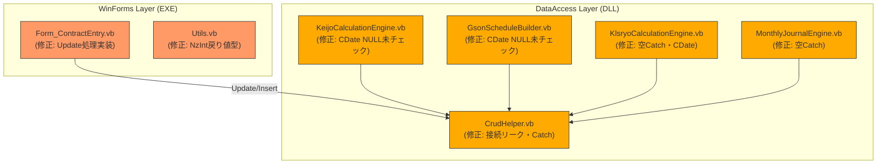

# 設計書: bugfix-remaining-todos (Issue #17)

## 1. 設計方針

### 既存アーキテクチャとの整合性

- 既存の 2 層構造（DataAccess DLL + WinForms EXE）を維持する。新しい層・クラスは導入しない
- CrudHelper の `Update(tableName, columnValues, whereClause, Optional whereParameters)` は実装済み（`CrudHelper.vb:283`）。Form 側の修正のみで対応できる
- `Option Strict On` の追加は修正対象ファイルのみに留める。DataAccess プロジェクト全体への適用は Phase 3 のスコープ外

### 採用する設計パターン

- **防御的プログラミング（Defensive Programming）**: `CDate()` の前に `IsDBNull` チェックを必ず挟む
- **Finally ブロックによるリソース解放**: 接続リーク修正は既存の `useInternalConnection` フラグ方式を `Finally` に移行する形で対応する
- **既存ヘルパーの活用**: `GetDbl()`, `GetInt()`, `GetBool()` ヘルパーが `KeijoCalculationEngine.vb` / `KlsryoCalculationEngine.vb` 内に既に存在する。同パターンで `IsDBNull` チェックを統一する

### 技術的判断の根拠

| 判断 | 根拠 |
|---|---|
| CrudHelper.Update を使用 | 既に実装済み（行 283）。新規 SQL 手書きより保守性が高い |
| NzInt 戻り値型を Integer に変更 | defaultValue パラメータも Integer に変更することでシグネチャを一貫させる。呼び出し元で CInt() キャスト不要になる |
| 空 Catch を `Ex As Exception` + ログ出力に変更 | 完全な握りつぶしは NG だが、`GetSekouDt()` / `GetNameFromMaster()` はデフォルト値返却が意図的設計のため、例外を `WriteError()` に記録する形に留める |
| CrudHelper 接続リークを Finally で修正 | 既存の `useInternalConnection` フラグを Finally ブロックに移動するだけで修正可能。Rollback の空 Catch は Dispose 中の副次例外として WriteError 記録に変更 |

---

## 2. コンポーネント構成図



---

## 3. ファイル構成

### 新規作成ファイル

なし（既存ファイルの修正のみ）

### 変更ファイル

| ファイルパス | 変更内容 | 優先度 | 影響範囲 |
|---|---|---|---|
| `LeaseM4BS.TestWinForms/LeaseM4BS.TestWinForms/Form_ContractEntry.vb` | Update 処理実装（行 316-327 の MessageBox 警告を CrudHelper.Update 呼び出しに置き換え） | 致命的 | 契約ヘッダ保存フロー |
| `LeaseM4BS.TestWinForms/LeaseM4BS.TestWinForms/Utils.vb` | NzInt の戻り値型を `Object` → `Integer`、defaultValue 型も `Object` → `Integer` に変更 | 致命的 | NzInt 呼び出し元全箇所 |
| `LeaseM4BS/LeaseM4BS.DataAccess/CrudHelper.vb` | GetDataTable / ExecuteNonQuery / ExecuteScalar の接続 Dispose を Finally に移動。Dispose() 内 Rollback 失敗を WriteError 記録に変更 | 重大 | DB アクセス全体 |
| `LeaseM4BS/LeaseM4BS.DataAccess/KeijoCalculationEngine.vb` | 行 127 `CDate(row("start_dt"))` / 行 129 `CDate(row("b_rend_dt"))` / 行 162-163 `CDbl(row("kykh_kykh_id"))` / `CDbl(row("kykm_kykm_no"))` に IsDBNull チェック追加 | 重大 | 計上計算エンジン |
| `LeaseM4BS/LeaseM4BS.DataAccess/GsonScheduleBuilder.vb` | 行 41 / 行 85 `CDate(row("gson_dt"))` に IsDBNull チェック追加 | 重大 | 減損スケジュール生成 |
| `LeaseM4BS/LeaseM4BS.DataAccess/KlsryoCalculationEngine.vb` | 行 360 / 993 / 1005 の空 Catch を WriteError 記録に変更。行 366 / 387 `CDate(henfRow("shri_dt1"))` に IsDBNull チェック追加 | 重大 | 取引分類計算エンジン |
| `LeaseM4BS/LeaseM4BS.DataAccess/MonthlyJournalEngine.vb` | 行 102 / 153 の空 Catch を WriteError 記録に変更 | 重大 | 月次仕訳エンジン |

---

## 4. データモデル

変更なし。既存の `d_kykh` / `d_kykm` テーブル構造をそのまま使用する。

---

## 5. インターフェース設計

### 公開インターフェース

#### Utils.vb: NzInt（変更）

```
' 変更前
Public Function NzInt(value As Object, Optional defaultValue As Object = 0) As Object

' 変更後
Public Function NzInt(value As Object, Optional defaultValue As Integer = 0) As Integer
```

- 戻り値型を `Object` → `Integer` に変更
- `defaultValue` 型も `Object` → `Integer` に変更
- 内部ロジックに変更なし（`Integer.TryParse` の結果を直接 Integer として返す）

#### Form_ContractEntry.vb: cmd_CREATE_Click Update 処理（変更）

修正モード（`isNewMode = False`）の分岐（行 315-327）を以下のロジックに置き換える:

```
Else
    ' 修正: CrudHelper.Update を使用して d_kykh を更新
    Dim whereParams As New List(Of NpgsqlParameter)
    whereParams.Add(New NpgsqlParameter("@kykh_id", currentKykhId))
    _crud.Update("d_kykh", valKykh, "kykh_id = @kykh_id", whereParams)
End If
```

`valKykh` の構築ロジックは変更しない。新規時の `kykh_id` キーを valKykh に追加しないよう、既存の `If isNewMode Then valKykh.Add("kykh_id", ...)` 分岐は維持する（WHERE 句で kykh_id を指定するため、SET 句への混入を防ぐ）。

#### CrudHelper.vb: 接続リーク修正パターン（変更）

3 メソッド（`GetDataTable` / `ExecuteNonQuery` / `ExecuteScalar`）を共通パターンで修正する:

```
' 変更前（成功パスのみ Dispose）
Catch ex As Exception
    Throw New Exception(...)

' 変更後（Finally で必ず Dispose）
Finally
    If useInternalConnection AndAlso conn IsNot Nothing Then
        conn.Dispose()
    End If
End Try
```

`Dispose()` 内の Rollback 失敗 Catch:

```
' 変更前
Catch
End Try

' 変更後
Catch rollbackEx As Exception
    _connectionManager.WriteError($"Rollback失敗: {rollbackEx.Message}")
End Try
```

#### KeijoCalculationEngine.vb: CDate NULL ガード追加（変更）

行 127-129 の `p.StartDt` / `p.BRendDt` 設定箇所:

```
' 変更前
p.StartDt = CDate(row("start_dt"))
p.BRendDt = CDate(row("b_rend_dt"))

' 変更後（IsDBNull チェックを追加して行をスキップ）
If IsDBNull(row("start_dt")) OrElse IsDBNull(row("b_rend_dt")) Then Continue For
p.StartDt = CDate(row("start_dt"))
p.BRendDt = CDate(row("b_rend_dt"))
```

行 162-163 の `CDbl` 変換:

```
' 変更前
resultRow.KykhId = CDbl(row("kykh_kykh_id"))
resultRow.KykmNo = CDbl(row("kykm_kykm_no"))

' 変更後（既存の GetDbl ヘルパーを使用）
resultRow.KykhId = GetDbl(row, "kykh_kykh_id")
resultRow.KykmNo = GetDbl(row, "kykm_kykm_no")
```

#### GsonScheduleBuilder.vb: CDate NULL ガード追加（変更）

行 41 / 85 の `CDate(row("gson_dt"))`:

```
' 変更前
Dim gsonDt As Date = CDate(row("gson_dt"))

' 変更後（NULL 行はスキップ）
If IsDBNull(row("gson_dt")) Then Continue For
Dim gsonDt As Date = CDate(row("gson_dt"))
```

#### KlsryoCalculationEngine.vb: 空 Catch 修正 + NULL ガード（変更）

行 360（haifDt 取得）の空 Catch:

```
' 変更前
Catch
End Try

' 変更後
Catch ex As Exception
    _connectionManager.WriteError($"配賦情報取得失敗: {ex.Message}")
End Try
```

`GetSekouDt()` / `GetNameFromMaster()` の空 Catch（行 993 / 1005）:

```
' 変更前
Catch
End Try

' 変更後（デフォルト値返却は維持しつつ、エラーをログ記録）
Catch ex As Exception
    ' デフォルト値を返すが、エラーはログに記録する
    _connectionManager.WriteError($"設定値取得失敗({NameOf(GetSekouDt)}): {ex.Message}")
End Try
```

行 366 の `CDate(henfRow("shri_dt1"))`:

```
' 変更前
Dim henfShriDt1 As Date = CDate(henfRow("shri_dt1"))

' 変更後
If IsDBNull(henfRow("shri_dt1")) Then Continue For
Dim henfShriDt1 As Date = CDate(henfRow("shri_dt1"))
```

#### MonthlyJournalEngine.vb: 空 Catch 修正（変更）

行 102 / 153 の Rollback 失敗 Catch:

```
' 変更前
Catch
End Try

' 変更後（Rollback 失敗をログ記録）
Catch rollbackEx As Exception
    ' Rollback 失敗は致命的でないが、記録する
    System.Diagnostics.Debug.WriteLine($"Rollback失敗: {rollbackEx.Message}")
End Try
```

MonthlyJournalEngine は `_connectionManager` を直接持たないため、`System.Diagnostics.Debug.WriteLine` で記録する。

---

## 6. 状態管理設計

変更なし。`LoginSession` 静的プロパティ、`CrudHelper` のトランザクション状態管理はそのまま維持する。

---

## 7. エラーハンドリング方針

### 修正後のエラー分類と対処

| エラー種類 | 対処方法 | ユーザーフィードバック |
|---|---|---|
| CrudHelper.Update 失敗（d_kykh UPDATE） | Catch ex → MessageBox.Show("保存エラー: " & ex.Message) | エラーダイアログ表示 |
| CDate(NULL 値) による InvalidCastException | `IsDBNull` チェックで事前回避 → 行 Continue For | サイレント（計算対象外としてスキップ） |
| Rollback 失敗（Dispose 中） | WriteError ログ記録 | なし（Dispose 中の副次例外） |
| haifDt 取得失敗（KlsryoCalculationEngine） | WriteError ログ記録 → 処理継続 | なし（配賦なしとして継続） |
| GetSekouDt / GetNameFromMaster 失敗 | WriteError ログ記録 → デフォルト値返却 | なし（デフォルト値で継続） |

### 修正禁止事項（副作用リスク）

- `GetSekouDt()` の `Return New Date(2008, 4, 1)` のデフォルト値は変更しない（Access 版の仕様と整合）
- `Form_f_CHUKI_RECALC.vb` の `ResetChukiData()` は「危険・要確認」コメントがあるため、今 Phase では変更しない

---

## 8. 実装順序

### 依存関係の考慮

- Step 1-2 は互いに独立して実施可能
- Step 3-6 は DataAccess DLL の変更であり、DLL ビルド後に Step 7（回帰テスト）が実施可能
- Step 3（CrudHelper）を先に修正することで、Step 4-6 でのテスト実行時の接続リーク問題を解消できる

---

1. **Step 1**: `Utils.vb` — NzInt 戻り値型を Object から Integer に変更
   - 依存: なし
   - 変更行: 5（関数シグネチャ）
   - リスク: NzInt の呼び出し元で CInt() キャストしている箇所がある場合、コンパイルエラーが発生する可能性がある。コンパイラエラーで全件洗い出し後に修正する

2. **Step 2**: `Form_ContractEntry.vb` — Update 処理実装（行 316-327 置き換え）
   - 依存: なし（CrudHelper.Update は実装済み）
   - 変更行: 316-327 の MessageBox 警告 + コメントアウトを、CrudHelper.Update 呼び出しに置き換える
   - リスク: valKykh に `kykh_id` が混入しないよう、`If isNewMode Then valKykh.Add("kykh_id", ...)` の分岐が維持されていることを確認する（`k_create_dt` も同様）

3. **Step 3**: `CrudHelper.vb` — 接続リーク修正（GetDataTable / ExecuteNonQuery / ExecuteScalar）+ Dispose Rollback Catch 修正
   - 依存: なし
   - 変更パターン: `If useInternalConnection Then conn.Dispose()` を `Finally` ブロックに移動（3 箇所共通）
   - リスク: 既存テスト（test_e2e_blackbox 等）が DB を使用するため、修正後ビルドして既存テストで動作確認する

4. **Step 4**: `KeijoCalculationEngine.vb` — CDate NULL ガード追加（行 127, 129, 162, 163）
   - 依存: Step 3 推奨（テスト実行のため）
   - 変更行: 127-129 に `If IsDBNull(...) Then Continue For` 追加、162-163 を `GetDbl()` ヘルパーに変更

5. **Step 5**: `GsonScheduleBuilder.vb` — CDate NULL ガード追加（行 41, 85）
   - 依存: Step 3 推奨
   - 変更行: 41, 85 に `If IsDBNull(...) Then Continue For` 追加

6. **Step 6**: `KlsryoCalculationEngine.vb` — 空 Catch 修正（行 360, 993, 1005）+ CDate NULL ガード（行 366）
   - 依存: Step 3 推奨
   - 注意: `_connectionManager` フィールドがクラス内にあることを確認してから `WriteError` を呼び出す

7. **Step 7**: `MonthlyJournalEngine.vb` — 空 Catch 修正（行 102, 153）
   - 依存: Step 3 推奨
   - 注意: `_connectionManager` を直接持たないため `System.Diagnostics.Debug.WriteLine` を使用

8. **Step 8**: 回帰テスト実行
   - 依存: Step 1-7 完了後
   - 実行テスト: test_e2e_blackbox.exe / test_chuki_idolst_joken_blackbox.exe / test_keijo_joken_blackbox.exe / test_schedule_blackbox.exe / test_type_safety_blackbox.exe
   - 全テスト PASS を確認してから PR を作成する

---

## 9. 影響範囲分析とリスク軽減

### 影響範囲マトリクス

| 修正箇所 | 影響を受けるコンポーネント | リスクレベル | 軽減策 |
|---|---|---|---|
| Utils.NzInt 型変更 | NzInt を呼ぶ全フォーム | 中（コンパイルエラーが発生しうる） | コンパイル後にエラー一覧で全件確認し、修正する |
| Form_ContractEntry Update 実装 | d_kykh テーブルの UPDATE | 中（データ変更を伴う） | WHERE 句に kykh_id を使用して対象を限定する |
| CrudHelper Finally 修正 | DataAccess 全 DB アクセス | 低（動作は変わらない） | 成功パスでも失敗パスでも Dispose が呼ばれるようになる。副作用なし |
| CDate NULL ガード追加 | 計算エンジン（スキップ件数増加の可能性） | 低 | NULL の gson_dt / start_dt は業務上異常データであるためスキップが正しい動作 |
| 空 Catch → WriteError | エラーログ出力が増える | 低 | 既存の WriteError 実装を使用するため副作用なし |

### 絶対に変更しないもの（スコープ外）

- `DbConnectionManager.GetConnectionString()` のハードコード接続文字列フォールバック
- `Form_MAIN.vb` の未実装メニュー MessageBox（現状維持）
- `Form_f_CHUKI_RECALC.vb` の `ResetChukiData()`（「危険・要確認」のため）
- DataAccess プロジェクトへの `Option Strict On` 一括適用
