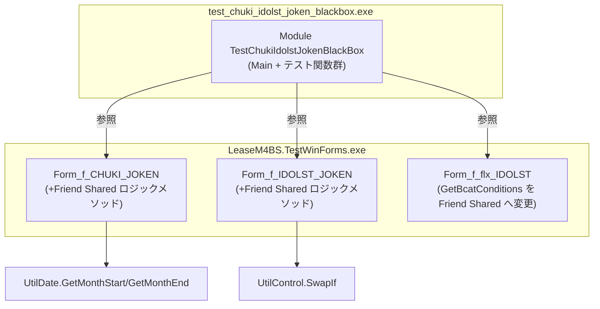

# 設計書: chuki-idolst-joken-blackbox (Issue #10)

## 1. 設計方針

### 既存アーキテクチャとの整合性

- `test_keijo_joken_blackbox.vb` および `test_schedule_blackbox.vb` と同一パターンを採用する
  - `Module TestXxxBlackBox` + `Function Test_NNN_XXX() As Boolean` 形式
  - `allPassed` フラグ集約 + 最終サマリー出力
- テスト対象のロジックは **WinForms コントロールに依存しない Pure Function** として切り出す
  - `Form_f_CHUKI_JOKEN.GenerateWhereClause` / `GenerateLabelText` は `Private` のため `Friend` へ昇格
  - `Form_f_IDOLST_JOKEN.GetLabelText` は `Private` のため `Friend` へ昇格
  - `Form_f_flx_IDOLST.GetBcatConditions` は `Private` のため `Friend` へ昇格
  - ただし上記の変更だけでは WinForms コントロール (`DateTimePicker` 等) に依存するため、ロジック相当の **スタティック Pure Function** を同フォームクラス内に `Friend Shared` で追加する方針を採る
- コンパイルは既存パターンに準拠し `vbc` コマンドで行う（MSBuild 不使用）

### 採用する設計パターン

- **ロジック分離パターン**: WinForms コントロールへの依存を引数として渡す等価純関数を用意する
  - `GenerateWhereClause(prms, itengaiF, opeF, followF, omissionF, kyknNoFrom, kyknNoTo, skmkCd, lcptCd, bcatCd, dtFrom, dtTo)` を `Friend Shared` として追加
  - `GenerateLabelText(dtFrom, dtTo, teigakuF, risokuF)` を `Friend Shared` として追加
  - `GetLabelText(dtFrom, dtTo, bcatFlags)` を `Friend Shared` として追加（IDOLST_JOKEN）
  - `GetBcatConditions(checkBcatFlags)` を `Friend Shared` に変更（flx_IDOLST）
- **テストコードはコンソールアプリ単一ファイル** (`test_chuki_idolst_joken_blackbox.vb`)
  - `System.Windows.Forms.dll` を参照することで `Form_*` クラスに型アクセスする
  - ただしフォームをインスタンス化せず、追加した `Friend Shared` メソッドを直接呼び出す

### 技術的判断の根拠

- **leakbn_id の値について**: `ScheduleTypes.vb` の `LeaseKbn` enum では `Itengai=3, Ope=4` と定義されているが、`Form_f_CHUKI_JOKEN.vb` の `GenerateWhereClause` では `IN (1, 2)` を使用している。要件定義書では `1=移転外ファイナンスリース、2=オペレーティングリース` と定義されており、これは `c_leakbn` テーブルの実 ID 値として正しい可能性がある（enum の `Itengai=3` は別の分類軸）。テストではこの**現行実装の期待値**を使用し、バグの有無は SKIP コメントで記録する
- **GetLabelText 末尾「、」バグ**: bcat4 のみ True のとき `"管理部署4、"` で終わる動作が Access 版と一致するか不明なため、現行実装ベースの期待値でテストし、バグ候補として `' NOTE:` コメントを付記する
- **WinForms 参照の必要性**: `Form_f_CHUKI_JOKEN` / `Form_f_IDOLST_JOKEN` / `Form_f_flx_IDOLST` はすべて `LeaseM4BS.TestWinForms.exe` 内にあり DLL 化されていない。コンパイル時に `LeaseM4BS.TestWinForms.exe` を `/r:` 参照するか、あるいは Pure Function をクラスライブラリ側 (`LeaseM4BS.DataAccess`) に移動する必要がある。**本設計では後者は採らず**、テスト用 Pure Function をフォームクラス内に `Friend Shared` で追加し、`LeaseM4BS.TestWinForms.exe` を参照してコンパイルする方針とする

---

## 2. コンポーネント構成図



---

## 3. ファイル構成

### 新規作成ファイル

| ファイルパス | 責務 | 依存先 |
|---|---|---|
| `c:\kobayashi_LeaseM4BS\test_chuki_idolst_joken_blackbox.vb` | CHUKI_JOKEN + IDOLST_JOKEN ロジックのブラックボックステスト (コンソールアプリ) | `LeaseM4BS.TestWinForms.exe`, `Npgsql.dll`, `System.Data.dll` |

### 変更ファイル

| ファイルパス | 変更内容 | 影響範囲 |
|---|---|---|
| `LeaseM4BS.TestWinForms/LeaseM4BS.TestWinForms/Form_f_CHUKI_JOKEN.vb` | `GenerateWhereClause` / `GenerateLabelText` の等価 Pure Function を `Friend Shared` で追加 | 同ファイルのみ（既存 Private メソッドは残す） |
| `LeaseM4BS.TestWinForms/LeaseM4BS.TestWinForms/Form_f_IDOLST_JOKEN.vb` | `GetLabelText` の等価 Pure Function を `Friend Shared` で追加 | 同ファイルのみ |
| `LeaseM4BS.TestWinForms/LeaseM4BS.TestWinForms/Form_f_flx_IDOLST.vb` | `GetBcatConditions` を `Private` → `Friend Shared` に変更し引数を追加 | `BuildSql` 内の呼び出し箇所を引数渡しに修正 |

---

## 4. データモデル

### テストで扱う入出力型

新規クラス・テーブルの変更はなし。テスト内部でのみ以下の型を使用する。

```
' CHUKI_JOKEN GenerateWhereClause の入力パラメータ
itengaiF    As Boolean           ' リース区分: 移転外チェック
opeF        As Boolean           ' リース区分: オペチェック
followF     As Boolean           ' 省略基準: 従う
omissionF   As Boolean           ' 省略基準: 省略物件のみ
kyknNoFrom  As String            ' 物件No FROM (空文字 = 未入力)
kyknNoTo    As String            ' 物件No TO  (空文字 = 未入力)
skmkCd      As Object            ' 資産科目 SelectedValue (Nothing = 未選択)
lcptCd      As Object            ' リース会社 SelectedValue (Nothing = 未選択)
bcatCd      As Object            ' 管理部署 SelectedValue (Nothing = 未選択)
dtFrom      As Date              ' 集計期間 FROM
dtTo        As Date              ' 集計期間 TO

' 戻り値
whereClause As String
prms        As List(Of NpgsqlParameter)

' IDOLST_JOKEN GetLabelText の入力パラメータ
dtFrom      As Date
dtTo        As Date
bcat1F      As Boolean
bcat2F      As Boolean
bcat3F      As Boolean
bcat4F      As Boolean
bcat5F      As Boolean

' GetBcatConditions の入力パラメータ
checkBcatFlags As Boolean()  ' 長さ5
```

---

## 5. インターフェース設計

### 公開インターフェース (Friend Shared 追加メソッド)

#### Form_f_CHUKI_JOKEN に追加

```vb
' WHERE句生成 Pure Function (WinForms 非依存版)
Friend Shared Function GenerateWhereClausePure(
    ByRef prms As List(Of NpgsqlParameter),
    itengaiF As Boolean,
    opeF As Boolean,
    followF As Boolean,
    omissionF As Boolean,
    kyknNoFrom As String,
    kyknNoTo As String,
    skmkCd As Object,
    lcptCd As Object,
    bcatCd As Object,
    dtFrom As Date,
    dtTo As Date
) As String
  説明: GenerateWhereClause の等価ロジックを WinForms コントロールへの依存なしで再現する。
        引数は既存の Private メソッドが参照するコントロール値を直接受け取る。

' ラベルテキスト生成 Pure Function
Friend Shared Function GenerateLabelTextPure(
    dtFrom As Date,
    dtTo As Date,
    teigakuF As Boolean,
    risokuF As Boolean
) As String
  説明: GenerateLabelText の等価ロジックを WinForms コントロールへの依存なしで再現する。
```

#### Form_f_IDOLST_JOKEN に追加

```vb
' ラベルテキスト生成 Pure Function
Friend Shared Function GetLabelTextPure(
    dtFrom As Date,
    dtTo As Date,
    bcat1F As Boolean,
    bcat2F As Boolean,
    bcat3F As Boolean,
    bcat4F As Boolean,
    bcat5F As Boolean
) As String
  説明: GetLabelText の等価ロジックを WinForms コントロールへの依存なしで再現する。
```

#### Form_f_flx_IDOLST の変更

```vb
' 既存 Private Function → Friend Shared Function に変更し引数を追加
Friend Shared Function GetBcatConditions(checkBcatFlags As Boolean()) As String
  説明: 管理部署チェックフラグ配列を受け取り、SQL AND 条件文字列を返す。
        呼び出し元 BuildSql からは GetBcatConditions(CheckBcatFlags) と変更する。
```

---

## 6. 状態管理設計

テストコード内での状態:

- `allPassed As Boolean` — 全テストの通過状態を集約するフラグ
- 各 `Function Test_NNN_XXX() As Boolean` — 独立して実行可能、状態共有なし
- テスト間での `NpgsqlParameter` リストは毎回 `New List(Of NpgsqlParameter)` で生成

---

## 7. エラーハンドリング方針

- 各テスト関数は `Try/Catch ex As Exception` で囲み、予期しない例外は `FAIL` として捕捉・出力する
- WinForms フォームをインスタンス化しないため、Form_Load イベントによる DB 接続は発生しない
- `NpgsqlParameter` リストの組み立ては DB 接続不要のため、例外は基本的に発生しない
- 末尾「、」バグなど既知の動作上の懸念は `' NOTE:` コメントで記録し、テスト自体は PASS/FAIL で評価する

---

## 8. テストケース一覧

### Part 1: CHUKI_JOKEN WHERE 句生成 (`GenerateWhereClausePure`)

| テスト番号 | テスト名 | 入力条件 | 期待値（WHERE 句のキーワード） |
|---|---|---|---|
| Test_01 | 両区分・省略従う・全条件なし | itengaiF=T, opeF=T, followF=T | `IN (1, 2)`, `chuum_id = 1` |
| Test_02 | 移転外のみ | itengaiF=T, opeF=F, followF=T | `leakbn_id = 1`, NOT `IN (1, 2)` |
| Test_03 | オペのみ | itengaiF=F, opeF=T, followF=T | `leakbn_id = 2` |
| Test_04 | 省略基準: 無視する | followF=F, omissionF=F | 文字列に `chuum_id` を含まない |
| Test_05 | 省略基準: 省略物件のみ | omissionF=T | `chuum_id = 2` |
| Test_06 | 物件 No FROM/TO あり | kyknNoFrom="100", kyknNoTo="200" | `kykm_no >= @kyknNoFrom`, `kykm_no <= @kyknNoTo` |
| Test_07 | 物件 No 未入力 | kyknNoFrom="", kyknNoTo="" | `kykm_no` を含まない |
| Test_08 | 資産科目あり | skmkCd="10" | `skmk.skmk_cd = @skmkCd` |
| Test_09 | リース会社あり | lcptCd="LC01" | `lcpt.lcpt1_cd = @lcptCd` |
| Test_10 | 管理部署あり | bcatCd="B001" | `b_bcat.bcat_cd = @bcatCd` |
| Test_11 | dtFrom の月初正規化 | dtFrom=2024/04/15 | `@dtFrom` = 2024/04/01 |
| Test_12 | dtTo の月末正規化 | dtTo=2024/03/10 | `@dtTo` = 2024/03/31 |

### Part 2: CHUKI_JOKEN ラベルテキスト生成 (`GenerateLabelTextPure`)

| テスト番号 | テスト名 | 入力条件 | 期待値 |
|---|---|---|---|
| Test_13 | 期間テキスト | dtFrom=2024/04, dtTo=2025/03 | `"決算期間：2024/04～2025/03  "` を含む |
| Test_14 | 常時テキスト | 任意 | `"所有権移転外ファイナンスリースの計算条件  "` を含む |
| Test_15 | 償却: 定額 | teigakuF=True | `"償却方法：リース定額  "` を含む |
| Test_16 | 償却: 定率 | teigakuF=False | `"償却方法：近似定率  "` を含む |
| Test_17 | 利息: 利息法 | risokuF=True | `"利息計算：利息法  "` を含む |
| Test_18 | 利息: 利子込法 | risokuF=False | `"利息計算：利子込法  "` を含む |

### Part 3: CHUKI_JOKEN バリデーション等価ロジック

| テスト番号 | テスト名 | 入力条件 | 期待値 |
|---|---|---|---|
| Test_19 | SwapIf: FROM > TO | dtFrom=2025/03, dtTo=2024/04 | 入れ替え後 FROM=2024/04, TO=2025/03 |
| Test_20 | リース区分両方 False | itengaiF=F, opeF=F | WHERE 句に `leakbn_id` 条件なし |

### Part 4: IDOLST_JOKEN ラベルテキスト生成 (`GetLabelTextPure`)

| テスト番号 | テスト名 | 入力条件 | 期待値 |
|---|---|---|---|
| Test_21 | 移動日テキスト | dtFrom=2024/04/01, dtTo=2024/06/30 | `"移動日:　2024/04/01～2024/06/30  "` を含む |
| Test_22 | bcat1 のみ True | bcat1=T, others=F | `"管理部署1"` を含む, `"管理部署2"` を含まない |
| Test_23 | bcat1・2 True | bcat1=T, bcat2=T | `"管理部署1、管理部署2"` を含み末尾が `"、"` でない |
| Test_24 | bcat5 のみ True | bcat5=T | `"管理部署5"` を含み末尾が `"、"` でない |
| Test_25 | bcat4 のみ True (バグ候補確認) | bcat4=T, bcat5=F | 末尾が `"、"` でないことを確認（NOTE: bcat5 未選択時の末尾「、」バグ検証） |
| Test_26 | 全 True | all=T | 5つすべてを含み末尾が `"、"` でない |

### Part 5: IDOLST GetBcatConditions SQL 生成 (`GetBcatConditions`)

| テスト番号 | テスト名 | 入力条件 | 期待値 |
|---|---|---|---|
| Test_27 | 全 False | {F,F,F,F,F} | `String.Empty` |
| Test_28 | bcat1 のみ True | {T,F,F,F,F} | `"AND ( b_bcat.bcat1_cd <> r1_bcat.bcat1_cd OR b_bcat.bcat1_cd IS NULL OR r1_bcat.bcat1_cd IS NULL )"` |
| Test_29 | bcat1・3 True | {T,F,T,F,F} | bcat1 条件 OR bcat3 条件が `AND ( ... )` 形式 |
| Test_30 | 全 True | {T,T,T,T,T} | 5条件が OR 結合された `AND ( ... )` |

### Part 6: IDOLST_JOKEN バリデーション等価ロジック

| テスト番号 | テスト名 | 入力条件 | 期待値 |
|---|---|---|---|
| Test_31 | SwapIf: FROM > TO | dtFrom=2024/06/30, dtTo=2024/04/01 | 入れ替え後 FROM=2024/04/01, TO=2024/06/30 |

---

## 9. 実装順序

1. **Step 1**: `Form_f_flx_IDOLST.vb` — `GetBcatConditions` を `Private` → `Friend Shared` に変更し引数追加
   - 依存: なし
   - 変更箇所: `Private Function GetBcatConditions()` → `Friend Shared Function GetBcatConditions(checkBcatFlags As Boolean())`
   - `BuildSql` 内の呼び出し: `GetBcatConditions()` → `GetBcatConditions(CheckBcatFlags)`

2. **Step 2**: `Form_f_CHUKI_JOKEN.vb` — Pure Function を `Friend Shared` で追加
   - 依存: `UtilDate.GetMonthStart` / `GetMonthEnd` (既存)
   - 追加メソッド: `GenerateWhereClausePure` / `GenerateLabelTextPure`
   - 既存 Private メソッドは変更しない

3. **Step 3**: `Form_f_IDOLST_JOKEN.vb` — Pure Function を `Friend Shared` で追加
   - 依存: なし
   - 追加メソッド: `GetLabelTextPure`
   - 既存 Private メソッドは変更しない

4. **Step 4**: `LeaseM4BS.TestWinForms` プロジェクトをリビルドして DLL/EXE を更新
   - 依存: Step 1〜3

5. **Step 5**: `test_chuki_idolst_joken_blackbox.vb` — テストコード作成
   - 依存: Step 4
   - コンパイルコマンド:
     ```
     vbc /r:LeaseM4BS.DataAccess.dll /r:Npgsql.dll /r:System.Data.dll /r:System.Windows.Forms.dll /r:LeaseM4BS.TestWinForms.exe test_chuki_idolst_joken_blackbox.vb
     ```

6. **Step 6**: コンパイル・実行・全テスト PASS 確認
   - 依存: Step 5

---

## 10. 補足: leakbn_id 不一致バグへの対処方針

`ScheduleTypes.vb` の `LeaseKbn` enum:
- `Iten = 1` (移転ファイナンスリース)
- `Itengai = 3` (移転外ファイナンスリース)
- `Ope = 4` (オペレーティングリース)

`Form_f_CHUKI_JOKEN.vb` の `GenerateWhereClause`:
- 移転外のみ → `leakbn_id = 1`
- オペのみ → `leakbn_id = 2`

要件定義書では `1=移転外ファイナンスリース、2=オペレーティングリース` と定義されており、これは `c_leakbn` テーブルの実データを参照している可能性がある。`LeaseKbn` enum は別の用途（計算エンジン内の識別子）である可能性があり、必ずしも DB の `leakbn_id` 列値と対応していない可能性がある。

**テストでの方針**: `GenerateWhereClause` が現状生成する値（`IN (1, 2)`, `= 1`, `= 2`）を期待値として採用し、Access 版との乖離は別 Issue で調査する。テストコード内に `' NOTE: leakbn_id の値が Access版定数と一致するか要確認 (Issue #10)` コメントを付記する。

---

## 11. 補足: GetLabelText 末尾「、」バグへの対処方針

現行実装の `Form_f_IDOLST_JOKEN.GetLabelText`:
- bcat1〜bcat4 は末尾に「、」を付加し、bcat5 のみ「、」なしで直書き
- 末尾が「、」の場合 `TrimEnd("、"c)` で除去

バグ候補:
- bcat4=True, bcat5=False の組み合わせでは、最後が `"管理部署4、"` となり TrimEnd が適用されるため正常動作する
- bcat4=True, bcat5=False の場合は `TrimEnd` が機能するため末尾「、」は除去される

実際のバグシナリオ: bcat4=True で bcat5=False の場合 → `"管理部署4、"` → TrimEnd → `"管理部署4"` (正常)

ただし VB.NET の `TrimEnd("、"c)` は末尾の連続する「、」文字をすべて除去するため、bcat1〜4 が True で bcat5 が False のとき `"管理部署4、"` → `"管理部署4"` となる。動作としては正常と判断できる。

**テストでの方針**: Test_25 で bcat4 のみ True のときの末尾「、」を実際に検証し、現行実装が期待通りに動作することを確認する。
