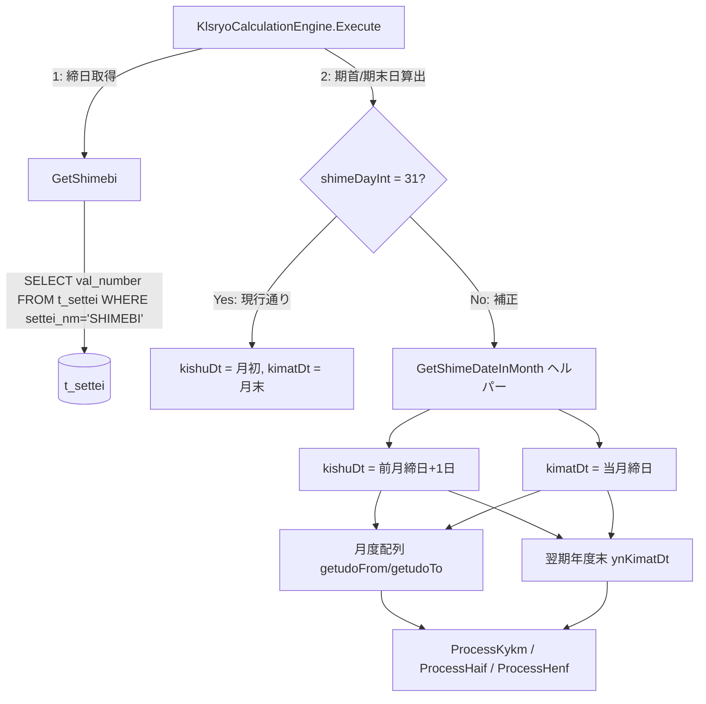

# 設計書: closing-day-correction

## 1. 設計方針

### 既存アーキテクチャとの整合性
- `KlsryoCalculationEngine` はステートフルクラスパターン（`_crud As CrudHelper` 保持）を踏襲する
- 設定値取得は `GetSekouDt()` と同一パターンの `GetShimebi()` プライベートメソッドで実装する
- 既存の `CashScheduleBuilder.GetMonthEndDate` / `CalcSimeDtB` は変更しない（月末固定用途を保持）

### 採用する設計パターン
- **パラメータ追加方式ではなく DB取得方式を採用**
  - 要件 FR-001 では `Execute` 開始時に `t_settei` から取得する方式を明示している
  - 呼び出し元（Form_f_flx_KLSRYO, Form_f_KLSRYO_JOKEN）の修正不要
  - `GetSekouDt()` と完全に対称なパターンのため保守性が高い
  - 注: 要件 US-004 の「パラメータ追加方式（Optional shimeBi=31）」はフォールバック設計として不要となる

### 技術的判断の根拠
- `getudoFrom/getudoTo` は `kishuDt.AddMonths(i)` / `getudoFrom(i+1).AddDays(-1)` で計算されており、`kishuDt` 補正後は自動的に正しい月度区間になる（要件 FR-004）
- `ynKimatDt` は Access版 gKLSRYO_Main 行145-152 のスコープ外であり、`kimatDt` 補正後に既存の `GetMonthEndDate + AddMonths(12)` チェーンを適用すると月末になってしまう。締日非31の場合は `GetShimeDateInMonth` ヘルパーで締日に合わせた計算に変更が必要
- 月内日数超過（2月に30日締め等）は `Math.Min(shimeDayInt, DateTime.DaysInMonth(...))` で切り下げる

---

## 2. コンポーネント構成図



---

## 3. ファイル構成

### 新規作成ファイル
なし（既存ファイルのみ変更）

### 変更ファイル
| ファイルパス | 変更内容 | 影響範囲 |
|---|---|---|
| `LeaseM4BS/LeaseM4BS.DataAccess/KlsryoCalculationEngine.vb` | `Execute` に締日取得・期首/期末日補正・ynKimatDt補正を追加。`GetShimebi()` および `GetShimeDateInMonth()` プライベートメソッドを追加 | `Execute` の内部処理のみ。呼び出し元フォームへの影響なし |

---

## 4. データモデル

### t_settei テーブル（既存、スキーマ変更なし）

| カラム名 | 型 | 用途 |
|---|---|---|
| settei_nm | VARCHAR | 設定名キー（例: `'SEKOU_DT'`, `'SHIMEBI'`） |
| val_number | DOUBLE PRECISION | 数値設定値（締日の場合: 1〜31） |
| settei_type | INTEGER | 設定型区分 |

**注意事項**: `settei_nm = 'SHIMEBI'` のキー名は仮定値。実装前に Access版 `gSET_*` 系初期化コードまたは実DBスキーマで確認すること（要件 8.1 仮定事項）。

---

## 5. インターフェース設計

### 公開インターフェース

既存の `Execute` シグネチャは変更なし（後方互換性を維持）:

```
Execute(dtFrom As Date, dtTo As Date, taisho As Integer, ktmg As ShriKtmg, meisai As ShriMeisai) As DataTable
  説明: 現行と同一シグネチャ。内部で GetShimebi() を呼び出し締日を取得する。
```

### プライベートメソッド（新規追加）

```
GetShimebi() As Integer
  説明: t_settei テーブルから締日(1-31)を取得する。GetSekouDt() と同パターン。
        取得失敗またはレコード不在の場合は 31 をデフォルト値として返す。
  戻り値: 締日(Integer, 1-31)。デフォルト = 31。
  副作用: DBアクセス失敗時は DbConnectionManager.WriteError でログ記録。

GetShimeDateInMonth(year As Integer, month As Integer, shimeDayInt As Integer) As Date
  説明: 指定年月に締日を適用したDateを返す。月内日数を超える場合は月末に切り下げる。
        例: shimeDayInt=30, month=2 → 2月28日(または29日)
  引数:
    year       - 対象年
    month      - 対象月
    shimeDayInt - 締日(1-31)
  戻り値: 指定年月の締日に対応するDate。
```

---

## 6. 状態管理設計

### Execute 内の状態フロー（変更箇所）

```
【現行】
kishuDt = New Date(dtFrom.Year, dtFrom.Month, 1)
kimatDt = CashScheduleBuilder.GetMonthEndDate(dtTo)

【変更後】
1. shimeDayInt = GetShimebi()
2. kishuDt = New Date(dtFrom.Year, dtFrom.Month, 1)     ' 初期値（現行通り）
3. kimatDt = CashScheduleBuilder.GetMonthEndDate(dtTo)  ' 初期値（現行通り）
4. If shimeDayInt <> 31 Then
     ' 期首日補正 (Access版 行101-102)
     ' dte_lKISHU_DT = DateAdd("d",1, CDate(Format(DateAdd("m",-1,dte_lKISHU_DT),"yyyy/mm") & "/" & ig締日))
     kishuDt = GetShimeDateInMonth(dtFrom.AddMonths(-1).Year, dtFrom.AddMonths(-1).Month, shimeDayInt).AddDays(1)
     ' 期末日補正 (Access版 行103-104)
     ' dte_lKIMAT_DT = CDate(Format(dte_lKIMAT_DT,"yyyy/mm") & "/" & ig締日)
     kimatDt = GetShimeDateInMonth(dtTo.Year, dtTo.Month, shimeDayInt)
   End If
5. ynKimatDt 算出: 締日に応じた補正付きで5年分算出
6. getudoFrom/getudoTo: kishuDt ベースのため、補正後は自動的に正しい値になる（変更不要）
```

### ynKimatDt の補正設計

```
【現行】
wk = CashScheduleBuilder.GetMonthEndDate(wk)  ' 月末日を取得
wk = wk.AddMonths(12)
ynKimatDt(i) = CashScheduleBuilder.GetMonthEndDate(wk)

【変更後（shimeDayInt <> 31 の場合）】
' 締日月数計算: kimatDt を基点として12ヶ月ごとに締日を適用
' shimeDayInt=31 の場合は現行通り GetMonthEndDate を使用
For i = 0 To 4:
  If i = 0 Then
    wk = kimatDt                        ' 補正済み kimatDt を基点
  Else
    wk = ynKimatDt(i - 1)
  End If
  wk = wk.AddMonths(12)                 ' 12ヶ月後の同月へ
  If shimeDayInt = 31 Then
    ynKimatDt(i) = CashScheduleBuilder.GetMonthEndDate(wk)  ' 月末
  Else
    ynKimatDt(i) = GetShimeDateInMonth(wk.Year, wk.Month, shimeDayInt)  ' 締日
  End If
Next
```

### 月度配列の状態（変更不要）

`getudoFrom(i) = kishuDt.AddMonths(i)` および `getudoTo(i) = getudoFrom(i+1).AddDays(-1)` のロジックはそのまま流用する。補正後 `kishuDt` が `前月締日+1日` になるため、`AddMonths(i)` で各月の開始日が正しく算出される。`getudoTo(i)` は `getudoFrom(i+1).AddDays(-1)` = 当月締日が自動的に導出される。

---

## 7. エラーハンドリング方針

### GetShimebi() のエラーハンドリング

| 状況 | 動作 |
|---|---|
| `t_settei` に `SHIMEBI` レコードなし | デフォルト値 31 を返す |
| `val_number` が NULL | デフォルト値 31 を返す |
| `val_number` が整数以外（型変換例外） | `Catch` でキャッチし、`WriteError` でログ、31 を返す |
| DB接続例外 | `Catch` でキャッチし、`WriteError` でログ、31 を返す |

```vb
' GetSekouDt() と完全対称なパターン
Private Function GetShimebi() As Integer
    Try
        Dim dt = _crud.GetDataTable("SELECT val_number FROM t_settei WHERE settei_nm = 'SHIMEBI'")
        If dt.Rows.Count > 0 AndAlso Not IsDBNull(dt.Rows(0)("val_number")) Then
            Return CInt(dt.Rows(0)("val_number"))
        End If
    Catch ex As Exception
        DbConnectionManager.WriteError("設定値取得失敗(GetShimebi)", ex)
    End Try
    Return 31 ' デフォルト: 月末締め
End Function
```

### GetShimeDateInMonth() のエラーハンドリング

- 引数バリデーションなし（呼び出し元の責務）
- 月内日数超過は `Math.Min` で切り下げるため例外は発生しない

```vb
' 月内日数を超える締日を安全に適用
Private Shared Function GetShimeDateInMonth(year As Integer, month As Integer, shimeDayInt As Integer) As Date
    Dim day As Integer = Math.Min(shimeDayInt, DateTime.DaysInMonth(year, month))
    Return New Date(year, month, day)
End Function
```

---

## 8. 実装順序

依存関係に基づき、以下の順序で実装する。

1. **Step 1**: `KlsryoCalculationEngine.vb` - `GetShimeDateInMonth` プライベート共有関数を追加
   - 依存: なし
   - 場所: ファイル末尾のヘルパーセクション（`GetSekouDt` の近傍）
   - 内容: `Math.Min(shimeDayInt, DateTime.DaysInMonth(year, month))` で月末切り下げ

2. **Step 2**: `KlsryoCalculationEngine.vb` - `GetShimebi` プライベートメソッドを追加
   - 依存: なし（CrudHelper は既存）
   - 場所: `GetSekouDt` の直後
   - 内容: `GetSekouDt` と同パターンで `t_settei` から `val_number` を取得、デフォルト 31

3. **Step 3**: `KlsryoCalculationEngine.vb` - `Execute` 内の期首/期末日算出ブロックを修正
   - 依存: Step 1, Step 2
   - 場所: `KlsryoCalculationEngine.vb:22-24`（「期首日/期末日の算出」コメントブロック）
   - 内容:
     ```vb
     ' *** 期首日/期末日の算出 (Access版 gKLSRYO_Main:行145-152)
     Dim shimeDayInt As Integer = GetShimebi()
     Dim kishuDt As Date = New Date(dtFrom.Year, dtFrom.Month, 1)
     Dim kimatDt As Date = CashScheduleBuilder.GetMonthEndDate(dtTo)
     If shimeDayInt <> 31 Then
         ' 期首日補正: 前月締日+1日
         kishuDt = GetShimeDateInMonth(dtFrom.AddMonths(-1).Year, dtFrom.AddMonths(-1).Month, shimeDayInt).AddDays(1)
         ' 期末日補正: 当月締日
         kimatDt = GetShimeDateInMonth(dtTo.Year, dtTo.Month, shimeDayInt)
     End If
     ```

4. **Step 4**: `KlsryoCalculationEngine.vb` - `Execute` 内の `ynKimatDt` 算出ブロックを修正
   - 依存: Step 1, Step 3
   - 場所: `KlsryoCalculationEngine.vb:27-38`（「翌期以降年度末」ループ）
   - 内容: `shimeDayInt = 31` の場合は `GetMonthEndDate` を使用（現行通り）、それ以外は `GetShimeDateInMonth` を使用するように分岐を追加

5. **Step 5**: テストの確認
   - 依存: Step 1〜4
   - 既存テストが shimeDayInt=31 として通過すること（後方互換性）
   - 新規テストとして shimeDayInt=15, shimeDayInt=25, shimeDayInt=30（2月）の境界値を確認

---

## 9. Access版との対応表

| Access版 (pc_SHRI_KLSRYO.txt:145-152) | VB.NET 等価 |
|---|---|
| `dte_lKISHU_DT = New Date(dtFrom.Year, dtFrom.Month, 1)` | `kishuDt = New Date(dtFrom.Year, dtFrom.Month, 1)` |
| `dte_lKIMAT_DT = g末日YMDGet(dtTo)` | `kimatDt = CashScheduleBuilder.GetMonthEndDate(dtTo)` |
| `If ig締日 <> 31 Then` | `If shimeDayInt <> 31 Then` |
| `DateAdd("m",-1, dte_lKISHU_DT)` | `dtFrom.AddMonths(-1)` |
| `CDate(Format(...,"yyyy/mm") & "/" & ig締日)` | `GetShimeDateInMonth(year, month, shimeDayInt)` |
| `DateAdd("d",1, ...)` | `.AddDays(1)` |
| `CDate(Format(dte_lKIMAT_DT,"yyyy/mm") & "/" & ig締日)` | `GetShimeDateInMonth(dtTo.Year, dtTo.Month, shimeDayInt)` |

---

## 10. 検証方針（エッジケース）

| ケース | 期待する kishuDt | 期待する kimatDt |
|---|---|---|
| shimeDayInt=31, dtFrom=2024/04/01, dtTo=2025/03/31 | 2024/04/01（変更なし） | 2025/03/31（変更なし） |
| shimeDayInt=15, dtFrom=2024/04/21, dtTo=2025/03/21 | 2024/03/15+1日 = 2024/03/16 | 2025/03/15 |
| shimeDayInt=25, dtFrom=2024/04/26, dtTo=2025/03/26 | 2024/03/25+1日 = 2024/03/26 | 2025/03/25 |
| shimeDayInt=30, dtFrom=2024/03/01, dtTo=2025/02/28 | 2024/01/30+1日 = 2024/01/31 | 2025/02/28（2月末に切り下げ） |
| shimeDayInt=28, dtFrom=2024/03/01, dtTo=2025/02/28 | 2024/01/28+1日 = 2024/01/29 | 2025/02/28（2月は28日） |
