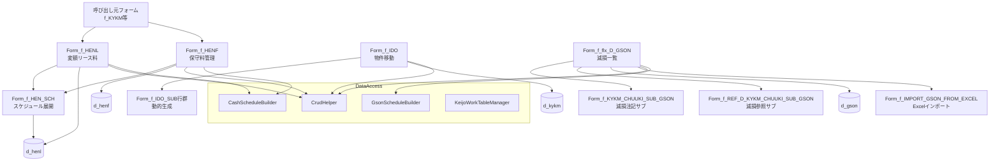

# 設計書: hen-ido-gson-forms

> Issue #32: 変更・異動・減損処理画面群の移行

---

## 1. 設計方針

### 既存アーキテクチャとの整合性

本機能群は既存の2層構造（WinForms UI + DataAccess クラスライブラリ）を踏襲する。

- UI 層 (`LeaseM4BS.TestWinForms`) にイベントハンドラとバインディングロジックを実装
- DataAccess 層 (`LeaseM4BS.DataAccess`) の既存クラス (`CrudHelper`, `GsonScheduleBuilder`, `CashScheduleBuilder`) を最大限再利用
- 新規 DataAccess クラスは最小限とし、既存クラスで対応できないもののみ追加する

### 採用する設計パターン

| パターン | 採用箇所 |
|---|---|
| モーダルダイアログ (`ShowDialog`) | f_HEN_SCH, f_HENF, f_HENL, f_IDO, f_IDO_SUB |
| データ行リスト + 合計行再計算 | f_HENL, f_HENF, f_HEN_SCH |
| 動的行生成 (Panel + FlowLayoutPanel) | f_IDO_SUB (複数行表示) |
| トランザクション内バルク更新 | f_IDO 実行処理 |
| セキュリティチェック (`ApplyDataUpdateLimit`) | f_flx_D_GSON |

### 技術的判断の根拠

1. **f_HENL / f_HENF のデータ行表示**: Designer.vb の構造（単一 TextBox 群 + 合計 TextBox 群）を分析した結果、Access版は複数行を Panel に動的生成するパターンと判断。`FlowLayoutPanel` に `UserControl` を追加する方式は既存コードに前例がないため、`DataGridView` を使用する代替案も検討したが、Designer.vb にグリッドがないためインメモリの `DataTable` を `_rows As List(Of HenlRow)` で保持し、各行データを同じ位置の TextBox にレンダリングするシンプルな1行表示 + Prev/Next ナビゲーション方式を採用する。ただし要件定義 US-002 で「D_HENLの各行を一覧表示」と明記されているため、Designer.vb の構造上の制約として Panel の縦スクロール方式（各 LINE_ID 分の行コントロール群を Panel に追加）を採用する。

2. **f_IDO_SUB のコントロール重複問題**: `Form_f_IDO_SUB.Designer.vb` にヘッダ行（Label）とデータ行（TextBox）が同じ座標 (0,0) に配置されている。実装では `Form_f_IDO` 内の `Panel` に `Form_f_IDO_SUB` のコントロールを動的生成して複数行を表示する方式ではなく、`Form_f_IDO` 内に `DataGridView dgv_ITEMS` を追加せず、Designer.vb の Panel 領域で複数インスタンスを縦積みする。`Form_f_IDO_SUB` 自体は1行分のデータを表すコントロール行として機能し、`Form_f_IDO` がそのインスタンスを複数保持する。

3. **f_HEN_SCH の単一行モード**: Designer.vb のコントロール構成（合計行 TextBox がボタン行と同じ Panel に存在）および要件定義の仮定事項から、単一スケジュール行の編集ダイアログとして実装する。呼び出し元 (`Form_f_HENL` / `Form_f_HENF`) が選択行データを渡し、編集結果を受け取るモーダルパターンとする。

---

## 2. コンポーネント構成図



---

## 3. ファイル構成

### 新規作成ファイル

| ファイルパス | 責務 | 依存先 |
|---|---|---|
| `LeaseM4BS.TestWinForms/Form_f_KYKM_CHUUKI_SUB_GSON.vb` | 減損注記サブフォーム（編集モード）コードビハインド | CrudHelper, d_gson |
| `LeaseM4BS.TestWinForms/Form_f_KYKM_CHUUKI_SUB_GSON.Designer.vb` | 上記の Designer | - |
| `LeaseM4BS.TestWinForms/Form_f_REF_D_KYKM_CHUUKI_SUB_GSON.vb` | 減損注記サブフォーム（参照モード）コードビハインド | Form_f_KYKM_CHUUKI_SUB_GSON |
| `LeaseM4BS.TestWinForms/Form_f_REF_D_KYKM_CHUUKI_SUB_GSON.Designer.vb` | 上記の Designer | - |
| `LeaseM4BS.TestWinForms/Form_f_IMPORT_GSON_FROM_EXCEL.vb` | 減損 Excel インポートコードビハインド | FileHelper, CrudHelper |
| `LeaseM4BS.TestWinForms/Form_f_IMPORT_GSON_FROM_EXCEL.Designer.vb` | 上記の Designer | - |

> 注: 上記3フォームの Designer.vb が既存かどうかを実装前に確認すること。存在する場合は .vb のみ作成。

### 変更ファイル

| ファイルパス | 変更内容 | 影響範囲 |
|---|---|---|
| `LeaseM4BS.TestWinForms/Form_f_HEN_SCH.vb` | スケジュール行編集ロジック全実装 (スタブ→実装) | f_HENL, f_HENF から呼ばれる |
| `LeaseM4BS.TestWinForms/Form_f_HENL.vb` | 変額リース料 CRUD・展開・合計再計算 (スタブ→実装) | d_henl, CashScheduleBuilder |
| `LeaseM4BS.TestWinForms/Form_f_HENF.vb` | 保守料 CRUD・展開・合計再計算 (スタブ→実装) | d_henf, CashScheduleBuilder |
| `LeaseM4BS.TestWinForms/Form_f_IDO.vb` | 物件移動処理全実装 (スタブ→実装) | d_kykm, Form_f_IDO_SUB |
| `LeaseM4BS.TestWinForms/Form_f_IDO_SUB.vb` | 物件移動サブ行実装 (スタブ→実装) | Form_f_IDO から参照 |
| `LeaseM4BS.TestWinForms/Form_f_flx_D_GSON.vb` | 検索・照会・変更ボタン実装 (現状: Load と Close のみ) | d_gson, GsonScheduleBuilder |

---

## 4. データモデル

### 対象テーブル（既存・変更なし）

#### d_henl（変額リース料）

| 列名 | 型 | 説明 |
|---|---|---|
| kykm_id | double | 物件ID（PK の一部） |
| line_id | integer | 行ID（PK の一部） |
| shri_dt1 | date | 初回支払日 |
| shri_kn | integer | 支払間隔（ヶ月） |
| sshri_kn | integer | 〆支払間隔（ヶ月） |
| shri_cnt | integer | 支払回数 |
| klsryo | double | 支払額（税抜） |
| kzei | double | 消費税額 |
| zritu | double | 消費税率 |
| shho_id | integer | 支払方法ID |

#### d_henf（保守料）

主要列は d_henl と同構造。追加列:
- `f_hkmk_id`: 費用区分ID
- `f_lcpt1_id`: 支払先ID
- `f_gsha_id`: 契約先ID
- `kykbnf`: 契約番号
- `koza_id`: 銀行口座ID
- `start_dt`: 開始日
- `lkikan`: 契約期間
- `saikaisu`: 再リース回数
- `hszei_kjkbn_id`: 消費税計上区分ID
- `hszei_kjkbn_id_ms_f`: 自動設定禁止フラグ

#### d_gson（減損データ）

| 列名 | 型 | 説明 |
|---|---|---|
| kykm_id | double | 物件ID（PK の一部） |
| line_id | integer | 行ID（PK の一部） |
| gson_dt | date | 処理年月 |
| gson_tmg | integer | 処理タイミング (0=月度末, 1=月度初) |
| gson_ryo | double | 減損損失（当期） |
| gson_rkei | double | 減損損失累計額 |

#### d_kykm（物件ヘッダ、異動処理で更新する列）

| 列名 | 説明 |
|---|---|
| bcat1_id 〜 bcat5_id | 管理部署1〜5 |
| hkbcat1_id 〜 hkbcat5_id | 費用負担部署1〜5 |
| ido_dt | 異動日 |

### インメモリモデル（実装専用）

```
' f_HENL / f_HENF の行データ保持用
Structure HenlRow
    Dim LineId As Integer
    Dim ShriDt1 As Date
    Dim Klsryo As Double
    Dim Kzei As Double
    Dim Zritu As Double
    Dim ShriKn As Integer
    Dim SshriKn As Integer
    Dim ShriCnt As Integer
    Dim ShriEnDt As Date
    Dim KlsryoGokei As Double
    Dim KzeiGokei As Double
    Dim KlsryoZkomiGokei As Double
    Dim IsNew As Boolean  ' 新規追加行フラグ
End Structure
```

---

## 5. インターフェース設計

### 公開インターフェース

#### Form_f_HEN_SCH（スケジュール展開）

```
' 呼び出し元がセットするプロパティ
Property KykmId As Double
  説明: 物件ID（ワーク表示用）

Property LineId As Integer
  説明: 編集対象の LINE_ID（-1 = 新規）

Property ShriDt As String
Property Klsryo As Double
Property Kzei As Double
Property Zritu As Double
Property SshriKn As Integer

' 呼び出し元が結果を受け取るプロパティ（DialogResult.OK 時）
ReadOnly Property ResultShriDt As String
ReadOnly Property ResultKlsryo As Double
ReadOnly Property ResultKzei As Double
ReadOnly Property ResultZritu As Double
ReadOnly Property ResultSshriKn As Integer
ReadOnly Property IsDeleted As Boolean  ' 行削除フラグ
```

#### Form_f_HENL（変額リース料）

```
' 呼び出し元がセットするプロパティ
Property KykmId As Double
  説明: 表示・編集対象の物件ID

' 主要イベントハンドラ
Sub Form_Load       → LoadHenlData() 呼び出し
Sub cmd_展開_Click  → 選択行を Form_f_HEN_SCH に ShowDialog
Sub cmd_削除_Click  → 選択行を d_henl から DELETE
Sub cmd_閉じる_Click → Me.Close()
```

#### Form_f_HENF（保守料）

Form_f_HENL と同パターン。KykmId に加えて HenfLineId（d_henf の行ID）を受け取る。

```
Property KykmId As Double
Property HenfLineId As Integer
  説明: 保守料レコード識別子（d_henf.line_id）
```

#### Form_f_IDO（物件移動）

```
' 設定不要（スタンドアロンダイアログ）
' 主要メソッド
Sub LoadIdobjects()
  説明: オプション選択に応じて d_kykm から BCAT or HKBCAT を SELECT

Sub ExecuteIdo()
  説明: chk_IDO_F=True の行の d_kykm を トランザクション内で UPDATE
  制約: txt_IDO_DT が空の場合は MessageBox でエラー表示してリターン
```

#### Form_f_IDO_SUB（物件移動サブ行）

```
' Form_f_IDO が動的に生成するコントロール行
' プロパティ（行データ設定用）
Property KykmId As Double
Property KykmNo As String
Property Saikaisu As Integer
Property BuknBango1 As String
Property BuknNm As String
Property StartDt As Date
Property CkaiykDt As Object   ' Nullable
Property Klsryo As Double

' 選択状態の読み取り
ReadOnly Property IsChecked As Boolean  ' chk_IDO_F.Checked
```

#### Form_f_flx_D_GSON（減損フレックス一覧）— 追加実装分

```
' 追加するプロパティ（既存の Load/Close/OUTPUT_FILE 以外）
Sub SearchData()
  説明: txt_SEARCH の入力値で d_gson + 関連テーブルを JOIN SELECT し dgv_LIST にバインド

Sub cmd_照会_Click
  説明: 選択行の kykm_id で Form_f_REF_D_KYKM_CHUUKI_SUB_GSON を ShowDialog

Sub cmd_変更_Click
  説明: 選択行の kykm_id で Form_f_KYKM_CHUUKI_SUB_GSON を ShowDialog
```

#### Form_f_KYKM_CHUUKI_SUB_GSON（減損注記サブ）

```
Property KykmId As Double
  説明: 表示・編集対象の物件ID

' 主要メソッド
Sub LoadGsonData()   → d_gson SELECT → dgv_LIST にバインド
Sub UpdateTotals()   → GSON_RYO_SUM を集計して表示
```

#### Form_f_REF_D_KYKM_CHUUKI_SUB_GSON（減損参照サブ）

```
Property KykmId As Double
  説明: 参照専用（編集不可）

' 表示のみ。Form_f_KYKM_CHUUKI_SUB_GSON の LoadGsonData を再利用し
' 全コントロールを ReadOnly/Disabled に設定して表示する。
```

#### Form_f_IMPORT_GSON_FROM_EXCEL（減損 Excel インポート）

```
' 主要メソッド
Sub cmd_Excelファイル選択_Click   → OpenFileDialog → プレビュー表示
Sub cmd_ワークテーブルに取り込む_Click
  説明: FileHelper でExcel読み込み → ワークテーブルINSERT（27列構造）
  現状: todo ファイル入力 → 完全実装

Sub cmd_前回本登録ログ_Click → Form_f_ZENKAI_LOG を ShowDialog
```

---

## 6. 状態管理設計

### f_HENL / f_HENF の行データ管理

```
Private _kykmId As Double
Private _rows As New List(Of HenlRow)   ' ロード済み行データ
Private _currentRowIndex As Integer = 0 ' 現在表示行インデックス

' ロード時
Private Sub LoadHenlData()
    Dim dt = _crud.GetDataTable("SELECT * FROM d_henl WHERE kykm_id = @kykm_id ORDER BY line_id", prms)
    _rows.Clear()
    For Each row As DataRow In dt.Rows
        _rows.Add(DataRowToHenlRow(row))
    Next
    RenderCurrentRow()
    UpdateSumFields()
End Sub

' 合計再計算（FR-005）
Private Sub UpdateSumFields()
    txt_KLSRYO_SUM.Text = _rows.Sum(Function(r) r.Klsryo).ToString()
    txt_KZEI_SUM.Text = _rows.Sum(Function(r) r.Kzei).ToString()
    txt_KLSRYO_ZKOMI_SUM.Text = _rows.Sum(Function(r) r.Klsryo + r.Kzei).ToString()
    txt_KLSRYO_GOKEI_SUM.Text = _rows.Sum(Function(r) r.KlsryoGokei).ToString()
    ' ...
End Sub
```

### f_IDO の選択状態管理

```
Private _subControls As New List(Of Form_f_IDO_SUB)
Private _checkedCount As Integer = 0

' 全選択・全解除
Private Sub SelectAll(checked As Boolean)
    For Each sub In _subControls
        sub.chk_IDO_F.Checked = checked
    Next
    UpdateCount()
End Sub

Private Sub UpdateCount()
    _checkedCount = _subControls.Count(Function(s) s.chk_IDO_F.Checked)
    ' COUNT / DCOUNT 表示更新
End Sub
```

### f_HEN_SCH の消費税自動計算（FR-004）

```
' KLSRYO または ZRITU 変更時に発火
Private Sub RecalcKzei()
    Dim klsryo As Double
    Dim zritu As Double
    If Double.TryParse(txt_KLSRYO.Text, klsryo) AndAlso Double.TryParse(txt_ZRITU.Text, zritu) Then
        Dim kzei As Long = CLng(Math.Floor(klsryo * zritu / 100))
        txt_KZEI.Text = kzei.ToString()
        txt_KLSRYO_ZKOMI.Text = (klsryo + kzei).ToString()
    End If
End Sub
```

---

## 7. エラーハンドリング方針

### エラーの種類と対処方法

| エラー種別 | 発生箇所 | 対処 |
|---|---|---|
| DB 接続エラー | 全フォームの Load / SearchData | `Catch ex As Exception → MessageBox.Show("一覧取得エラー: " & ex.Message)` |
| バリデーションエラー | f_IDO の実行時 (IDO_DT 空欄等) | `MessageBox.Show` でエラー内容を表示、処理中断 |
| トランザクション失敗 | f_IDO 実行, f_HENL/HENF 削除 | `Catch → _crud.Rollback() → MessageBox.Show` |
| D_HENL 全削除警告 | f_HENL 削除 (0件になる場合) | 削除前に件数確認し、0件になる場合は警告ダイアログ表示 |
| GSON_TMG 値エラー | GsonScheduleBuilder.Build | 既存の例外スロー動作を維持 |
| Excel 解析エラー | f_IMPORT_GSON_FROM_EXCEL | ファイル選択時に列数チェック (≠27列で警告) |

### ユーザーへのフィードバック

- 正常完了: 更新系操作後に `MessageBox.Show("完了しました。")` を表示
- エラー: `MessageBox.Show(message, "エラー", MessageBoxButtons.OK, MessageBoxIcon.Error)`
- 確認: 削除操作前に `MessageBox.Show(..., MessageBoxButtons.YesNo, MessageBoxIcon.Question)` で確認

---

## 8. 実装順序

依存関係を考慮し、下位モジュールから順に実装する。

### Step 1: Form_f_HEN_SCH — スケジュール行編集ダイアログ
- **対象**: `Form_f_HEN_SCH.vb`
- **作業**: プロパティ定義、`cmd_呼出元に反映_Click`、`cmd_削除_Click`、`cmd_閉じる_Click`、消費税自動再計算 (`RecalcKzei`)
- **依存**: なし（純粋な UI ダイアログ、DB アクセスなし）

### Step 2: Form_f_HENL — 変額リース料管理
- **対象**: `Form_f_HENL.vb`
- **作業**: `LoadHenlData`, `RenderCurrentRow`, `UpdateSumFields`, `cmd_展開_Click` (→ Form_f_HEN_SCH 呼び出し), `cmd_削除_Click` (D_HENL DELETE), `cmd_閉じる_Click`
- **依存**: Step 1 (Form_f_HEN_SCH), CrudHelper, d_henl

### Step 3: Form_f_HENF — 保守料管理
- **対象**: `Form_f_HENF.vb`
- **作業**: Step 2 と同パターン。追加でヘッダ情報 (`txt_F_HKMK_NM` 等) を d_henf から読み込み表示。`chk_HSZEI_KJKBN_ID_MS_F` のフラグ管理を追加。
- **依存**: Step 1 (Form_f_HEN_SCH), CrudHelper, d_henf

### Step 4: Form_f_IDO_SUB — 物件移動サブ行
- **対象**: `Form_f_IDO_SUB.vb`
- **作業**: プロパティ定義、行データ表示メソッド、`chk_IDO_F` 変更イベント（親への通知）
- **依存**: なし（データ表示のみ）

### Step 5: Form_f_IDO — 物件移動
- **対象**: `Form_f_IDO.vb`
- **作業**: `LoadIdobjects`（照会処理）、`cmd_照会_Click`、`cmd_選択_Click` / `cmd_非選択_Click`、`cmd_解除_Click`、`cmd_実行_Click`（トランザクション内バルク UPDATE）、`cmd_CANCEL_Click`
- **依存**: Step 4 (Form_f_IDO_SUB), CrudHelper, d_kykm

### Step 6: Form_f_KYKM_CHUUKI_SUB_GSON — 減損注記サブ（編集）
- **対象**: `Form_f_KYKM_CHUUKI_SUB_GSON.vb` / `Designer.vb` (新規)
- **作業**: Designer でコントロール定義（DataGridView + 合計 TextBox + 保存/閉じるボタン）、`LoadGsonData`、`UpdateTotals`、INSERT/UPDATE/DELETE ロジック
- **依存**: CrudHelper, d_gson

### Step 7: Form_f_REF_D_KYKM_CHUUKI_SUB_GSON — 減損注記サブ（参照）
- **対象**: `Form_f_REF_D_KYKM_CHUUKI_SUB_GSON.vb` / `Designer.vb` (新規)
- **作業**: Step 6 の `LoadGsonData` を流用し全コントロールを ReadOnly に設定
- **依存**: Step 6

### Step 8: Form_f_flx_D_GSON — 減損フレックス一覧（追加実装）
- **対象**: `Form_f_flx_D_GSON.vb`（既存スタブに追記）
- **作業**: `SearchData`（JOIN SQL 実装）、`cmd_照会_Click`、`cmd_変更_Click`（Step 6/7 を呼び出す）、`txt_SEARCH` に TextChanged イベント追加
- **依存**: Step 6, 7, CrudHelper, GsonScheduleBuilder

### Step 9: Form_f_IMPORT_GSON_FROM_EXCEL — Excelインポート
- **対象**: `Form_f_IMPORT_GSON_FROM_EXCEL.vb` / `Designer.vb` (新規)
- **作業**: Designer でコントロール定義、`cmd_Excelファイル選択_Click`、`cmd_ワークテーブルに取り込む_Click`（FileHelper 使用、27列構造）、`cmd_前回本登録ログ_Click`
- **依存**: CrudHelper, FileHelper

---

## 9. SQL 設計

### Form_f_flx_D_GSON の検索 SQL

```sql
SELECT
    dk.kykm_no,
    ck.kjkbn_nm,
    dg.line_id,
    dk.bukn_nm,
    dg.gson_dt,
    CASE dg.gson_tmg WHEN 0 THEN '月度末' WHEN 1 THEN '月度初' END AS gson_tmg_nm,
    dg.gson_ryo,
    dg.gson_rkei,
    mb.bcat_nm AS kanri_tani,
    mb2.bcat_nm AS kanri_busho,
    cc.kkbn_nm,
    ml.lcpt_nm,
    dkh.kykbnh,
    dk.saikaisu,
    dkh.kishu_dt
FROM d_gson dg
INNER JOIN d_kykm dk ON dg.kykm_id = dk.kykm_id
INNER JOIN d_kykh dkh ON dk.kykm_id = dkh.kykm_id
LEFT JOIN c_kjkbn ck ON dkh.kjkbn_id = ck.kjkbn_id
LEFT JOIN m_bcat mb ON dk.bcat1_id = mb.bcat_id
LEFT JOIN m_bcat mb2 ON dk.bcat2_id = mb2.bcat_id
LEFT JOIN c_kkbn cc ON dkh.kkbn_id = cc.kkbn_id
LEFT JOIN m_lcpt ml ON dkh.lcpt1_id = ml.lcpt_id
WHERE (@search = '' OR dk.kykm_no ILIKE '%' || @search || '%'
    OR dkh.kykbnh ILIKE '%' || @search || '%'
    OR dk.bukn_nm ILIKE '%' || @search || '%')
ORDER BY dk.kykm_no, dg.gson_dt
```

### Form_f_IDO の照会 SQL（管理部署モード）

```sql
SELECT
    dk.kykm_id,
    dk.kykm_no,
    dk.saikaisu,
    dk.bukn_bango1,
    dk.bukn_nm,
    dkh.kishu_dt AS start_dt,
    dk.ckaiyk_dt,
    dkh.klsryo
FROM d_kykm dk
INNER JOIN d_kykh dkh ON dk.kykm_id = dkh.kykm_id
WHERE dk.bcat1_id = @bcat1_id  -- オプション416選択時
   -- HKBCAT の場合は dk.hkbcat1_id = @hkbcat1_id
ORDER BY dk.kykm_no
```

### Form_f_IDO の更新 SQL（管理部署モード）

```sql
UPDATE d_kykm SET
    bcat1_id = @to_bcat1_id,
    bcat2_id = @to_bcat2_id,
    bcat3_id = @to_bcat3_id,
    bcat4_id = @to_bcat4_id,
    bcat5_id = @to_bcat5_id,
    ido_dt = @ido_dt
WHERE kykm_id = @kykm_id
```
