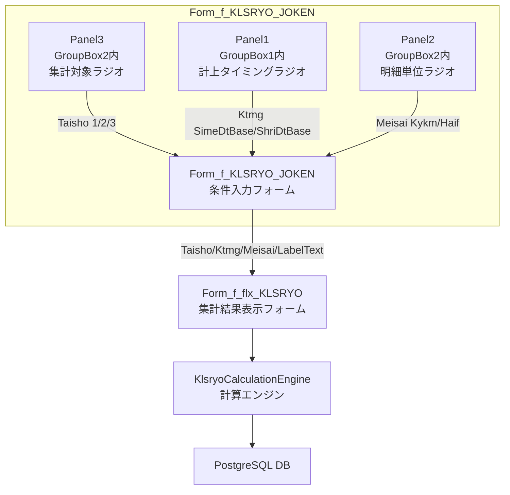

# 設計書: klsryo-joken-options

## 1. 設計方針

### 既存アーキテクチャとの整合性

- JOKEN フォームが条件を集約し flx フォームへパラメータを渡す既存のレイヤー構造を維持する
- `Form_f_flx_KLSRYO` のプロパティインターフェース（`Taisho As Integer`, `Ktmg As ShriKtmg`, `Meisai As ShriMeisai`）は変更しない
- `KlsryoCalculationEngine.Execute` のシグネチャは変更しない

### 採用する設計パターン

- `Form_f_KEIJO_JOKEN.vb` で採用済みの「`If(radio_X.Checked, 値A, 値B)` 三項演算子」パターンを踏襲する
- Designer.vb にはラジオボタンが既に定義・配置済みであるため、**新規コントロールの追加は行わない**
- `cmd_EXECUTE_Click` 内のハードコード3行を、既存ラジオボタンの `Checked` プロパティ読み取りに置き換える

### 技術的判断の根拠

1. **コントロール名リネーム（Designer.vb）を行う**: `オプション483` 等の日本語名はコードから参照しにくく、デバッグ・保守コストが高い。`Form_f_KEIJO_JOKEN` の `radio_BUKN`/`radio_HAIF` に倣い英語名に統一する。
2. **デフォルト選択の修正が必要**: 現状の Designer.vb では `オプション483`（支払日ベース）が `Checked=True` だが、要件は「締日ベース = デフォルト」。`chk_SHIME` 側を `Checked=True` に修正し、`オプション483`（→ `radio_SHRI`）の `Checked=True` を除去する。
3. **`LabelText` プロパティへの受け渡しを追加**: `Form_f_flx_KLSRYO.LabelText` プロパティは既に定義済みだが未設定。選択条件の文字列を生成して渡す（FR-005）。

---

## 2. コンポーネント構成図



---

## 3. ファイル構成

### 新規作成ファイル
なし

### 変更ファイル

| ファイルパス | 変更内容 | 影響範囲 |
|---|---|---|
| `LeaseM4BS.TestWinForms/LeaseM4BS.TestWinForms/Form_f_KLSRYO_JOKEN.Designer.vb` | コントロール名リネーム（日本語→英語）+ デフォルト選択の修正 | Form_f_KLSRYO_JOKEN のみ |
| `LeaseM4BS.TestWinForms/LeaseM4BS.TestWinForms/Form_f_KLSRYO_JOKEN.vb` | `cmd_EXECUTE_Click` のハードコード値 → ラジオボタン読み取り + LabelText 生成 | Form_f_KLSRYO_JOKEN のみ |

---

## 4. データモデル

既存の型を変更しない。利用する既存の Enum:

```vb
' KlsryoTypes.vb（変更なし）
Public Enum ShriKtmg
    Nothing_ = 0
    SimeDtBase = 1   ' 締日ベース
    ShriDtBase = 2   ' 支払日ベース
    ShriRDtBase = 3  ' 前月支払日ベース（UI選択肢なし）
End Enum

Public Enum ShriMeisai
    Kykm = 1   ' 物件単位
    Haif = 2   ' 配賦単位
End Enum
```

パラメータ対応表:

| UI選択 | Access値 | VB.NET値 |
|---|---|---|
| リース料 | opg_TAISHO=1 | Taisho=1 (Integer) |
| 保守料 | opg_TAISHO=2 | Taisho=2 (Integer) |
| 全部 | opg_TAISHO=3 | Taisho=3 (Integer) |
| 締日ベース | opg_KTMG=1 | ShriKtmg.SimeDtBase |
| 支払日ベース | opg_KTMG=2 | ShriKtmg.ShriDtBase |
| 物件単位 | opg_MEISAI=1 | ShriMeisai.Kykm |
| 配賦単位 | opg_MEISAI=2 | ShriMeisai.Haif |

---

## 5. インターフェース設計

### コントロール名リネーム計画（Designer.vb）

リネーム対象の旧名 → 新名の対応表:

| 旧コントロール名 | 新コントロール名 | 対応する Access opg 値 | 表示テキスト |
|---|---|---|---|
| `chk_SHIME` | `radio_SIME` | opg_KTMG=1 | 〆支払ベース |
| `オプション483` | `radio_SHRI` | opg_KTMG=2 | 支払日ベース |
| `オプション504` | `radio_LSRYO` | opg_TAISHO=1 | リース料 |
| `オプション506` | `radio_HOSHU` | opg_TAISHO=2 | 保守料 |
| `オプション508` | `radio_ZENBU` | opg_TAISHO=3 | 全部 |
| `オプション487` | `radio_BUKN` | opg_MEISAI=1 | 物件単位 |
| `オプション489` | `radio_HAIF` | opg_MEISAI=2 | 配賦単位 |

**注意**: `chk_SHIME` は RadioButton として宣言済みのため、`radio_SIME` へのリネームで命名規則違反を解消する。

### デフォルト選択の修正（Designer.vb）

現状の問題: `radio_SHRI`（旧 `オプション483`、支払日ベース）が `Checked=True`
修正後: `radio_SIME`（旧 `chk_SHIME`、締日ベース）を `Checked=True`、`radio_SHRI` の `Checked=True` を除去

変更箇所:
1. 旧 `chk_SHIME`（→ `radio_SIME`）セクションに `Checked=True` と `TabStop=True` を追加
2. 旧 `オプション483`（→ `radio_SHRI`）セクションの `Checked=True` と `TabStop=True` を削除

### 公開インターフェース（変更なし）

```
' Form_f_flx_KLSRYO.vb（シグネチャ変更なし）
Public Property Taisho As Integer = 3
Public Property Ktmg As ShriKtmg = ShriKtmg.SimeDtBase
Public Property Meisai As ShriMeisai = ShriMeisai.Haif
Public Property LabelText As String

' KlsryoCalculationEngine.Execute（シグネチャ変更なし）
Function Execute(dtFrom As Date, dtTo As Date, taisho As Integer, ktmg As ShriKtmg, meisai As ShriMeisai) As DataTable
```

---

## 6. 状態管理設計

### データフロー

```
Form_f_KLSRYO_JOKEN（cmd_EXECUTE_Click）
  ↓
  radio_LSRYO.Checked → Taisho=1
  radio_HOSHU.Checked → Taisho=2
  それ以外(radio_ZENBU.Checked) → Taisho=3
  ↓
  radio_SIME.Checked → Ktmg=ShriKtmg.SimeDtBase
  それ以外(radio_SHRI.Checked) → Ktmg=ShriKtmg.ShriDtBase
  ↓
  radio_BUKN.Checked → Meisai=ShriMeisai.Kykm
  それ以外(radio_HAIF.Checked) → Meisai=ShriMeisai.Haif
  ↓
  LabelText（条件表示文字列）生成
  ↓
Form_f_flx_KLSRYO（SearchData → KlsryoCalculationEngine.Execute）
```

### cmd_EXECUTE_Click 変更後の実装

```vb
' 変更前（ハードコード）
frm.Taisho = 3
frm.Ktmg = LeaseM4BS.DataAccess.ShriKtmg.SimeDtBase
frm.Meisai = LeaseM4BS.DataAccess.ShriMeisai.Haif

' 変更後（ラジオボタン読み取り）
frm.Taisho = If(radio_LSRYO.Checked, 1, If(radio_HOSHU.Checked, 2, 3))
frm.Ktmg = If(radio_SIME.Checked, LeaseM4BS.DataAccess.ShriKtmg.SimeDtBase, LeaseM4BS.DataAccess.ShriKtmg.ShriDtBase)
frm.Meisai = If(radio_BUKN.Checked, LeaseM4BS.DataAccess.ShriMeisai.Kykm, LeaseM4BS.DataAccess.ShriMeisai.Haif)
frm.LabelText = BuildLabelText(frm.DtFrom, frm.DtTo, frm.Taisho, frm.Ktmg, frm.Meisai)
```

### LabelText 生成ロジック（Form_f_KLSRYO_JOKEN.vb に追加）

```vb
Private Function BuildLabelText(dtFrom As Date, dtTo As Date, taisho As Integer, ktmg As LeaseM4BS.DataAccess.ShriKtmg, meisai As LeaseM4BS.DataAccess.ShriMeisai) As String
    Dim taishoStr = If(taisho = 1, "リース料", If(taisho = 2, "保守料", "全部"))
    Dim ktmgStr = If(ktmg = LeaseM4BS.DataAccess.ShriKtmg.SimeDtBase, "締日ベース", "支払日ベース")
    Dim meisaiStr = If(meisai = LeaseM4BS.DataAccess.ShriMeisai.Kykm, "物件単位", "配賦単位")
    Return $"集計期間: {dtFrom:yyyy/MM} ～ {dtTo:yyyy/MM} / 対象: {taishoStr} / タイミング: {ktmgStr} / 明細: {meisaiStr}"
End Function
```

---

## 7. エラーハンドリング方針

- ラジオボタンの排他制御はパネルのコンテナ機能（同一 Panel 内の RadioButton の相互排他）によって保証される。追加のバリデーションは不要
- `cmd_EXECUTE_Click` 既存のバリデーション（`txt_DATE_FROM` / `txt_DATE_TO` の空チェック）は変更しない
- 計算エンジン側のエラーは `Form_f_flx_KLSRYO.SearchData()` の既存 Try-Catch (`MessageBox.Show("一覧取得エラー: " & ex.Message)`) で捕捉される。追加実装不要

---

## 8. 実装順序

1. **Step 1**: `Form_f_KLSRYO_JOKEN.Designer.vb` - コントロール名リネームとデフォルト選択の修正
   - 依存: なし
   - 作業内容:
     1. `Friend WithEvents` 宣言部の7コントロール名を一括リネーム
     2. `InitializeComponent()` 内の `Me.旧名` 参照をすべて `Me.新名` に置換
     3. `chk_SHIME`（→ `radio_SIME`）に `Checked=True` / `TabStop=True` を追加
     4. `オプション483`（→ `radio_SHRI`）の `Checked=True` / `TabStop=True` を削除
     5. Panel1 の `Controls.Add` 呼び出しで参照しているコントロール名も新名に更新

2. **Step 2**: `Form_f_KLSRYO_JOKEN.vb` - `cmd_EXECUTE_Click` のハードコード値置き換えと LabelText 生成
   - 依存: Step 1（コントロール名変更後でないとコンパイルエラーになる）
   - 作業内容:
     1. ハードコード3行（`frm.Taisho`, `frm.Ktmg`, `frm.Meisai`）をラジオボタン読み取りに置き換え
     2. `frm.LabelText = BuildLabelText(...)` の呼び出し行を追加
     3. `Private Function BuildLabelText(...)` を新規追加
