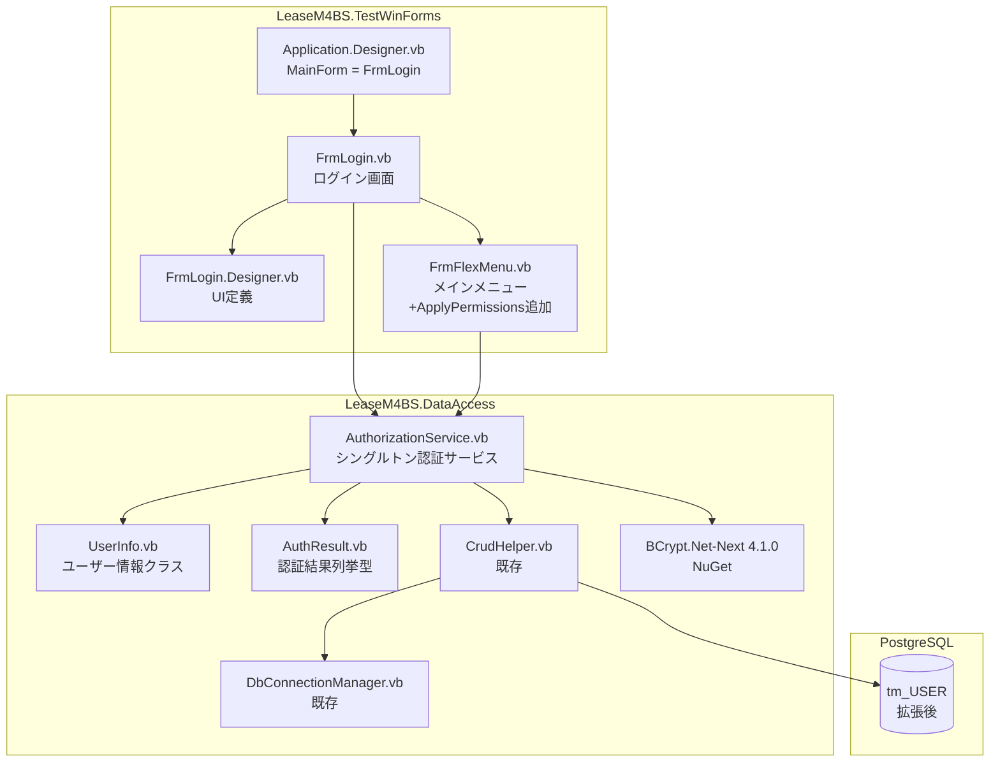
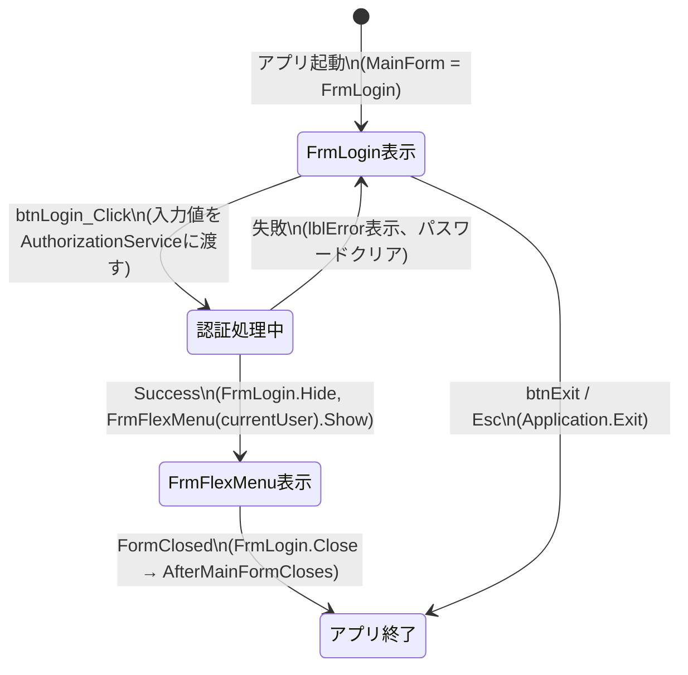
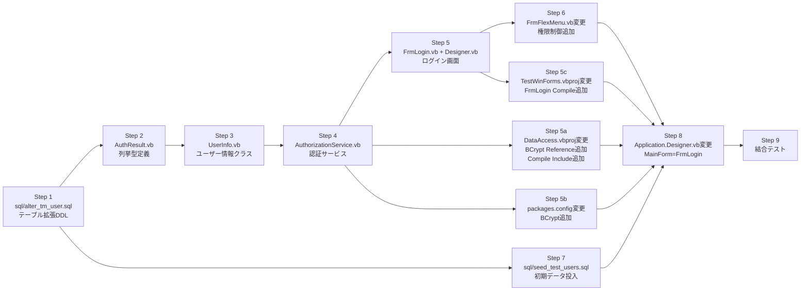

# 設計書: login-screen

> **作成日:** 2026-03-11
> **対象:** LeaseM4BS ログイン画面実装（ISS-006）
> **入力資料:** 01_code_research.md / 02_doc_research.md / 03_requirements.md / ログイン画面_実装計画.md

> **⚠ 実装時の変更（2026-03-11）:**
> BCrypt.Net-Next 4.1.0 は .NET Framework 4.7.2 で System.Memory 4.0.5.0 のアセンブリ解決に失敗するため（FileLoadException）、
> 外部依存ゼロの **PBKDF2-SHA256**（`Rfc2898DeriveBytes`, 100,000 iterations）に置換した。
> 本設計書中の BCrypt 関連記述は PBKDF2 に読み替えること。
> 実装クラス: `PasswordHasher.vb`（`HashPassword` / `Verify`）、ハッシュ形式: `iterations:base64salt:base64hash`

---

## 1. 設計方針

### 既存アーキテクチャとの整合性

- 2層構成（DataAccess層 / UI層）を維持する。AuthorizationService・UserInfo・AuthResult は `LeaseM4BS.DataAccess` に配置し、UI層（TestWinForms）は DataAccess を参照して利用する
- DB アクセスは既存の `CrudHelper.GetDataTable()` / `ExecuteNonQuery()` パターンを使用し、新たな DB 接続クラスは作成しない
- シングルトン管理は `Shared` フィールドによる VB.NET 標準パターンで実装する（新たな DI コンテナは導入しない）

### 採用する設計パターン

- **シングルトン（Shared フィールド）:** `AuthorizationService.Current` でセッションを保持
- **オーバーロードコンストラクタ:** FrmFlexMenu は既存の `New()` を維持し、`New(currentUser As UserInfo)` を追加（Designer 互換性確保）
- **MainForm 変更方式:** Application.Designer.vb の `OnCreateMainForm` で `FrmLogin` を MainForm に設定し、FrmFlexMenu.FormClosed → FrmLogin.Close() → アプリ終了の流れを実現する

### 技術的判断の根拠

| 判断事項 | 採用案 | 根拠 |
|---|---|---|
| 画面遷移方式 | MainForm = FrmLogin（方式B） | 02_doc_research.md で実装計画書方式を推奨。AfterMainFormCloses によるシャットダウン制御が明確 |
| BCrypt パッケージ追加先 | LeaseM4BS.DataAccess のみ | AuthorizationService が DataAccess に配置されるため。TestWinForms には不要 |
| BCrypt バージョン | 4.1.0 | 02_doc_research.md 確認済み。.NET Framework 4.7.2 直接対応 |
| メニュー権限マッピング | ハードコード（_menuPermissions Dictionary） | Phase 1 スコープ。Phase 2 で ts_MENU 連携に切り替えられるよう Dictionary に局所化 |
| FrmLogin 基底クラス | System.Windows.Forms.Form 直接継承 | PopupBaseForm は位置制御用途であり、ログイン画面には不要 |

---

## 2. コンポーネント構成図



---

## 3. ファイル構成

### 新規作成ファイル

| ファイルパス | 責務 | 依存先 |
|---|---|---|
| `LeaseM4BS/LeaseM4BS.DataAccess/AuthResult.vb` | 認証結果列挙型（Success / UserNotFound / InvalidPassword / AccountDisabled / AccountLocked） | なし |
| `LeaseM4BS/LeaseM4BS.DataAccess/UserInfo.vb` | ログインユーザー情報保持クラス（UserId / LoginId / UserName / Role / IsActive） | なし |
| `LeaseM4BS/LeaseM4BS.DataAccess/AuthorizationService.vb` | シングルトン認証サービス。Authenticate / HasAccess / Logout を提供 | CrudHelper, BCrypt.Net-Next, UserInfo, AuthResult |
| `LeaseM4BS.TestWinForms/LeaseM4BS.TestWinForms/FrmLogin.vb` | ログイン画面ロジック（イベント処理・バリデーション・画面遷移） | AuthorizationService, FrmFlexMenu |
| `LeaseM4BS.TestWinForms/LeaseM4BS.TestWinForms/FrmLogin.Designer.vb` | FrmLogin の UI 定義（コントロール配置・プロパティ設定） | FrmLogin.vb |
| `sql/alter_tm_user.sql` | tm_USER テーブル拡張 DDL（カラム追加・制約追加） | なし |
| `sql/seed_test_users.sql` | テスト用初期ユーザーデータ投入 SQL | alter_tm_user.sql 実行後 |

### 変更ファイル

| ファイルパス | 変更内容 | 影響範囲 |
|---|---|---|
| `LeaseM4BS/LeaseM4BS.DataAccess/packages.config` | BCrypt.Net-Next 4.1.0 パッケージエントリ追加 | DataAccess ビルド |
| `LeaseM4BS/LeaseM4BS.DataAccess/LeaseM4BS.DataAccess.vbproj` | BCrypt の `<Reference>` 追加、AuthResult / UserInfo / AuthorizationService の `<Compile>` 追加 | DataAccess ビルド |
| `LeaseM4BS.TestWinForms/LeaseM4BS.TestWinForms/LeaseM4BS.TestWinForms.vbproj` | FrmLogin.vb（SubType=Form）と FrmLogin.Designer.vb（DependentUpon）の `<Compile>` 追加 | TestWinForms ビルド |
| `LeaseM4BS.TestWinForms/LeaseM4BS.TestWinForms/My Project/Application.Designer.vb` | `OnCreateMainForm` 内の `Me.MainForm` を `FrmFlexMenu` → `FrmLogin` に変更（1行） | アプリ起動フォーム |
| `LeaseM4BS.TestWinForms/LeaseM4BS.TestWinForms/FrmFlexMenu.vb` | `_currentUser As UserInfo` フィールド追加、`New(currentUser As UserInfo)` コンストラクタオーバーロード追加、`ApplyPermissions()` メソッド追加、`GetFirstAccessibleButton()` メソッド追加 | メインメニュー権限制御 |

---

## 4. データモデル

### tm_USER テーブル拡張 DDL

ファイル: `sql/alter_tm_user.sql`

```sql
-- tm_USER テーブル拡張（ログイン認証用カラム追加）
-- 実行前提: tm_USER テーブルが存在すること
-- 既存行がある場合は UPDATE でマイグレーション後に NOT NULL 制約を追加する

ALTER TABLE tm_USER ADD COLUMN login_id      VARCHAR(50);
ALTER TABLE tm_USER ADD COLUMN password_hash VARCHAR(256);
ALTER TABLE tm_USER ADD COLUMN role          VARCHAR(20)  NOT NULL DEFAULT 'viewer';
ALTER TABLE tm_USER ADD COLUMN is_active     BOOLEAN      NOT NULL DEFAULT TRUE;
ALTER TABLE tm_USER ADD COLUMN last_login_at TIMESTAMP;
ALTER TABLE tm_USER ADD COLUMN failed_login_count INTEGER NOT NULL DEFAULT 0;
ALTER TABLE tm_USER ADD COLUMN locked_until  TIMESTAMP;

-- 既存行マイグレーション（既存ユーザーがいる場合）
UPDATE tm_USER SET login_id = user_name WHERE login_id IS NULL;
UPDATE tm_USER SET password_hash = '$2b$12$placeholder' WHERE password_hash IS NULL;

-- NOT NULL 制約（既存行の更新後に追加）
ALTER TABLE tm_USER ALTER COLUMN login_id      SET NOT NULL;
ALTER TABLE tm_USER ALTER COLUMN password_hash SET NOT NULL;

-- 制約
ALTER TABLE tm_USER ADD CONSTRAINT uq_user_login_id UNIQUE (login_id);
ALTER TABLE tm_USER ADD CONSTRAINT chk_user_role
    CHECK (role IN ('admin', 'accounting', 'general_affairs', 'viewer'));
```

### ロール定義

| role 値 | 対象部門 | メニューアクセス |
|---|---|---|
| `admin` | IT部門・システム管理者 | 全7ボタン有効 |
| `accounting` | 経理部 | btnMaster 以外有効（6ボタン） |
| `general_affairs` | 総務部 | btnContract / btnROUAsset のみ有効（2ボタン） |
| `viewer` | 監査・管理職 | btnMaster 以外有効（6ボタン） |

---

## 5. インターフェース設計

### 公開インターフェース（LeaseM4BS.DataAccess）

#### AuthResult.vb

```vb
Public Enum AuthResult
    Success = 0
    UserNotFound = 1
    InvalidPassword = 2
    AccountDisabled = 3
    AccountLocked = 4   ' Phase 2 用（カラムは Phase 1 で追加済み）
End Enum
```

#### UserInfo.vb

```vb
Public Class UserInfo
    Public Property UserId As Integer     ' tm_USER.user_id (SERIAL PK)
    Public Property LoginId As String     ' tm_USER.login_id（ログインに使用）
    Public Property UserName As String    ' tm_USER.user_name
    Public Property Role As String        ' "admin" / "accounting" / "general_affairs" / "viewer"
    Public Property IsActive As Boolean   ' tm_USER.is_active
End Class
```

#### AuthorizationService.vb

```vb
Public Class AuthorizationService

    ' シングルトンインスタンス
    Private Shared _instance As AuthorizationService = New AuthorizationService()
    Public Shared ReadOnly Property Current As AuthorizationService
        Get
            Return _instance
        End Get
    End Property

    ' ログイン中ユーザー情報（未ログイン時は Nothing）
    Public ReadOnly Property CurrentUser As UserInfo

    ' 認証を実行する
    ' loginId: tm_USER.login_id（ログイン画面で入力する文字列ID）
    ' password: 平文パスワード
    ' 戻り値: AuthResult 列挙値
    Public Function Authenticate(loginId As String, password As String) As AuthResult

    ' 指定メニューへのアクセス権があるか判定する
    ' menuId: ボタン名（"btnContract" 等）
    ' 戻り値: True=アクセス可 / False=アクセス不可（未ログイン時は常に False）
    Public Function HasAccess(menuId As String) As Boolean

    ' ログアウト（CurrentUser を Nothing にクリア）
    Public Sub Logout()

End Class
```

### 公開インターフェース（LeaseM4BS.TestWinForms）

#### FrmLogin.vb

```vb
' System.Windows.Forms.Form を直接継承
Partial Public Class FrmLogin

    ' Designer 用パラメータなしコンストラクタ（既定動作）
    Public Sub New()

End Class
```

#### FrmFlexMenu.vb（追加分）

```vb
' 追加フィールド
Private _currentUser As UserInfo

' 追加コンストラクタ（ログイン後に FrmLogin から呼び出す）
' currentUser: AuthorizationService.Current.CurrentUser を渡す
Public Sub New(currentUser As UserInfo)

' 追加メソッド: ロールに基づいて各メニューボタンの Enabled を設定する
Private Sub ApplyPermissions()

' 追加メソッド: Enabled=True かつ最初のメニューボタンを返す
Private Function GetFirstAccessibleButton() As Button
```

---

## 6. 状態管理設計

### セッション状態

```
未ログイン状態:
  AuthorizationService.Current.CurrentUser = Nothing

ログイン済み状態:
  AuthorizationService.Current.CurrentUser = UserInfo { UserId, LoginId, UserName, Role, IsActive }
```

### 画面遷移とライフサイクル



### _menuPermissions Dictionary（AuthorizationService 内ハードコード）

```vb
Private Shared ReadOnly _menuPermissions As New Dictionary(Of String, String()) From {
    {"btnContract",          New String() {"admin", "accounting", "general_affairs", "viewer"}},
    {"btnROUAsset",          New String() {"admin", "accounting", "general_affairs", "viewer"}},
    {"btnMonthlyPayments",   New String() {"admin", "accounting", "viewer"}},
    {"btnMonthlyAccounting", New String() {"admin", "accounting", "viewer"}},
    {"btnPeriodBalance",     New String() {"admin", "accounting", "viewer"}},
    {"btnTaxAdjustment",     New String() {"admin", "accounting", "viewer"}},
    {"btnMaster",            New String() {"admin"}}
}
```

Phase 2 では本 Dictionary を廃止し、ts_MENU テーブルとの動的連携に置き換える。

---

## 7. エラーハンドリング方針

### 認証エラー（AuthorizationService.Authenticate の戻り値に基づく FrmLogin 側の処理）

| AuthResult | lblError に表示するメッセージ | 後続処理 |
|---|---|---|
| UserNotFound | "ログインIDまたはパスワードが正しくありません" | パスワードクリア → txtLoginId にフォーカス |
| InvalidPassword | "ログインIDまたはパスワードが正しくありません" | 同上（メッセージを UserNotFound と統一） |
| AccountDisabled | "このアカウントは無効化されています" | パスワードクリア → txtLoginId にフォーカス |
| AccountLocked | "アカウントがロックされています" | パスワードクリア → txtLoginId にフォーカス（Phase 2 用） |

UserNotFound と InvalidPassword のメッセージを統一する理由: ユーザー存在有無の推測を防止するため（NFR-001）。

### バリデーションエラー

| 条件 | lblError に表示するメッセージ |
|---|---|
| txtLoginId.Text が空 | "ログインIDを入力してください" |
| txtPassword.Text が空 | "パスワードを入力してください" |

### DB 接続エラー

AuthorizationService.Authenticate 内の `CrudHelper` 呼び出しで例外が発生した場合は、呼び出し元（FrmLogin.btnLogin_Click）で `Try-Catch` し、lblError に "システムエラーが発生しました。管理者に連絡してください。" を表示してパスワードをクリアする。スタックトレースはコンソール（`Debug.WriteLine`）に出力する。

---

## 8. NuGet パッケージ追加仕様

### BCrypt.Net-Next 4.1.0 追加先

`LeaseM4BS/LeaseM4BS.DataAccess/` に追加する。`LeaseM4BS.TestWinForms` には不要。

#### packages.config 追加エントリ

`LeaseM4BS/LeaseM4BS.DataAccess/packages.config` に以下を追記:

```xml
<package id="BCrypt.Net-Next" version="4.1.0" targetFramework="net472" />
```

#### LeaseM4BS.DataAccess.vbproj の `<Reference>` 追加

`LeaseM4BS/LeaseM4BS.DataAccess/LeaseM4BS.DataAccess.vbproj` の `<ItemGroup>` 内（既存 Reference エントリの後）に追加:

```xml
<Reference Include="BCrypt.Net-Next, Version=4.1.0.0, Culture=neutral, PublicKeyToken=2b1b13b29ce02c82, processorArchitecture=MSIL">
  <HintPath>..\packages\BCrypt.Net-Next.4.1.0\lib\net472\BCrypt.Net-Next.dll</HintPath>
</Reference>
```

> **注意:** `PublicKeyToken` と DLL パスは NuGet パッケージ復元後に実際のファイルで確認すること。HintPath のディレクトリ名はパッケージ復元時に決定される。

---

## 9. vbproj 変更仕様

### LeaseM4BS.DataAccess.vbproj

`<Compile>` ItemGroup（現在 `CrudHelper.vb` / `DbConnectionManager.vb` / `MasterDataLoader.vb` の後）に追加:

```xml
<Compile Include="AuthResult.vb" />
<Compile Include="UserInfo.vb" />
<Compile Include="AuthorizationService.vb" />
```

### LeaseM4BS.TestWinForms.vbproj

`<Compile>` ItemGroup（`FrmFlexMenu.Designer.vb` の `</Compile>` の後）に追加:

```xml
<Compile Include="FrmLogin.vb">
  <SubType>Form</SubType>
</Compile>
<Compile Include="FrmLogin.Designer.vb">
  <DependentUpon>FrmLogin.vb</DependentUpon>
</Compile>
```

---

## 10. FrmLogin.Designer.vb コード構造

既存の `FrmAssetDetailEntry.Designer.vb` パターンに準拠する。色定数・フォント定数は `InitializeComponent()` 内のローカル変数として定義する。

```vb
<Global.Microsoft.VisualBasic.CompilerServices.DesignerGenerated()>
Partial Class FrmLogin
    Inherits System.Windows.Forms.Form

    Private components As System.ComponentModel.IContainer

    Protected Overrides Sub Dispose(ByVal disposing As Boolean)
        Try
            If disposing AndAlso components IsNot Nothing Then
                components.Dispose()
            End If
        Finally
            MyBase.Dispose(disposing)
        End Try
    End Sub

    <System.Diagnostics.DebuggerStepThrough()>
    Private Sub InitializeComponent()
        ' --- コントロール変数宣言 ---
        Me.lblTitle    = New System.Windows.Forms.Label()
        Me.lblLoginId  = New System.Windows.Forms.Label()
        Me.txtLoginId  = New System.Windows.Forms.TextBox()
        Me.lblPassword = New System.Windows.Forms.Label()
        Me.txtPassword = New System.Windows.Forms.TextBox()
        Me.lblError    = New System.Windows.Forms.Label()
        Me.btnLogin    = New System.Windows.Forms.Button()
        Me.btnExit     = New System.Windows.Forms.Button()
        Me.lblVersion  = New System.Windows.Forms.Label()

        ' --- 色・フォント定数（InitializeComponent 内ローカル変数） ---
        Dim CLR_HEADER  As Color = Color.FromArgb(0, 51, 102)   ' 濃紺（FrmFlexMenu 共通値）
        Dim CLR_TEXT    As Color = Color.FromArgb(33, 37, 41)
        Dim CLR_LABEL   As Color = Color.FromArgb(73, 80, 87)
        Dim CLR_BG      As Color = Color.White
        Dim FNT_TITLE   As New Font("Meiryo", 13.0F, FontStyle.Bold)
        Dim FNT_LABEL   As New Font("Meiryo", 9.0F, FontStyle.Bold)
        Dim FNT_INPUT   As New Font("Meiryo", 9.75F, FontStyle.Regular)
        Dim FNT_SMALL   As New Font("Meiryo", 8.0F, FontStyle.Regular)

        Me.SuspendLayout()

        ' === フォーム本体 ===
        Me.Text             = "LeaseM4BS ログイン"
        Me.ClientSize       = New Size(400, 350)
        Me.FormBorderStyle  = FormBorderStyle.FixedDialog
        Me.StartPosition    = FormStartPosition.CenterScreen
        Me.MaximizeBox      = False
        Me.MinimizeBox      = False
        Me.ShowInTaskbar    = True
        Me.BackColor        = CLR_BG
        Me.Font             = New Font("Meiryo", 9.0F)
        Me.AcceptButton     = btnLogin
        Me.CancelButton     = btnExit

        ' === lblTitle ===
        Me.lblTitle.Text      = "リース会計管理システム"
        Me.lblTitle.Font      = FNT_TITLE
        Me.lblTitle.ForeColor = CLR_HEADER
        Me.lblTitle.TextAlign = ContentAlignment.MiddleCenter
        Me.lblTitle.SetBounds(20, 30, 360, 36)

        ' === lblLoginId ===
        Me.lblLoginId.Text      = "ログインID:"
        Me.lblLoginId.Font      = FNT_LABEL
        Me.lblLoginId.ForeColor = CLR_LABEL
        Me.lblLoginId.SetBounds(60, 96, 100, 20)

        ' === txtLoginId ===
        Me.txtLoginId.Font      = FNT_INPUT
        Me.txtLoginId.MaxLength = 50
        Me.txtLoginId.SetBounds(60, 118, 280, 24)

        ' === lblPassword ===
        Me.lblPassword.Text      = "パスワード:"
        Me.lblPassword.Font      = FNT_LABEL
        Me.lblPassword.ForeColor = CLR_LABEL
        Me.lblPassword.SetBounds(60, 158, 100, 20)

        ' === txtPassword ===
        Me.txtPassword.Font                  = FNT_INPUT
        Me.txtPassword.PasswordChar          = "*"c
        Me.txtPassword.UseSystemPasswordChar = True
        Me.txtPassword.MaxLength             = 100
        Me.txtPassword.SetBounds(60, 180, 280, 24)

        ' === lblError ===
        Me.lblError.ForeColor = Color.Red
        Me.lblError.Font      = FNT_LABEL
        Me.lblError.Text      = ""
        Me.lblError.TextAlign = ContentAlignment.MiddleCenter
        Me.lblError.SetBounds(20, 218, 360, 20)

        ' === btnLogin ===
        Me.btnLogin.Text      = "ログイン"
        Me.btnLogin.Font      = FNT_LABEL
        Me.btnLogin.BackColor = CLR_HEADER
        Me.btnLogin.ForeColor = Color.White
        Me.btnLogin.FlatStyle = FlatStyle.Flat
        Me.btnLogin.SetBounds(80, 252, 100, 34)

        ' === btnExit ===
        Me.btnExit.Text      = "終了"
        Me.btnExit.Font      = FNT_LABEL
        Me.btnExit.FlatStyle = FlatStyle.Standard
        Me.btnExit.SetBounds(220, 252, 100, 34)

        ' === lblVersion ===
        Me.lblVersion.Text      = "v1.0.0"
        Me.lblVersion.Font      = FNT_SMALL
        Me.lblVersion.ForeColor = CLR_LABEL
        Me.lblVersion.TextAlign = ContentAlignment.MiddleRight
        Me.lblVersion.SetBounds(280, 318, 100, 16)

        ' --- コントロール追加 ---
        Me.Controls.Add(Me.lblTitle)
        Me.Controls.Add(Me.lblLoginId)
        Me.Controls.Add(Me.txtLoginId)
        Me.Controls.Add(Me.lblPassword)
        Me.Controls.Add(Me.txtPassword)
        Me.Controls.Add(Me.lblError)
        Me.Controls.Add(Me.btnLogin)
        Me.Controls.Add(Me.btnExit)
        Me.Controls.Add(Me.lblVersion)

        Me.ResumeLayout(False)
    End Sub

    ' --- フィールド宣言 ---
    Friend WithEvents lblTitle    As System.Windows.Forms.Label
    Friend WithEvents lblLoginId  As System.Windows.Forms.Label
    Friend WithEvents txtLoginId  As System.Windows.Forms.TextBox
    Friend WithEvents lblPassword As System.Windows.Forms.Label
    Friend WithEvents txtPassword As System.Windows.Forms.TextBox
    Friend WithEvents lblError    As System.Windows.Forms.Label
    Friend WithEvents btnLogin    As System.Windows.Forms.Button
    Friend WithEvents btnExit     As System.Windows.Forms.Button
    Friend WithEvents lblVersion  As System.Windows.Forms.Label

End Class
```

---

## 11. FrmLogin.vb コード構造

```vb
Imports System
Imports System.Drawing
Imports System.Windows.Forms
Imports LeaseM4BS.DataAccess

Partial Public Class FrmLogin

    Public Sub New()
        InitializeComponent()
    End Sub

    Private Sub FrmLogin_Load(sender As Object, e As EventArgs) Handles Me.Load
        txtLoginId.Focus()
        ' バージョン表示（アセンブリ情報から取得）
        lblVersion.Text = "v" & My.Application.Info.Version.ToString(3)
    End Sub

    Private Sub btnLogin_Click(sender As Object, e As EventArgs) Handles btnLogin.Click
        ' バリデーション
        If String.IsNullOrEmpty(txtLoginId.Text.Trim()) Then
            lblError.Text = "ログインIDを入力してください"
            txtLoginId.Focus()
            Return
        End If
        If String.IsNullOrEmpty(txtPassword.Text) Then
            lblError.Text = "パスワードを入力してください"
            txtPassword.Focus()
            Return
        End If

        lblError.Text = ""
        Try
            Dim result As AuthResult = AuthorizationService.Current.Authenticate(
                txtLoginId.Text.Trim(), txtPassword.Text)

            Select Case result
                Case AuthResult.Success
                    ShowMainMenu()
                Case AuthResult.UserNotFound, AuthResult.InvalidPassword
                    lblError.Text = "ログインIDまたはパスワードが正しくありません"
                    ClearPasswordAndFocus()
                Case AuthResult.AccountDisabled
                    lblError.Text = "このアカウントは無効化されています"
                    ClearPasswordAndFocus()
                Case AuthResult.AccountLocked
                    lblError.Text = "アカウントがロックされています"
                    ClearPasswordAndFocus()
            End Select
        Catch ex As Exception
            Debug.WriteLine(ex.ToString())
            lblError.Text = "システムエラーが発生しました。管理者に連絡してください。"
            ClearPasswordAndFocus()
        End Try
    End Sub

    Private Sub btnExit_Click(sender As Object, e As EventArgs) Handles btnExit.Click
        Application.Exit()
    End Sub

    Private Sub ShowMainMenu()
        Me.Hide()
        Dim mainMenu As New FrmFlexMenu(AuthorizationService.Current.CurrentUser)
        AddHandler mainMenu.FormClosed, Sub(s, ev) Me.Close()
        mainMenu.Show()
    End Sub

    Private Sub ClearPasswordAndFocus()
        txtPassword.Text = ""
        txtLoginId.Focus()
    End Sub

End Class
```

---

## 12. AuthorizationService.vb コード構造

```vb
Imports System
Imports System.Collections.Generic
Imports System.Data
Imports Npgsql
Imports BCryptNet = BCrypt.Net.BCrypt

Namespace LeaseM4BS.DataAccess

Public Class AuthorizationService

    ' シングルトン
    Private Shared ReadOnly _instance As New AuthorizationService()
    Public Shared ReadOnly Property Current As AuthorizationService
        Get
            Return _instance
        End Get
    End Property

    Private _currentUser As UserInfo = Nothing
    Public ReadOnly Property CurrentUser As UserInfo
        Get
            Return _currentUser
        End Get
    End Property

    ' Phase 1: ハードコードメニュー権限マッピング
    ' Phase 2: ts_MENU テーブルの ITEM_ENABLED と連携に置き換え
    Private Shared ReadOnly _menuPermissions As New Dictionary(Of String, String()) From {
        {"btnContract",          New String() {"admin", "accounting", "general_affairs", "viewer"}},
        {"btnROUAsset",          New String() {"admin", "accounting", "general_affairs", "viewer"}},
        {"btnMonthlyPayments",   New String() {"admin", "accounting", "viewer"}},
        {"btnMonthlyAccounting", New String() {"admin", "accounting", "viewer"}},
        {"btnPeriodBalance",     New String() {"admin", "accounting", "viewer"}},
        {"btnTaxAdjustment",     New String() {"admin", "accounting", "viewer"}},
        {"btnMaster",            New String() {"admin"}}
    }

    Private Sub New()
        ' シングルトンのため Private
    End Sub

    Public Function Authenticate(loginId As String, password As String) As AuthResult
        Dim sql As String = "SELECT user_id, login_id, user_name, role, is_active, password_hash " &
                            "FROM tm_USER WHERE login_id = @login_id"
        Dim params As New List(Of NpgsqlParameter) From {
            New NpgsqlParameter("@login_id", loginId)
        }

        Using crud As New CrudHelper()
            Dim dt As DataTable = crud.GetDataTable(sql, params)

            If dt.Rows.Count = 0 Then
                Return AuthResult.UserNotFound
            End If

            Dim row As DataRow = dt.Rows(0)
            Dim isActive As Boolean = CType(row("is_active"), Boolean)
            If Not isActive Then
                Return AuthResult.AccountDisabled
            End If

            Dim storedHash As String = CStr(row("password_hash"))
            If Not BCryptNet.Verify(password, storedHash) Then
                ' 失敗回数インクリメント
                crud.ExecuteNonQuery(
                    "UPDATE tm_USER SET failed_login_count = failed_login_count + 1 " &
                    "WHERE login_id = @login_id",
                    New List(Of NpgsqlParameter) From {
                        New NpgsqlParameter("@login_id", loginId)
                    })
                Return AuthResult.InvalidPassword
            End If

            ' 認証成功: last_login_at 更新・失敗カウントリセット
            crud.ExecuteNonQuery(
                "UPDATE tm_USER SET last_login_at = @last_login_at, failed_login_count = 0 " &
                "WHERE login_id = @login_id",
                New List(Of NpgsqlParameter) From {
                    New NpgsqlParameter("@last_login_at", DateTime.Now),
                    New NpgsqlParameter("@login_id", loginId)
                })

            _currentUser = New UserInfo With {
                .UserId   = CInt(row("user_id")),
                .LoginId  = CStr(row("login_id")),
                .UserName = CStr(row("user_name")),
                .Role     = CStr(row("role")),
                .IsActive = isActive
            }
            Return AuthResult.Success
        End Using
    End Function

    Public Function HasAccess(menuId As String) As Boolean
        If _currentUser Is Nothing Then Return False
        If Not _menuPermissions.ContainsKey(menuId) Then Return False
        Return Array.IndexOf(_menuPermissions(menuId), _currentUser.Role) >= 0
    End Function

    Public Sub Logout()
        _currentUser = Nothing
    End Sub

End Class

End Namespace
```

---

## 13. FrmFlexMenu.vb 変更内容

`FrmFlexMenu.vb` への追加分（既存コードは変更しない）:

```vb
' --- 追加フィールド（既存フィールド宣言の後に追加）---
Private _currentUser As UserInfo

' --- 追加コンストラクタ（既存 New() の後に追加）---
Public Sub New(currentUser As UserInfo)
    InitializeComponent()
    _currentUser = currentUser
    SetupMenuButtons()
    ApplyPermissions()
    SwitchContent(GetFirstAccessibleButton())
End Sub

' --- 追加メソッド（CreateContentForButton の後に追加）---
Private Sub ApplyPermissions()
    For Each btn In {btnContract, btnROUAsset, btnMonthlyPayments,
                     btnMonthlyAccounting, btnPeriodBalance,
                     btnTaxAdjustment, btnMaster}
        btn.Enabled = AuthorizationService.Current.HasAccess(btn.Name)
    Next
End Sub

Private Function GetFirstAccessibleButton() As Button
    For Each btn In {btnContract, btnROUAsset, btnMonthlyPayments,
                     btnMonthlyAccounting, btnPeriodBalance,
                     btnTaxAdjustment, btnMaster}
        If btn.Enabled Then Return btn
    Next
    Return btnContract  ' フォールバック
End Function
```

`FrmFlexMenu.vb` に `Imports LeaseM4BS.DataAccess` が存在しない場合は冒頭の Imports に追加する。

---

## 14. Application.Designer.vb 変更内容

`LeaseM4BS.TestWinForms/LeaseM4BS.TestWinForms/My Project/Application.Designer.vb:35`

```vb
' 変更前
Me.MainForm = Global.LeaseM4BS.TestWinForms.FrmFlexMenu

' 変更後
Me.MainForm = Global.LeaseM4BS.TestWinForms.FrmLogin
```

> このファイルは `<AutoGen>True</AutoGen>` だが、Visual Studio のプロジェクトプロパティで「スタートアップフォーム」を FrmLogin に変更すれば IDE から自動更新される。直接ファイル編集した場合は IDE による上書きに注意すること。

---

## 15. 実装順序



### 実装ステップ詳細

1. **Step 1: `sql/alter_tm_user.sql` 作成・実行**
   - 依存: なし
   - 内容: tm_USER テーブルへのカラム追加・制約追加 DDL

2. **Step 2: `LeaseM4BS/LeaseM4BS.DataAccess/AuthResult.vb` 作成**
   - 依存: なし
   - 内容: AuthResult 列挙型（Success / UserNotFound / InvalidPassword / AccountDisabled / AccountLocked）

3. **Step 3: `LeaseM4BS/LeaseM4BS.DataAccess/UserInfo.vb` 作成**
   - 依存: なし
   - 内容: UserInfo クラス（UserId / LoginId / UserName / Role / IsActive プロパティ）

4. **Step 4: `LeaseM4BS/LeaseM4BS.DataAccess/AuthorizationService.vb` 作成**
   - 依存: Step 1（tm_USER にカラムが存在すること）/ Step 2 / Step 3 / BCrypt.Net-Next
   - 内容: シングルトン Authenticate / HasAccess / Logout 実装

5. **Step 5a: `LeaseM4BS/LeaseM4BS.DataAccess/packages.config` 変更**
   - 依存: Step 4 と並行
   - 内容: BCrypt.Net-Next 4.1.0 エントリ追加

6. **Step 5b: `LeaseM4BS/LeaseM4BS.DataAccess/LeaseM4BS.DataAccess.vbproj` 変更**
   - 依存: Step 5a（NuGet 復元後に HintPath 確認）
   - 内容: BCrypt Reference 追加 + AuthResult / UserInfo / AuthorizationService の Compile Include 追加

7. **Step 6: `LeaseM4BS.TestWinForms/LeaseM4BS.TestWinForms/FrmLogin.vb` + `FrmLogin.Designer.vb` 作成**
   - 依存: Step 4（AuthorizationService が存在すること）
   - 内容: ログイン画面 UI + イベント処理

8. **Step 7: `LeaseM4BS.TestWinForms/LeaseM4BS.TestWinForms/LeaseM4BS.TestWinForms.vbproj` 変更**
   - 依存: Step 6
   - 内容: FrmLogin.vb（SubType=Form）と FrmLogin.Designer.vb（DependentUpon）を Compile に追加

9. **Step 8: `LeaseM4BS.TestWinForms/LeaseM4BS.TestWinForms/FrmFlexMenu.vb` 変更**
   - 依存: Step 4 / Step 6
   - 内容: _currentUser フィールド / New(UserInfo) コンストラクタ / ApplyPermissions / GetFirstAccessibleButton 追加

10. **Step 9: `My Project/Application.Designer.vb` 変更**
    - 依存: Step 6（FrmLogin が存在すること）
    - 内容: OnCreateMainForm 内の MainForm を FrmLogin に変更

11. **Step 10: `sql/seed_test_users.sql` 作成・実行 + 結合テスト**
    - 依存: Step 1 完了後
    - 内容: 5種テストユーザーデータ投入（BCrypt ハッシュ生成後）、TC-001〜TC-014 実施

---

## 参考

- 新規ファイル数: **7ファイル**（VB.NET 5 + SQL 2）
- 変更ファイル数: **5ファイル**
- 実装ステップ数: **10ステップ**
