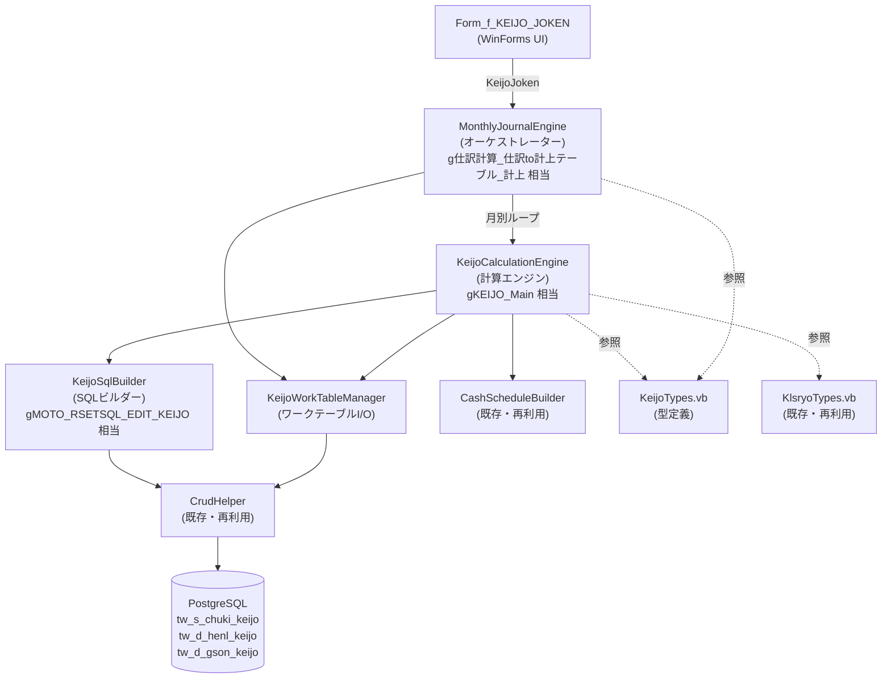
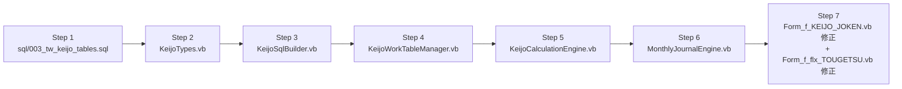

# 設計書: monthly-journal-engine

## 1. 設計方針

### 既存アーキテクチャとの整合性
- `KlsryoCalculationEngine.vb` と同一クラス設計パターンを採用する
  - `Private _crud As New CrudHelper()` でDB操作
  - `Public Function Execute(...)` をメインエントリポイントとする
  - 内部処理は Private メソッドで分割（Access版の GoSub 相当）
- `KlsryoTypes.vb` に定義済みの `RecKbn`, `ShriKtmg`, `ShriMeisai`, `Kkbn`, `Kjkbn`, `HaifInfo` をそのまま再利用する
- `CashScheduleBuilder` をそのまま再利用する（定額/変額/付随費用スケジュール生成）

### 採用する設計パターン
- **ワークテーブル方式**: `KlsryoCalculationEngine` は DataTable を返すが、KEIJO エンジンは Access 版に倣い PostgreSQL のワークテーブル（`tw_s_chuki_keijo` 等）に書き込む
  - 後続処理（仕訳出力）がワークテーブルを参照するため、永続化が必要
  - `KlsryoCalculationEngine.CalcKlsryoFromSchedule` は Private のため、KEIJOエンジン内に同等ロジック `CalcKeijoFromSchedule` を複製する（Access版の構造に忠実）
- **型定義の分離**: `KeijoJoken`、`KeijoResult` は新規ファイル `KeijoTypes.vb` に定義する（既存 `KlsryoTypes.vb` はこれ以上肥大化させない）

### 技術的判断の根拠
- `CalcKlsryoFromSchedule` の複製: KEIJO版は月別内訳(G01-G12)・翌期年度別残高が不要な代わり、`KEIJO_DT`・`KEIJO_F`・`HENSAI_KIND`・`MAE_ZOU/GEN` が追加になり、KlsryoResult を継承するより独立した KeijoResult 型の方が設計が明確
- SQL ワークテーブル方式: 後続の仕訳出力処理（#11-#13）がワークテーブルを参照する前提のため
- `MonthlyJournalEngine` が `KeijoCalculationEngine` を内包するオーケストレーター構成: Access版 `g仕訳計算_仕訳to計上テーブル_計上` が `gKEIJO_Main` を月別ループで呼ぶ構造に対応

---

## 2. コンポーネント構成図



---

## 3. ファイル構成

### 新規作成ファイル

| ファイルパス | 責務 | 依存先 |
|---|---|---|
| `sql/003_tw_keijo_tables.sql` | ワークテーブル DDL (`tw_s_chuki_keijo`, `tw_d_henl_keijo`, `tw_d_gson_keijo`) | なし |
| `LeaseM4BS/LeaseM4BS.DataAccess/KeijoTypes.vb` | 型定義（`KeijoJoken`, `KeijoResult`）と `HensaiKind` Enum | `KlsryoTypes.vb` の Enum 再利用 |
| `LeaseM4BS/LeaseM4BS.DataAccess/KeijoSqlBuilder.vb` | 計上用ソースデータSQL構築 | `CrudHelper.vb`, `KlsryoTypes.vb` |
| `LeaseM4BS/LeaseM4BS.DataAccess/KeijoCalculationEngine.vb` | 計上計算エンジン本体（`gKEIJO_Main` 相当） | `KeijoSqlBuilder.vb`, `CashScheduleBuilder.vb`, `KeijoTypes.vb`, `KlsryoTypes.vb`, `CrudHelper.vb` |
| `LeaseM4BS/LeaseM4BS.DataAccess/KeijoWorkTableManager.vb` | ワークテーブルへのINSERT/DELETE | `CrudHelper.vb`, `KeijoTypes.vb` |
| `LeaseM4BS/LeaseM4BS.DataAccess/MonthlyJournalEngine.vb` | 月別ループを制御するオーケストレーター（`g仕訳計算_仕訳to計上テーブル_計上` 相当） | `KeijoCalculationEngine.vb`, `KeijoWorkTableManager.vb`, `KeijoTypes.vb`, `CrudHelper.vb` |

### 変更ファイル

| ファイルパス | 変更内容 | 影響範囲 |
|---|---|---|
| `LeaseM4BS.TestWinForms/Form_f_KEIJO_JOKEN.vb` | [実行]ボタンから `MonthlyJournalEngine.Execute()` を呼び出す実装を追加 | 当該フォームのみ |
| `LeaseM4BS.TestWinForms/Form_f_flx_TOUGETSU.vb` | `BuildSql()` を `tw_s_chuki_keijo` 参照に変更、計算済みデータの表示 | 当該フォームのみ |

---

## 4. データモデル

### KeijoJoken（入力パラメータ）

```vb
' Access版: gKEIJO_Main 引数 + g仕訳計算_仕訳to計上テーブル_計上 引数を統合
Public Class KeijoJoken
    Public Property KeijoFrom As Date       ' 集計期間FROM (Access: dte_aKIKAN_FROM)
    Public Property KeijoTo As Date         ' 集計期間TO   (Access: dte_aKIKAN_TO)
    Public Property Taisho As Integer       ' 集計対象: 1=リース料, 2=保守料, 3=全部
    Public Property Meisai As ShriMeisai    ' 明細単位: 1=物件単位, 2=配賦単位
    Public Property HensaiKindShinhoHiyo As HensaiKind  ' 新法費用の返戻方法 (Access: ia返戻方法_新旧対応)
    Public Property KjkbnSisan As Boolean   ' 資産計上フラグ (Access: bgKJ_FLG_SISAN)
    Public Property KjkbnHiyo As Boolean    ' 費用計上フラグ (Access: bgKJ_FLG_HIYO)
    Public Property SokuzuShoriF As Boolean ' 速及処理完了残高当月埋フラグ (Access: fa処理完了残高当月埋_F)
    Public Property SaJoken As String       ' ユーザー指定フィルタ条件 (Access: saJoken)
End Class
```

### KeijoResult（計算結果型）

```vb
' Access版 cn_typ_mKEIJO に対応 (KlsryoResult との差分部分のみ)
' KEIJO では月別内訳(G01-G12)・翌期年度別残高・前期末残高・期末残高は不要
' 代わりに以下を追加:
Public Class KeijoResult
    Public Property Soukaisu As Object          ' 総回数 (Null可)
    Public Property SumikaisuZen As Object      ' 済回数・前期以前 (Null可)
    Public Property KeijoShriCnt As Integer     ' 当月計上回数
    Public Property LsryoTotal As Double        ' 税抜支払総額
    Public Property LsryoToki As Double         ' 当月計上額
    Public Property ZeiTotal As Double          ' 税額総額
    Public Property ZeiToki As Double           ' 当月税額
    Public Property TaishoF As Boolean          ' 一覧表示対象フラグ
    Public Property KeijoF As Boolean           ' 計上フラグ (KEIJO_DT が非NULL)
    Public Property LcptId As Object            ' 支払先ID
    Public Property HkmkId As Object            ' 費用科目ID
    Public Property ShriDt As Object            ' 当月支払日
    Public Property Zritu As Double             ' 消費税率
    Public Property ShhoId As Object            ' 支払方法ID
    Public Property LineId As Object            ' 配賦行ID
    Public Property Haifritu As Object          ' 配賦率
    Public Property HBcatId As Object           ' 費用負担部署ID
    Public Property Rsrvh1Id As Object          ' 予備ID(配賦)
    Public Property HZokusei1 As Object         ' 属性値1
    Public Property HZokusei2 As Object         ' 属性値2
    Public Property HZokusei3 As Object         ' 属性値3
    Public Property HZokusei4 As Object         ' 属性値4
    Public Property HZokusei5 As Object         ' 属性値5
    Public Property GsonDt As Object            ' 減損日
    Public Property RecKbn As RecKbn            ' レコード区分 (1:定額, 2:変額, 3:付随費用)
    Public Property KejDt As Object             ' 計上日 (= 支払日)
    Public Property HensaiKind As HensaiKind    ' 返戻方法
    Public Property MaeZou As Double            ' 前払・増加
    Public Property MaeGen As Double            ' 前払・減少
    Public Property MzeiZou As Double           ' 前払(消費税)・増加
    Public Property MzeiGen As Double           ' 前払(消費税)・減少
End Class
```

### HensaiKind Enum

```vb
' Access版 engHENSAI_KIND に対応
Public Enum HensaiKind
    Teigaku = 1     ' 定額
    HendoRiritsu = 2 ' 変動利率
    Kinto = 3       ' 均等
End Enum
```

---

## 5. インターフェース設計

### MonthlyJournalEngine.vb

```vb
' Access版 g仕訳計算_仕訳to計上テーブル_計上 に対応
Public Class MonthlyJournalEngine

    ''' <summary>
    ''' 月次仕訳計上処理メイン (Access版 g仕訳計算_仕訳to計上テーブル_計上)
    ''' ワークテーブルクリア → KeijoCalculationEngine 月別呼び出し → 繰越処理
    ''' </summary>
    ''' <returns>書き込み件数</returns>
    Public Function Execute(joken As KeijoJoken) As Integer

    ' Private: ワークテーブルクリア
    Private Sub ClearWorkTables()

    ' Private: 月別ループ (Access版 m仕訳計算_仕訳to集計TBL_SUB のループ部分)
    Private Function ExecuteMonthlyLoop(joken As KeijoJoken) As Integer
```

### KeijoCalculationEngine.vb

```vb
' Access版 gKEIJO_Main に対応
Public Class KeijoCalculationEngine

    ''' <summary>
    ''' 計上計算エンジンメイン (Access版 gKEIJO_Main)
    ''' 1ヶ月分の計上データを計算し、リストとして返す
    ''' </summary>
    Public Function Execute(
        joken As KeijoJoken,
        kishuDt As Date,
        kimatDt As Date
    ) As List(Of KeijoWorkRow)
    ' KeijoWorkRow = tw_s_chuki_keijo の1行に対応する値オブジェクト

    ' Private: ソースデータ取得 (Access版 gMOTO_RSETSQL_EDIT_KEIJO)
    Private Function GetSourceData(
        kishuDt As Date, kimatDt As Date,
        joken As KeijoJoken
    ) As DataTable

    ' Private: 集計対象判定 (Access版 mCHK_集計対象 - KEIJO版)
    Private Function IsTargetRecord(
        kishuDt As Date, kimatDt As Date,
        ktmg As ShriKtmg, row As DataRow
    ) As Boolean

    ' Private: 物件単位処理 (Access版 mKEIJO_Sub_KYKM)
    Private Function ProcessKykm(
        sourceDt As DataTable,
        kishuDt As Date, kimatDt As Date, y1kimatDt As Date,
        joken As KeijoJoken
    ) As List(Of KeijoWorkRow)

    ' Private: 配賦単位処理 (Access版 mKEIJO_Sub_HAIF)
    Private Function ProcessHaif(
        sourceDt As DataTable,
        kishuDt As Date, kimatDt As Date, y1kimatDt As Date,
        joken As KeijoJoken
    ) As List(Of KeijoWorkRow)

    ' Private: 付随費用処理 (Access版 mKEIJO_Sub_HENF)
    Private Function ProcessHenf(
        kishuDt As Date, kimatDt As Date, y1kimatDt As Date,
        joken As KeijoJoken
    ) As List(Of KeijoWorkRow)

    ' Private: コア計算 (Access版 mCALC_KEIJOfromSCH)
    ' KlsryoCalculationEngine.CalcKlsryoFromSchedule の KEIJO 版
    ' 月別内訳(G01-G12)不要、KEIJO_DT/KEIJO_F/SHRI_DT/HENSAI_KIND を算出
    Private Function CalcKeijoFromSchedule(
        ktmg As ShriKtmg,
        kishuDt As Date, kimatDt As Date, y1kimatDt As Date,
        vaStartDt As Object, vaRendDt As Object,
        jenchoF As Boolean,
        schedule As List(Of CashScheduleEntry)
    ) As KeijoResult

    ' Private: スケジュールから KeijoWorkRow 生成 (Access版 mKEIJO_Sub_SCHtoWK)
    ' スケジュール各エントリを1行として出力
    Private Function ScheduleToWorkRows(
        schedule As List(Of CashScheduleEntry),
        keijoResult As KeijoResult,
        sourceRow As DataRow,
        kishuDt As Date, kimatDt As Date,
        ktmg As ShriKtmg,
        hensaiKind As HensaiKind
    ) As List(Of KeijoWorkRow)

    ' Private: 不要行補完出力 (Access版 mKEIJO_Sub_SCHtoWK_ADD)
    Private Sub AddSupplementRows(
        rows As List(Of KeijoWorkRow),
        keijoResult As KeijoResult,
        hensaiKind As HensaiKind,
        sourceRow As DataRow
    )

    ' Private: 遡及補正 (Access版 mUPD_CASHSCH_SOKYU)
    Private Sub ApplySokyu(
        kjyoStDt As Object,
        schedule As List(Of CashScheduleEntry),
        ktmg As ShriKtmg
    )

    ' Private: 返戻方法・計上タイミング決定
    Private Function DetermineHensaiKindAndKtmg(
        row As DataRow,
        joken As KeijoJoken,
        sekouDt As Date
    ) As (HensaiKind As HensaiKind, Ktmg As ShriKtmg)

    ' Private: 法令区分取得 (Access版 mGET_法令区分)
    Private Function GetHoreiKbn(kyakDt As Object, startDt As Object, sekouDt As Date) As String

    ' Private: 施行日取得 (KlsryoCalculationEngine.GetSekouDt と同一)
    Private Function GetSekouDt() As Date

    ' Private: マスタ名称取得 (KlsryoCalculationEngine.GetNameFromMaster と同一)
    Private Function GetNameFromMaster(sql As String, id As Object) As Object

    ' Private Shared: Double 型安全取得 (KlsryoCalculationEngine.GetDbl と同一)
    Private Shared Function GetDbl(row As DataRow, colName As String) As Double
```

### KeijoSqlBuilder.vb

```vb
' Access版 gMOTO_RSETSQL_EDIT_KEIJO に対応
Public Class KeijoSqlBuilder

    ''' <summary>
    ''' 計上用ソースデータSQL構築 (Access版 gMOTO_RSETSQL_EDIT_KEIJO)
    ''' KlsryoCalculationEngine.GetSourceData に計上区分フィルタを追加したバリアント
    ''' </summary>
    Public Shared Function BuildSourceSql(
        meisai As ShriMeisai,
        taisho As Integer,
        kjkbnSisan As Boolean,
        kjkbnHiyo As Boolean
    ) As (Sql As String, Parameters As List(Of NpgsqlParameter))

    ''' <summary>付随費用用ソースSQL構築</summary>
    Public Shared Function BuildHenfSql(
        meisai As ShriMeisai
    ) As String

    ''' <summary>減損用ソースSQL構築</summary>
    Public Shared Function BuildGsonSql(kykmId As Integer) As String
```

### KeijoWorkTableManager.vb

```vb
' Access版のワークテーブル操作 (rslTO への AddNew/Update) に対応
Public Class KeijoWorkTableManager

    ''' <summary>
    ''' ワークテーブル全データ削除 (Execute 開始前クリア)
    ''' </summary>
    Public Sub ClearAll(crud As CrudHelper)

    ''' <summary>
    ''' tw_s_chuki_keijo への INSERT (定額・付随費用行)
    ''' </summary>
    Public Function InsertChukiKeijo(
        crud As CrudHelper,
        rows As List(Of KeijoWorkRow)
    ) As Integer

    ''' <summary>
    ''' tw_d_henl_keijo への INSERT (変額行)
    ''' </summary>
    Public Function InsertHenlKeijo(
        crud As CrudHelper,
        rows As List(Of KeijoWorkRow)
    ) As Integer

    ''' <summary>
    ''' tw_d_gson_keijo への INSERT (減損行)
    ''' </summary>
    Public Function InsertGsonKeijo(
        crud As CrudHelper,
        rows As List(Of KeijoWorkRow)
    ) As Integer
```

### KeijoWorkRow（中間値オブジェクト）

```vb
' tw_s_chuki_keijo の1行分のデータを保持する値オブジェクト
' Access版 rslTO への AddNew/Update の代替
Public Class KeijoWorkRow
    ' 契約情報
    Public Property KykmId As Double
    Public Property KykhId As Double
    Public Property KykmNo As Double
    Public Property SaikaisuKykm As Object
    Public Property BuknNm As String
    Public Property KykbnlNo As String
    ' 計上条件
    Public Property KkbnId As Object
    Public Property KjkbnId As Object
    Public Property LeakbnId As Object
    Public Property LcptId As Object
    ' 計算パラメータ
    Public Property HensaiKind As HensaiKind
    Public Property RecKbn As RecKbn
    ' スケジュール1行分
    Public Property ShriDt As Date
    Public Property SimeDt As Date
    Public Property Lsryo As Double
    Public Property Zei As Double
    Public Property Zritu As Double
    Public Property ShhoId As Object
    Public Property MaeF As Boolean
    Public Property CkaiykF As Boolean
    ' 計上結果
    Public Property KeijoF As Boolean
    Public Property KejoDt As Object
    Public Property SumikaisuZen As Object
    Public Property KeijoShriCnt As Integer
    Public Property LsryoTotal As Double
    Public Property LsryoToki As Double
    Public Property ZeiTotal As Double
    Public Property ZeiToki As Double
    ' 配賦情報
    Public Property LineId As Object
    Public Property Haifritu As Object
    Public Property HkmkId As Object
    Public Property HBcatId As Object
    Public Property Rsrvh1Id As Object
    Public Property HZokusei1 As Object
    Public Property HZokusei2 As Object
    Public Property HZokusei3 As Object
    Public Property HZokusei4 As Object
    Public Property HZokusei5 As Object
    ' 前払情報
    Public Property MaeZou As Double
    Public Property MaeGen As Double
    Public Property MzeiZou As Double
    Public Property MzeiGen As Double
    ' 減損情報
    Public Property GsonDt As Object
    ' 処理日
    Public Property ShoriDt As Object
    ' ターゲットテーブル識別 (Chuki/Henl/Gson)
    Public Property TargetTable As KeijoTargetTable
End Class

Public Enum KeijoTargetTable
    ChukiKeijo = 1   ' tw_s_chuki_keijo
    HenlKeijo = 2    ' tw_d_henl_keijo
    GsonKeijo = 3    ' tw_d_gson_keijo
End Enum
```

---

## 6. 状態管理設計

### MonthlyJournalEngine の状態フロー

```
Execute(joken)
├── _crud.BeginTransaction()
├── workTableMgr.ClearAll(_crud)
│   ├── DELETE tw_s_chuki_keijo
│   ├── DELETE tw_d_henl_keijo
│   └── DELETE tw_d_gson_keijo
├── ExecuteMonthlyLoop(joken)
│   └── FOR 各月 (joken.KeijoFrom 〜 joken.KeijoTo, 月単位):
│       ├── kishuDt = 月初日
│       ├── kimatDt = 月末日
│       ├── engine = New KeijoCalculationEngine()
│       ├── rows = engine.Execute(joken, kishuDt, kimatDt)
│       ├── workTableMgr.InsertChukiKeijo(_crud, rows.Where(Chuki))
│       ├── workTableMgr.InsertHenlKeijo(_crud, rows.Where(Henl))
│       └── workTableMgr.InsertGsonKeijo(_crud, rows.Where(Gson))
├── _crud.Commit()
└── [例外時] _crud.Rollback()
```

### KeijoCalculationEngine.Execute の内部状態フロー

```
Execute(joken, kishuDt, kimatDt)
├── y1kimatDt = kimatDt の1年後月末
├── sekouDt = GetSekouDt()
├── sourceDt = GetSourceData(kishuDt, kimatDt, joken)
├── resultRows = New List(Of KeijoWorkRow)
├── SELECT joken.Meisai:
│   ├── Kykm: resultRows.AddRange(ProcessKykm(sourceDt, kishuDt, kimatDt, y1kimatDt, joken))
│   └── Haif: resultRows.AddRange(ProcessHaif(sourceDt, kishuDt, kimatDt, y1kimatDt, joken))
├── IF taisho=2 or 3: resultRows.AddRange(ProcessHenf(kishuDt, kimatDt, y1kimatDt, joken))
└── Return resultRows
```

---

## 7. DB設計

### sql/003_tw_keijo_tables.sql の内容

#### tw_s_chuki_keijo（仕訳計上メインワークテーブル）

Access版 `tw_S_CHUKI_KEIJO` に相当。仕訳計上計算結果の格納テーブル。

| カラム名 | 型 | NULL | コメント |
|---|---|---|---|
| kykm_id | double precision | NOT NULL | 物件明細ID |
| kykh_id | double precision | NULL | 契約ヘッダID |
| kykm_no | double precision | NULL | 物件No |
| saikaisu | smallint | NULL | 再リース回数 |
| bukn_nm | varchar(100) | NULL | 物件名 |
| kykbnl | varchar(30) | NULL | 契約番号 |
| start_dt | timestamp | NULL | 開始日 |
| b_rend_dt | timestamp | NULL | 実際終了日 |
| kyak_dt | timestamp | NULL | 契約日 |
| kkbn_id | smallint | NULL | 契約区分 |
| kjkbn_id | smallint | NULL | 計上区分 |
| leakbn_id | smallint | NULL | リース区分 |
| lcpt_id | integer | NULL | 支払先ID |
| lcpt_nm | varchar(200) | NULL | 支払先名 |
| rcalc_id | smallint | NULL | 利率計算方法ID |
| skyak_ho_id | smallint | NULL | 契約方法ID |
| hensai_kind | smallint | NULL | 返戻方法 (1:定額 2:変動利率 3:均等) |
| soukaisu | smallint | NULL | 総回数 |
| sumikaisu_zen | smallint | NULL | 済回数（前期以前） |
| keijo_shri_cnt | smallint | NULL | 当月計上回数 |
| lsryo_total | double precision | NULL | 税抜支払総額 |
| lsryo_toki | double precision | NULL | 当月計上額（税抜） |
| zei_total | double precision | NULL | 税額総額 |
| zei_toki | double precision | NULL | 当月税額 |
| taisho_f | boolean | NULL | 一覧表示対象フラグ |
| keijo_f | boolean | NULL | 計上フラグ |
| rec_kbn | smallint | NULL | レコード区分 (1:定額 2:変額 3:付随費用) |
| shri_dt | timestamp | NULL | 当月支払日 |
| sime_dt | timestamp | NULL | 当月締日 |
| zritu | double precision | NULL | 消費税率 |
| shho_id | integer | NULL | 支払方法ID |
| shho_nm | varchar(100) | NULL | 支払方法名 |
| mae_f | boolean | NULL | 前払フラグ |
| ckaiyk_f | boolean | NULL | 中途解約フラグ |
| keijo_dt | timestamp | NULL | 計上日 (= 支払日) |
| shori_dt | timestamp | NULL | 処理日（月末日） |
| line_id | smallint | NULL | 配賦行ID |
| haifritu | double precision | NULL | 配賦率 |
| hkmk_id | integer | NULL | 費用科目ID |
| h_bcat_id | integer | NULL | 費用負担部署ID |
| rsrvh1_id | integer | NULL | 予備ID（配賦） |
| h_zokusei1 | varchar(100) | NULL | 属性値1 |
| h_zokusei2 | varchar(100) | NULL | 属性値2 |
| h_zokusei3 | varchar(100) | NULL | 属性値3 |
| h_zokusei4 | varchar(100) | NULL | 属性値4 |
| h_zokusei5 | varchar(100) | NULL | 属性値5 |
| mae_zou | double precision | NULL | 前払・増加 |
| mae_gen | double precision | NULL | 前払・減少 |
| mzei_zou | double precision | NULL | 前払（消費税）・増加 |
| mzei_gen | double precision | NULL | 前払（消費税）・減少 |
| gson_dt | timestamp | NULL | 減損日 |
| lsryo | double precision | NULL | スケジュール1行の支払額（税抜） |
| zei | double precision | NULL | スケジュール1行の税額 |
| chu_hnti_id | smallint | NULL | 注記単位ID |

#### tw_d_henl_keijo（変額仕訳ワークテーブル）

Access版 `tw_D_HENL_KEIJO` に相当。変額リース計上結果を格納。

`tw_s_chuki_keijo` と同一スキーマ（`rec_kbn = 2` のレコードが格納される）。

| カラム名 | 型 | NULL | コメント |
|---|---|---|---|
| （tw_s_chuki_keijo と同一スキーマ） | | | |

#### tw_d_gson_keijo（減損仕訳ワークテーブル）

Access版 `tw_D_GSON_KEIJO` に相当。減損計上結果を格納。

| カラム名 | 型 | NULL | コメント |
|---|---|---|---|
| kykm_id | double precision | NOT NULL | 物件明細ID |
| kykh_id | double precision | NULL | 契約ヘッダID |
| kjkbn_id | smallint | NULL | 計上区分 |
| gson_dt | timestamp | NULL | 減損日 |
| gson_tmg | smallint | NULL | 減損タイミング |
| gson_ryo | double precision | NULL | 減損額 |
| gson_nm | varchar(40) | NULL | 減損名称 |
| lsryo_toki | double precision | NULL | 当月計上額 |
| keijo_dt | timestamp | NULL | 計上日 |
| shori_dt | timestamp | NULL | 処理日 |

---

## 8. エラーハンドリング方針

### エラーの種類と対処方法

| エラー種別 | 対処方法 |
|---|---|
| DB接続エラー・SQL実行エラー | `CrudHelper` が詳細メッセージを付加するため、キャッチせず呼び出し元に伝播させる |
| `MonthlyJournalEngine.Execute` 内の例外 | `Try/Finally` で `_crud.Rollback()` を確実に呼び出す |
| 計算エラー（整合性違反） | `InvalidOperationException` をスローし、kykm_id と詳細情報をメッセージに含める |
| NULL参照 | `IsDBNull()` と `GetDbl()` ヘルパーで防御的に処理（KlsryoCalculationEngine と同一パターン） |

### トランザクション管理

```vb
' MonthlyJournalEngine.Execute のパターン
_crud.BeginTransaction()
Try
    ' ... ワークテーブル操作 ...
    _crud.Commit()
    Return totalRows
Catch ex As Exception
    _crud.Rollback()
    Throw
End Try
```

---

## 9. 実装順序



### Step 1: `sql/003_tw_keijo_tables.sql` — ワークテーブル DDL 作成
- 依存: なし
- 作業: `tw_s_chuki_keijo`, `tw_d_henl_keijo`, `tw_d_gson_keijo` の CREATE TABLE 文を記述
- `tw_d_henl_keijo` は `tw_s_chuki_keijo` と同一スキーマ（共通 DDL で作成）

### Step 2: `KeijoTypes.vb` — 型定義
- 依存: `KlsryoTypes.vb`（RecKbn, ShriKtmg, ShriMeisai 等を参照）
- 作業: `KeijoJoken`, `KeijoResult`, `HensaiKind` Enum, `KeijoWorkRow`, `KeijoTargetTable` Enum を定義

### Step 3: `KeijoSqlBuilder.vb` — SQLビルダー
- 依存: Step 2（KlsryoTypes）
- 作業: `BuildSourceSql()`, `BuildHenfSql()`, `BuildGsonSql()` を実装
- `KlsryoCalculationEngine.GetSourceData` と同等だが、計上区分フィルタ（kjkbn_id）を追加

### Step 4: `KeijoWorkTableManager.vb` — ワークテーブルI/O
- 依存: Step 2（KeijoTypes）
- 作業: `ClearAll()`, `InsertChukiKeijo()`, `InsertHenlKeijo()`, `InsertGsonKeijo()` を実装
- `CrudHelper.Insert()` を使用して各テーブルに書き込む

### Step 5: `KeijoCalculationEngine.vb` — 計算エンジン本体
- 依存: Step 2, 3, 4（KeijoTypes, KeijoSqlBuilder）+ `CashScheduleBuilder`（既存）+ `CrudHelper`（既存）
- 作業:
  - `Execute()`, `GetSourceData()`, `IsTargetRecord()` を実装（KlsryoCalculationEngine からほぼ移植）
  - `CalcKeijoFromSchedule()` を実装（KlsryoCalculationEngine.CalcKlsryoFromSchedule の KEIJO 版）
    - 月別内訳(G01-G12)・翌期年度別残高の計算を削除
    - `KEIJO_DT`（支払日）・`KEIJO_F`・`KEIJO_SHRI_CNT` の算出を追加
  - `ProcessKykm()`, `ProcessHaif()`, `ProcessHenf()` を実装
  - `DetermineHensaiKindAndKtmg()` で資産/費用・旧法/新法・移転外 の分岐を実装
  - `ApplySokyu()` で遡及処理（`mUPD_CASHSCH_SOKYU`）を実装
  - `ScheduleToWorkRows()` でスケジュール各エントリを `KeijoWorkRow` に変換

### Step 6: `MonthlyJournalEngine.vb` — オーケストレーター
- 依存: Step 2, 4, 5（KeijoTypes, KeijoWorkTableManager, KeijoCalculationEngine）+ `CrudHelper`（既存）
- 作業:
  - `Execute()` でトランザクション管理 + 月別ループを実装
  - `ClearWorkTables()` でワークテーブルをクリア
  - `ExecuteMonthlyLoop()` で月ごとに `KeijoCalculationEngine.Execute()` を呼び出し、結果を `KeijoWorkTableManager` に書き込む

### Step 7: フォーム修正
- 依存: Step 6（MonthlyJournalEngine）
- `Form_f_KEIJO_JOKEN.vb`: [実行]ボタンのハンドラで `MonthlyJournalEngine.Execute(joken)` を呼び出す
- `Form_f_flx_TOUGETSU.vb`: `BuildSql()` を `tw_s_chuki_keijo` 参照に変更
