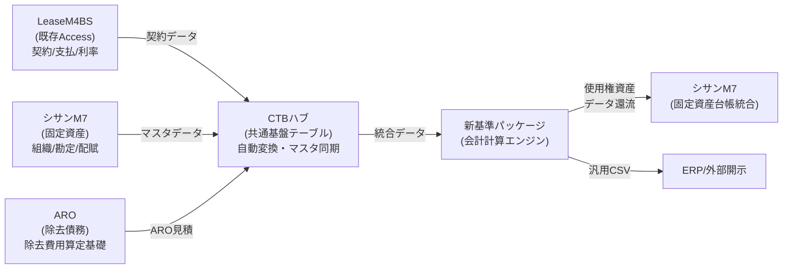

# 基本設計書：LeaseM4BS（リースM4BS）

**ドキュメント番号**: BD-2026-002
**バージョン**: 2.2
**作成日**: 2026年3月9日
**最終更新**: 2026年3月11日
**ステータス**: ドラフト
**情報ソース**: コードベース調査資料（01_code_research.md）+ Google Drive全ドキュメント

---

## 改訂履歴

| バージョン | 日付 | 変更内容 |
|---|---|---|
| 2.2 | 2026/03/11 | 共有ドライブ資料（2026/3/4-6）に基づく更新: §1.1に3システム連携アーキテクチャ追加 |
| 2.1 | 2026/03/09 | レビュー結果(REV-2026-001)に基づく修正: §3.1 CrudHelperメソッド表を実際の実装に全面修正[02-001]、§4.2データ採番パターンをFrmFlexContractに修正[02-002]、§2.3会計タブレイアウト図を3セクション構成に修正[02-003]、§3.2 AddSectionLabelヘルパーを追加[02-004]、DataAccessErrorCode SQLSTATE修正・LeaseM4BS未実装明記[02-005]、§5.1 schプレフィックス説明修正[02-006]、§2.2起動方式追記[02-007] |
| 2.0 | 2026/03/09 | コードベース調査資料に基づく全面改訂 |

---

## 1. アーキテクチャ設計

### 1.1 全体アーキテクチャ

本システムは2つのリポジトリから構成され、それぞれ異なるアーキテクチャパターンを採用している。

#### シサンM7（ms-access-migration）: 3層 + MVP Passive View

```
┌─────────────────────────────────────────────────────┐
│              UI層 (Windows Forms)                     │
│  Forms / Presenters / Controls                       │
│  パターン: MVP (Passive View)                         │
├───────────────────┬─────────────────────────────────┤
                    │ Interface (IView)
├───────────────────┴─────────────────────────────────┤
│           Business層 (新規構築中)                      │
│  Services / Models / Commands / Navigation           │
├───────────────────┬─────────────────────────────────┤
                    │ Interface (IRepository)
├───────────────────┴─────────────────────────────────┤
│           DataAccess層 (構築済み)                      │
│  Entity-Repository / CrudHelper / DbConnectionMgr   │
├───────────────────┬─────────────────────────────────┤
                    │ Npgsql (TCP/IP)
├───────────────────┴─────────────────────────────────┤
│             PostgreSQL (m7_db)                        │
│             421テーブル構築済み                         │
└─────────────────────────────────────────────────────┘
```

#### LeaseM4BS (LeaseM4BS-1): WinForms Code-Behind + Helper Class

```
┌─────────────────────────────────────────────────────┐
│    プレゼンテーション層 (LeaseM4BS.TestWinForms)       │
│  FrmFlexMenu / FrmFlexContract /                     │
│  FrmLeaseContractMain / FrmAssetDetailEntry          │
│  パターン: WinForms Code-Behind（イベント駆動型）       │
├───────────────────┬─────────────────────────────────┤
                    │ 直接呼び出し
├───────────────────┴─────────────────────────────────┤
│     データアクセス層 (LeaseM4BS.DataAccess)            │
│  CrudHelper / DbConnectionManager                    │
│  パターン: DAO的Helper Class                          │
├───────────────────┬─────────────────────────────────┤
                    │ Npgsql 6.0.11
├───────────────────┴─────────────────────────────────┤
│             PostgreSQL (lease_m4bs)                   │
└─────────────────────────────────────────────────────┘
```

#### 3システム連携アーキテクチャ（新リース会計基準対応）

ASBJ第34号/第33号（2024年9月公表）への対応として、既存のLeaseM4BS・シサンM7に加え、新基準パッケージを共通基盤テーブル（CTB）で連携する3システム統合アーキテクチャを採用する。詳細は「14_製品戦略・システム連携構想書（STR-2026-001）」を参照。



**データフローの要点:**

| データソース | 方向 | 提供データ |
|---|---|---|
| LeaseM4BS (既存Access) | → CTBハブ | 契約情報・支払条件・利率データ |
| シサンM7 (固定資産) | → CTBハブ | 組織マスタ・勘定科目・配賦ルール |
| ARO (除去債務) | → CTBハブ | 除去費用算定基礎データ |
| 新基準パッケージ | → シサンM7 | 使用権資産データ還流（自動書き戻し） |
| 新基準パッケージ | → ERP/外部開示 | 汎用CSV出力（仕訳データ等） |

### 1.2 レイヤー構成と責務

| レイヤー | プロジェクト | 責務 |
|---|---|---|
| プレゼンテーション層 | LeaseM4BS.TestWinForms | WinForms画面、ユーザーインタラクション、計算ロジックの一部 |
| データアクセス層 | LeaseM4BS.DataAccess | PostgreSQL接続管理、CRUD操作の抽象化 |
| テスト層 | LeaseM4BS.Tests | MSTestによる単体テスト |

---

## 2. 画面設計

### 2.1 画面遷移図

```
[FrmFlexMenu（メインメニュー）]
  ├── btnContract → [FrmFlexContract（契約書一覧）]
  │                    └── ボタン → [FrmLeaseContractMain（リース契約詳細）]
  │                                    ├── pgContract（契約タブ）
  │                                    │   └── ボタン → [FrmAssetDetailEntry（資産詳細）]
  │                                    ├── pgInitial（初回金タブ）
  │                                    ├── pgAccounting（会計タブ）←改修対象
  │                                    ├── pgSublease（転貸タブ）
  │                                    └── pgJudgment（リース判定タブ）
  ├── btnROUAsset → [FrmFlexROUAsset]      ※プレースホルダ
  ├── btnMonthlyPayments → [FrmFlexMonthlyPayments]   ※プレースホルダ
  ├── btnMonthlyAccounting → [FrmFlexMonthlyAccounting] ※プレースホルダ
  ├── btnPeriodBalance → [FrmFlexPeriodBalance]   ※プレースホルダ
  └── btnTaxAdjustment → [FrmFlexTaxAdjustment]   ※プレースホルダ
```

### 2.2 画面遷移方式

- FrmFlexMenu: `SwitchContent(menuButton)` で子画面（UserControl）を動的切替
- FrmLeaseContractMain: FrmFlexContract上のボタンから新規インスタンスとして起動。`frm.Show()` でモードレス表示（複数インスタンス同時起動可能）
- FrmAssetDetailEntry: FrmLeaseContractMainからポップアップ起動（PopupBaseForm継承）

### 2.3 会計タブ詳細レイアウト（改修対象）

```
┌──────────────────────────────────────────────────────────┐
│ [現契約期間 + 現支払情報] BuildAccSchTopRowSection()       │
│  ※読み取り専用（契約タブから自動転記）                      │
├──────────────────────────────────────────────────────────┤
│ [会計期間] BuildAccSchAccountingSection()                  │
│  会計期間・金額の表形式入力                                 │
│  ┌────────────────────────────────────────────┐          │
│  │ 返済スケジュールマトリックス              │          │
│  │  ROU: 期首・増加・変更増減・減少・期末    │          │
│  │  Liab: 期首・増加・変更増減・減少・期末   │          │
│  │  ARO: 期首・増加・変更増減・減少・期末    │          │
│  └────────────────────────────────────────────┘          │
├──────────────────────────────────────────────────────────┤
│ [変更履歴] BuildAccChangeHistorySection()                  │
│  DataGridViewによる変更履歴表示                             │
└──────────────────────────────────────────────────────────┘
```

### 2.4 リース判定タブ（pgJudgment）レイアウト

> **注意**: 「FrmLeaseJudgment」という独立フォームは存在しない。リース判定機能は `FrmLeaseContractMain.vb` の `pgJudgment` タブ（`InitTabJudge_Pro()` で構築）として実装されている。FrmLeaseContractMainのヘッダーボタンを共用し、独自ヘッダーボタンは持たない。

Google Driveの設計書に基づき、pgJudgmentタブ内に以下のセクションが構成される。

```
┌──────────────────────────────────────────────────────────┐
│ [FrmLeaseContractMainヘッダー]                             │
│  [登録][修正・変更][更新・満了解約][中途解約][削除]         │
├──────────────────────────────────────────────────────────┤
│ [pgJudgmentタブ内: セクション1: grpHeader → 契約/管理情報]│
│  cboAssetBreakdown / cboMgmt / cboCost                   │
│  txtNo / txtName / txtGroup / cboYoto / txtKinsi         │
├──────────────────────────────────────────────────────────┤
│ [セクション2: grpAsset → 物件属性] ※実装済み              │
│  txtBukken / txtKuaku / txtMens / txtAddr / txtMadori    │
│  dtpShunko / txtKibo / numTaiyo / numChikun              │
├──────────────────────────────────────────────────────────┤
│ [セクション3: grpParty → 契約詳細・関係者] ←新規追加       │
│  貸主(txtLenderName/Addr/Account)                        │
│  代行者(txtAgentName/Addr)                               │
│  仲介者(txtBrokerName/Addr/Account)                      │
│  借主(txtBorrowerName/Addr/Account)                      │
│  連帯保証人(txtGuarantor1/2)                             │
│  日付(dtpStartDate/EndDate) 期間(numContractMonths)       │
│  解約(txtNonCancelPeriod/cboCancelOption)                │
│  延長(cboExtendOption/numRenewalCount)                   │
├──────────────────────────────────────────────────────────┤
│ [セクション4: dgvSchedule → 支払スケジュール] ※実装済み   │
│  種別|1回支払額|初回支払日|支払間隔|総支払回数|最終支払日   │
│  賃料合計|連続月数|契約月月数|維持管理費|残価保証額...      │
├──────────────────────────────────────────────────────────┤
│ [セクション5: pnlResult → 会計判定結果] ←新規追加          │
│  lblTotalPayment(支払総額) / lblTotalCount(総回数)        │
│  lblRouAsset(使用権資産:2100) / lblLeaseLiab(負債:1100)  │
│  敷金(2210) / 前払家賃(3010) / 設備費(2150)              │
│  txtDiscountRate(追加借入利子率) / lblPresentValue(PV)    │
└──────────────────────────────────────────────────────────┘
```

---

## 3. クラス設計

### 3.1 データアクセス層

#### CrudHelper（使用パターン）

```vb
' CrudHelperパターン
Using helper As New CrudHelper()
    Dim dt As DataTable = helper.GetDataTable("SELECT ...", parameters)
    helper.Insert("table_name", values)
    helper.ExecuteNonQuery("UPDATE ...", parameters)
End Using

' DbConnectionManagerパターン（低レベル）
Dim connMgr As New DbConnectionManager()
Using conn As NpgsqlConnection = connMgr.GetConnection()
    Dim cmd As New NpgsqlCommand(sql, conn)
End Using
```

#### CrudHelper 主要メソッド

| メソッド | シグネチャ | 処理内容 | 戻り値 |
|---|---|---|---|
| GetDataTable | `GetDataTable(sql As String, Optional parameters As List(Of NpgsqlParameter) = Nothing)` | SELECTクエリ → DataTable | DataTable |
| ExecuteScalar(Of T) | `ExecuteScalar(Of T)(sql As String, Optional parameters As List(Of NpgsqlParameter) = Nothing)` | 単一値取得（型指定） | T |
| SafeConvert(Of T) | `SafeConvert(Of T)(value As Object, Optional defaultValue As T = Nothing)` | DB値のNull安全型変換 | T |
| Insert | `Insert(tableName As String, columnValues As Dictionary(Of String, Object))` | INSERT実行 | Integer（影響行数） |
| Update | `Update(tableName As String, columnValues As Dictionary(Of String, Object), whereClause As String, Optional whereParameters As List(Of NpgsqlParameter) = Nothing)` | UPDATE実行 | Integer（影響行数） |
| Delete | `Delete(tableName As String, whereClause As String, Optional whereParameters As List(Of NpgsqlParameter) = Nothing)` | DELETE実行 | Integer（影響行数） |
| ExecuteNonQuery | `ExecuteNonQuery(sql As String, Optional parameters As List(Of NpgsqlParameter) = Nothing)` | 汎用非クエリSQL実行 | Integer（影響行数） |
| Exists | `Exists(tableName As String, whereClause As String, Optional whereParameters As List(Of NpgsqlParameter) = Nothing)` | レコード存在確認 | Boolean |
| BeginTransaction | `BeginTransaction()` | トランザクション開始 | （なし） |
| Commit | `Commit()` | トランザクションコミット | （なし） |
| Rollback | `Rollback()` | トランザクションロールバック | （なし） |
| GetMaskedConnectionString | `GetMaskedConnectionString()` ※DbConnectionManagerのメソッド | パスワードをマスクした接続文字列取得 | String |

> **注意**: `ExecuteSelect`、`ExecuteInsert`、`ExecuteUpdate`、`ExecuteDelete`、`ExecuteTransaction`、`TableExists`、`GetRecordCount` 等のメソッドはLeaseM4BS.DataAccessの `CrudHelper.vb` には存在しない。これらはシサンM7側の設計書に記載されたメソッド名であり混同しないこと。

#### エラーハンドリング（LeaseM4BS）

LeaseM4BSの `CrudHelper.vb` は独自エラー体系を持たず、標準の `Exception` をスローする。

```vb
Catch ex As Exception
    Dim detailedMsg As String = CreateErrorMessage(ex, sql, parameters)
    Throw New Exception(detailedMsg, ex)  ' 詳細メッセージ付き再スロー
End Try
```

> **注意**: `DataAccessErrors.vb`（493行）、`DataAccessException`継承ツリー、`DataAccessErrorCode`列挙体はLeaseM4BSに実装されていない。これらはシサンM7（ms-access-migration）側の成果物であり、LeaseM4BSには適用されない。PostgreSQL SQLSTATE `42P01`（undefined_table）等への対応もLeaseM4BSでは未実装。

### 3.2 UI層 — 再利用可能ヘルパーメソッド

FrmLeaseContractMain内に定義された共用メソッド。

| メソッド名 | 用途 |
|---|---|
| CreateSection(text) | セクション用GroupBox生成 |
| CreateFieldLabel(text) | フィールドラベル生成 |
| CreateGridLabel(text) | グリッドラベル生成 |
| AddFieldRow(tbl, lbl1, ctrl1, lbl2, ctrl2) | TableLayoutPanelへのフィールド行追加 |
| AddSectionLabel(tbl, text) | TableLayoutPanel内のセクション見出しラベル追加（複数箇所で使用） |
| CalcMonthsBetween(startDt, endDt) | 2日付間の月数計算（端数補正あり） |
| RecalcAll() | 全タブの再計算トリガー |

### 3.3 シサンM7 — Entity-Repositoryパターン

```
IEntity(Of TId)
  → BlkSisnEntity : IEntity(Of Integer)  → 179カラムの大規模エンティティ

IRepository(Of TEntity, TId)
  → RepositoryBase(Of TEntity, TId)
      → BlkSisnRepository
          → GetById(id) / GetAll() / Insert(entity)
          → Update(entity) / Delete(id) / Exists(id)
          → パラメータ: Dictionary(Of String, Object)
```

### 3.4 シサンM7 — Business層（新規構築中）

| クラス | 責務 |
|---|---|
| MenuService | ts_MENUからメニュー階層構築 (LEBEL1/2/3_IDX) |
| FlexDefinitionService | FlexList定義の読み込み・管理 |
| FlexDataService | FlexListデータ取得・動的SQL・検索/ソート |
| AuthorizationService | ユーザー権限チェック |
| NavigationService | フォームのシングルインスタンス管理 |
| IFormFactory | 依存関係解決しながらフォーム生成 |
| IMenuCommand / CommandRegistry | メニュー項目とコマンドの紐付け |

### 3.5 シサンM7 — FlexList MVP構成

```
FlexListForm (View)
  ┌─────────────────────────────────────┐
  │  検索パネル (ComboBox×2+TextBox) │
  │  DataGridView（ソートインジケータ）│
  └─────────────────────────────────────┘
      │ IFlexListView
FlexListPresenter
  │ OnSearchButtonClick()    → SearchCondition → FlexDataService
  │ OnGridColumnHeaderClick() → SortCondition → FlexDataService
  │ _columnSortStates: Dictionary (なし→昇順→降順→なし)
  │ UpdateSortIndicators()   → ヘッダーに▲/▼
      │
FlexDataService
  │ GetFlexData(def, search, sort) → DataTable
  │ ValidateConditions()           → ホワイトリスト検証
  │ BuildSql()                     → WHERE/ORDER BY動的生成
```

---

## 4. 状態管理・パターン

### 4.1 状態管理（LeaseM4BS）

- WinForms標準のイベント駆動型
- `_isLoaded` フラグで初期化完了管理（不要なイベント発火防止）
- `Private Shared _xxxCounter As Integer` で採番カウンタ管理（静的変数）

### 4.2 データ採番パターン

採番は `FrmFlexContract.vb` の `OpenContractMain()` メソッド内で実行される。3つのカウンタが使用される。

```vb
' FrmFlexContract.vb — 静的フィールドとして宣言
Private Shared _contractCounter As Integer = 0
Private Shared _managementCounter As Integer = 0
Private Shared _approvalCounter As Integer = 0

' OpenContractMain() 内で採番
_contractCounter += 1
_managementCounter += 1
_approvalCounter += 1
frm.InitContractNo = String.Format("LC-{0}-{1:D4}", Date.Now.Year, _contractCounter)
frm.InitManagementNo = String.Format("MGMT-{0}-{1:D4}", Date.Now.Year, _managementCounter)
frm.InitApprovalNo = String.Format("APP-{0}-{1:D4}", Date.Now.Year, _approvalCounter)
```

---

## 5. 命名規則・コーディング規約

### 5.1 コントロール命名規則

| プレフィックス | コントロール種別 |
|---|---|
| txt | TextBox |
| lbl | Label |
| btn | Button |
| cmb/cbo | ComboBox |
| dtp | DateTimePicker |
| num | NumericUpDown |
| dgv | DataGridView |
| grp | GroupBox |
| chk | CheckBox |
| rb | RadioButton |
| pnl | Panel |
| pgXxx | TabPage |
| tbl | TableLayoutPanel |
| sch | 会計タブ内のセクション接頭辞（`txt` と組み合わせて `txtSchXxx` 形式で使用。例: `txtSchDiscountRate`, `txtSchRouEnd`） |

### 5.2 クラス・メソッド命名規則

- クラス名: PascalCase（CrudHelper, DbConnectionManager）
- メソッド名: PascalCase（GetDataTable, ExecuteNonQuery）
- プライベートフィールド: _camelCase（_isLoaded, _activeButton）
- イベントハンドラ: On[動詞][対象] または [対象]_[イベント名]

### 5.3 コメント・ドキュメント規約

- クラス・Public/Privateメソッドに XMLコメント (`'''`) を使用
- インラインコメントは日本語
- 設計根拠は条文番号付きで記載（例: `' 第34号§22 リース負債の当初測定`）

---

## 6. テスト設計

### 6.1 シサンM7テスト

| 種別 | 対象 | ツール | DB |
|---|---|---|---|
| Repository統合テスト | 18テーブル × 7パターン | MSTest v4 + Respawn 3.2.0 | m7_db_test |
| Presenterテスト | 検索・ソートロジック | MSTest v4 + Mock | なし |

### 6.2 LeaseM4BSテスト

| 種別 | 対象 | ツール |
|---|---|---|
| CRUDテスト | tw_m_userテーブル | MSTest |
| UI画面テスト | なし（未実装） | - |

### 6.3 テストパターン

- `<TestClass>`, `<TestMethod>` 属性によるMSTest
- `<TestInitialize>` / `<TestCleanup>` でテストデータクリーンアップ
- デバッグ出力: `System.Diagnostics.Debug.WriteLine()`

---

## 7. エラーハンドリング設計

### 7.1 LeaseM4BS

- `Try/Catch ex As Exception` による例外補足
- エラーメッセージは `MessageBox.Show()` でユーザー表示
- デバッグ出力は `System.Diagnostics.Debug.WriteLine()`
- データアクセス層では詳細メッセージを構築して再スロー

### 7.2 シサンM7

- DataAccessErrorMapper による PostgreSQL SQLSTATE → カスタムエラー変換
- DataErrorCollection にエラー蓄積
- ErrorOccurred イベント発火（将来のログ機能用）
- Presenter でキャッチ → View にエラー表示
