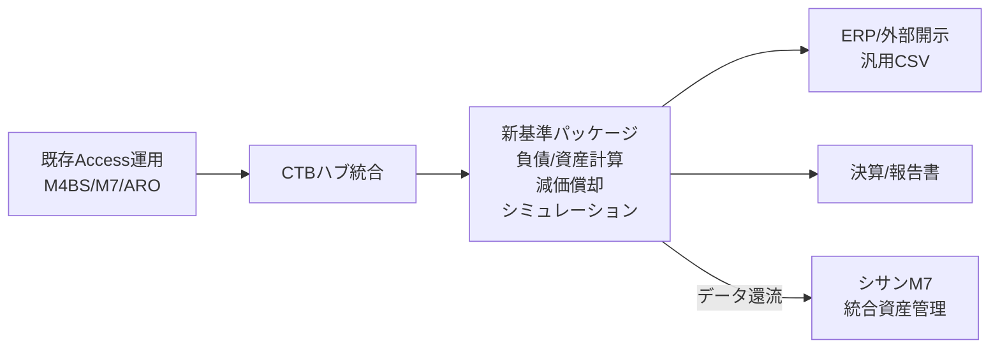

# 開発ロードマップ・工程表：LeaseM4BS / シサンM7

**ドキュメント番号**: RMP-2026-001
**バージョン**: 1.0
**作成日**: 2026年3月11日
**情報ソース**: Google Drive「20260304_開発スケジュール等」

---

## 改訂履歴

| バージョン | 日付 | 変更内容 |
|---|---|---|
| 1.0 | 2026/03/11 | 初版作成 |

---

## 1. プロジェクト概要

### 1.1 目標

2026年6月30日までに全13開発項目を完遂する。

### 1.2 3つの戦略柱

1. **コア開発リソース最適化**: 限られた開発リソースを最重要項目に集中配分
2. **戦略的機能引き継ぎ**: 担当者間の計画的な機能引き継ぎにより開発の継続性を確保
3. **品質管理徹底**: 全フェーズを通じたテスト・レビュー体制の維持

---

## 2. 開発項目一覧と進捗

| # | 開発項目 | 進捗率 | 担当 | フェーズ |
|---|---|---|---|---|
| 1 | リースM4BSリニューアル(.NET) | 80% | 小林（船山から引継） | Phase 1 |
| 2 | シサンM7リニューアル(.NET) | 30% | 小林（中川から切替） | Phase 1 |
| 3 | ARO（資産除去債務）リニューアル | 0% | 関根（3月より専任） | Phase 1 |
| 4 | Accessマイグレーションツール | 一部凍結 | 小林/関根 | Phase 1 |
| 5 | 新基準「単体新製品」 | 50% | 中村/小谷→小林 | Phase 2 |
| 6 | ハブ統合(CTB) | 10% | 船山 | Phase 2 |
| 7 | M7データ還流 | 0% | 船山（4月開始、5月ロジック完了） | Phase 2 |
| 8 | 汎用CSV仕訳出力 | 調整中 | 中村/小谷→庄司 | Phase 3 |
| 9 | 会計/税務複数償却計算 | 調整中 | 中村/小谷→庄司 | Phase 3 |
| 10 | 財務指標シミュレーション | 調整中 | 中村/小谷→庄司 | Phase 3 |
| 11 | 統合マニュアル | 0% | 全員（6月末完成） | Phase 3 |
| 12 | バンドルインストーラ | 0% | 小林（船山） | Phase 3 |
| 13 | 全テスト/レビュー | 進行中 | 全員 | 全フェーズ |

---

## 3. 3フェーズ構成

### 3.1 Phase 1: プラットフォーム近代化（項目1-4）

- Access→.NET/PostgreSQL移行
- M4BS、M7、ARO各システムの.NET化
- Accessマイグレーションツールによる既存データの移行支援（一部凍結中）

### 3.2 Phase 2: 新リース会計基準対応（項目5-7）

- 新基準「単体新製品」開発（ASBJ第33号/第34号準拠）
- CTBハブ統合（リース契約データの資産種別横断統合管理）
- M7データ還流フロー（シサンM7との双方向データ連携）

### 3.3 Phase 3: レポーティング・外部連携（項目8-12）

- 会計/税務償却、汎用CSV仕訳出力
- 財務指標シミュレーション
- 統合マニュアル・バンドルインストーラ

---

## 4. データフローアーキテクチャ

---

## 5. リソース配置戦略

| 担当者 | 主要責務 | 対象項目 |
|---|---|---|
| 小林 | コア開発リード（新製品、M4BS、M7） | 項目1, 2, 4, 5, 12 |
| 船山 | ハブ/還流フロー専任 | 項目6, 7 |
| 関根 | ARO専任（3月より） | 項目3, 4 |
| 庄司 | Phase 3機能引き継ぎ（5月末完了） | 項目8, 9, 10 |
| 全員 | テスト/レビュー・マニュアル並行 | 項目11, 13 |

---

## 6. マイルストーン

| 時期 | マイルストーン | 主な成果物 |
|---|---|---|
| 2026年3月 | ARO開発開始、リソース再編完了 | 関根ARO専任化、開発体制確立 |
| 2026年4月 | M7データ還流開始、Phase 3機能引継ぎ | 船山→還流フロー着手、庄司→Phase 3引継ぎ開始 |
| 2026年5月 | コアロジック完成、Phase 3完了 | M4BS/M7/ARO主要ロジック完成、CSV・償却・シミュレーション完了 |
| 2026年6月 | 統合テスト、マニュアル完成、全項目完遂 | 全13項目完了、統合マニュアル・バンドルインストーラ納品 |
