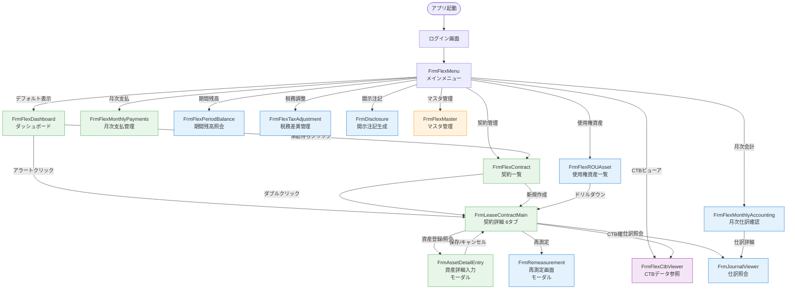
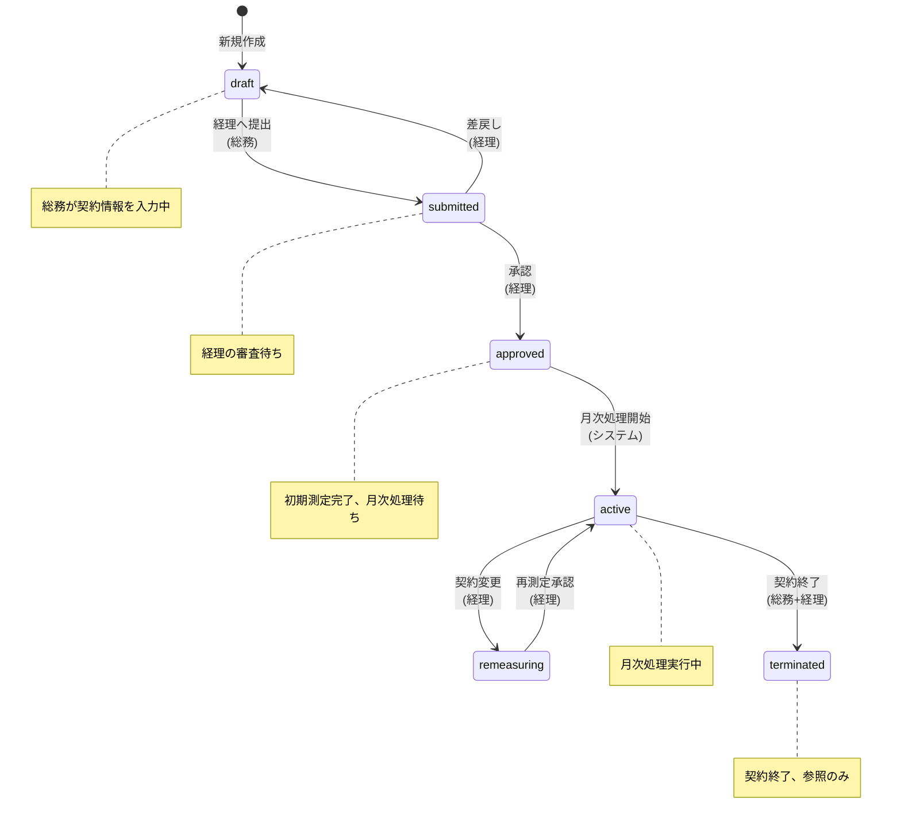

# 最適化設計書 — UIフロー・UI設計・DB設計
## Part 1: UIフロー設計

バージョン: 1.0
作成日: 2026-03-13

---

## 1. 本ドキュメントの位置づけ

本書は「統合分析レポート: UIフロー・UI設計・DB設計の最適化」(`analysis_ui_db_compatibility.md`) の分析結果に基づき、リース資産管理システム LeaseM4BS のUIフロー設計を詳細化したものである。

**制約条件** (全パートで厳守):

| # | 制約 | 意味 |
|---|------|------|
| C1 | CTB案を導入、大きな変更はかけない | 既存22カラムの名称・型変更禁止。NULLカラム追加のみ許容 |
| C2 | フレックス画面は存在すること | FrmFlexCtbViewerを維持し、CTBデータの横断参照を提供 |
| C3 | 総務入力と経理入力が明確に分離 | タブまたは画面レベルで入力領域を分け、権限で制御 |
| C4 | 会計レンジと税務レンジを保持 | 耐用年数・償却方法・減価償却額を会計/税務の2系統で管理 |

---

## 2. 業務フロー全体図

### 2.1 リース資産ライフサイクル

リース資産はASBJ第34号(新リース会計基準)に基づき、以下の8ステップで管理される。

```
  ┌──────────────────────────────────────────────────────────────────────────────────────────┐
  │                          リース資産ライフサイクル 業務フロー                                │
  ├──────────────────────────────────────────────────────────────────────────────────────────┤
  │                                                                                          │
  │  [Step1]        [Step2]        [Step3]         [Step4]         [Step5]                    │
  │  契約締結  ───→ 資産登録 ───→ リース判定 ───→ 初期測定  ───→ 月次処理 ──┐              │
  │  (総務)         (総務)        (総務+経理)      (経理)          (総務+経理) │              │
  │                                                                          │              │
  │                                                                          ▼              │
  │  [Step8]        [Step7]        [Step6]                           ┌─────────────┐        │
  │  契約終了 ◀─── 開示注記 ◀─── 再測定  ◀─── (契約変更発生時) ◀──│ 月次ループ   │        │
  │  (総務+経理)    (経理)         (経理)                            │ (毎月繰返し) │        │
  │                                                                  └─────────────┘        │
  │                                                                                          │
  └──────────────────────────────────────────────────────────────────────────────────────────┘
```

### 2.2 各ステップの詳細

| # | ステップ | 担当者 | 主な入力画面 | 入力内容 | 出力/成果物 |
|---|----------|--------|-------------|----------|------------|
| 1 | 契約締結 | **総務** | FrmLeaseContractMain (Tab1: 契約基本) | 契約番号・名称・契約先・契約期間・月額支払額 | 契約台帳データ (status=draft) |
| 2 | 資産登録 | **総務** | FrmLeaseContractMain (Tab2: 資産・初回金) → FrmAssetDetailEntry | 資産種別・配賦部署・初回費用(敷金/礼金/インセンティブ) | 資産台帳データ、部署配賦設定 |
| 3 | リース判定 | **総務**(Q1-Q4) + **経理**(割引率・免除) | FrmLeaseContractMain (Tab4: リース判定) | Q1:資産特定 / Q2:代替権 / Q3:経済的利益 / Q4:使用指図権 / 割引率 / 免除判定 | 判定結果 (non_lease / off_balance / on_balance) |
| 4 | 初期測定 | **経理** | FrmLeaseContractMain (Tab5: 会計処理) | PV計算確認・使用権資産額・リース負債額の確定 | 使用権資産額、リース負債額、返済スケジュール |
| 5 | 月次処理 | **総務**(支払実績) + **経理**(仕訳確認) | FrmFlexMonthlyPayments / FrmFlexMonthlyAccounting | 支払記録・利息配分・償却費計上・仕訳承認 | 月次仕訳 (利息/償却/支払) |
| 6 | 再測定 | **経理** | FrmRemeasurement | 契約変更内容(期間延長・支払変更等)・再計算パラメータ | 修正後ROU資産/リース負債 |
| 7 | 開示注記 | **経理** | FrmDisclosure / FrmFlexPeriodBalance | 期末残高確認・増減明細・注記テンプレート選択 | BS/PL開示資料 (ASBJ#34 51-61条準拠) |
| 8 | 契約終了 | **総務**(契約終了) + **経理**(除却仕訳) | FrmLeaseContractMain (ステータス変更) | 終了事由・除却仕訳・原状回復費用精算 | 除却仕訳、status=terminated |

### 2.3 ステータス遷移と業務ステップの対応

```
  ステータス遷移:

  draft ──[経理へ提出]──→ submitted ──[承認]──→ approved ──[月次処理開始]──→ active
    ▲                        │                                                    │
    │                   [差戻し]                                             [契約変更]
    └────────────────────────┘                                                    │
                                                                                  ▼
                                                             terminated ◀── remeasuring
                                                            (契約満了/                ▲
                                                             中途解約)                │
                                                                            [再測定承認]
                                                                                  │
                                                                            (再測定完了)
```

| 業務ステップ | ステータス遷移 |
|-------------|--------------|
| Step1-2: 契約締結・資産登録 | → draft |
| Step3: リース判定(総務Q1-Q4入力) | draft のまま |
| Step3: リース判定(総務が経理へ提出) | draft → submitted |
| Step3-4: リース判定(経理確認)・初期測定 | submitted のまま |
| Step4: 初期測定(経理承認) | submitted → approved |
| Step5: 月次処理開始 | approved → active |
| Step6: 再測定(契約変更発生) | active → remeasuring |
| Step6: 再測定完了(経理承認) | remeasuring → active |
| Step8: 契約終了 | active → terminated |

---

## 3. 画面遷移図

### 3.1 全体遷移図 (Mermaid)



**凡例**: 緑=総務メイン / 青=経理メイン / 紫=横断参照(CTB) / 橙=管理者（Part2カラーテーマと統一）

### 3.2 画面遷移マトリクス

| 遷移元 → | DASH | LIST | MAIN | ASSET | ROU | PAY | ACCT | BAL | TAX | DISC | CTB | REMEAS | JOURNAL | MASTER |
|----------|------|------|------|-------|-----|-----|------|-----|-----|------|-----|--------|---------|--------|
| **MENU** | o | o | - | - | o | o | o | o | o | o | o | - | - | o |
| **DASH** | - | o | o | - | - | - | - | - | - | - | - | - | - | - |
| **LIST** | - | - | o | - | - | - | - | - | - | - | - | - | - | - |
| **MAIN** | - | - | - | o | - | - | - | - | - | - | o | o | o | - |
| **ROU**  | - | - | o | - | - | - | - | - | - | - | o | - | - | - |
| **ACCT** | - | - | - | - | - | - | - | - | - | - | - | - | o | - |

`o` = 遷移可能, `-` = 遷移不可

---

## 4. 総務フローと経理フローの詳細

### 4.1 総務フロー（契約管理）

```
┌──────────────────────────────────────────────────────────────────────┐
│  総務フロー: 契約登録 〜 経理提出                                      │
├──────────────────────────────────────────────────────────────────────┤
│                                                                      │
│  FrmFlexDashboard (ダッシュボード)                                    │
│    │                                                                 │
│    ├── [差戻し案件] → 契約一覧(ステータス=draft, 差戻し済み)           │
│    └── [新規登録]   → 契約一覧                                       │
│                        │                                             │
│                        ▼                                             │
│  FrmFlexContract (契約一覧)                                           │
│    │                                                                 │
│    ├── [新規作成]   → FrmLeaseContractMain を新規モードで開く          │
│    └── [既存選択]   → FrmLeaseContractMain を編集モードで開く          │
│                        │                                             │
│                        ▼                                             │
│  FrmLeaseContractMain (契約詳細画面)                                  │
│    │                                                                 │
│    ├── Tab1: 契約基本 ─── 契約番号(自動採番), 契約名称, 契約先,       │
│    │                       契約種類, 契約期間, 支払条件, 月額支払      │
│    │                                                                 │
│    ├── Tab2: 資産・初回金                                             │
│    │   ├── 資産グリッド ─── [資産追加] → FrmAssetDetailEntry (モーダル)│
│    │   │                     ← 保存して戻る ────────────────┘         │
│    │   └── 初回費用 ──── 敷金/保証金, 礼金, インセンティブ             │
│    │                                                                 │
│    ├── Tab3: 転貸 ──── 転貸先情報(転貸契約がある場合のみ有効)          │
│    │                                                                 │
│    ├── Tab4: リース判定                                               │
│    │   ├── Q1: 資産の特定           [はい/いいえ]                     │
│    │   ├── Q2: 実質的代替権         [はい/いいえ]                     │
│    │   ├── Q3: 経済的利益           [はい/いいえ]                     │
│    │   ├── Q4: 使用指図権           [はい/いいえ]                     │
│    │   └── (割引率・免除判定は経理入力 → 読取専用表示)                 │
│    │                                                                 │
│    ├── [CTB確認] → FrmFlexCtbViewer (当該契約でフィルタ)              │
│    │                                                                 │
│    ├── [下書き保存]   → ステータス: draft (維持)                      │
│    └── [経理へ提出]   → ステータス: draft → submitted                 │
│          ※ バリデーション: Tab1-4の必須項目がすべて入力済みであること    │
│                                                                      │
└──────────────────────────────────────────────────────────────────────┘
```

#### 総務フロー: 月次業務

```
FrmFlexMonthlyPayments (月次支払管理)
  │
  ├── 支払予定一覧 (当月分を自動表示)
  ├── [支払実績入力] → 支払日, 実際支払額, 備考
  ├── [支払確認] → 支払実績を記録
  └── (仕訳の生成・承認は経理フローで実施)
```

### 4.2 経理フロー（会計処理）

```
┌──────────────────────────────────────────────────────────────────────┐
│  経理フロー: 審査・承認 〜 会計処理                                    │
├──────────────────────────────────────────────────────────────────────┤
│                                                                      │
│  FrmFlexDashboard (ダッシュボード)                                    │
│    │                                                                 │
│    ├── [承認待ち: N件] → 契約一覧(ステータス=submitted)               │
│    ├── [月次処理未完: N件] → FrmFlexMonthlyAccounting                 │
│    └── [期日アラート: N件] → 該当契約詳細                             │
│                                │                                     │
│                                ▼                                     │
│  FrmFlexContract (契約一覧 / ステータス=submitted でフィルタ)          │
│    │                                                                 │
│    └── [審査対象選択] → FrmLeaseContractMain                         │
│                          │                                           │
│                          ▼                                           │
│  FrmLeaseContractMain (契約詳細画面 / 経理モード)                     │
│    │                                                                 │
│    ├── Tab1-3: 総務入力内容 ── 読取専用で確認                         │
│    │                                                                 │
│    ├── Tab4: リース判定                                               │
│    │   ├── Q1-Q4: 総務回答 ── 読取専用で確認                         │
│    │   ├── 割引率設定        [入力可]                                 │
│    │   ├── 短期リース判定    [入力可]                                 │
│    │   └── 少額リース判定    [入力可]                                 │
│    │                                                                 │
│    ├── Tab5: 会計処理                                                 │
│    │   ├── PV計算結果確認 (自動計算値の表示)                           │
│    │   ├── 使用権資産額     [確認/調整]                               │
│    │   ├── リース負債額     [確認/調整]                               │
│    │   ├── 返済スケジュール [自動生成 → 確認]                         │
│    │   └── 会計耐用年数・償却方法 [設定]                               │
│    │                                                                 │
│    ├── Tab6: 税務・差異                                               │
│    │   ├── 税務パラメータ: 税務耐用年数, 税務償却方法, 税務ROU資産額   │
│    │   ├── 会計 vs 税務 比較表 (自動計算)                             │
│    │   └── 一時差異・繰延税金資産/負債 (自動計算)                      │
│    │                                                                 │
│    ├── [承認]     → ステータス: submitted → approved                  │
│    │   ※ バリデーション: Tab4-6の必須項目 + PV計算の整合性チェック      │
│    │                                                                 │
│    └── [差戻し]   → ステータス: submitted → draft                     │
│          ※ 差戻しコメント必須                                         │
│                                                                      │
├──────────────────────────────────────────────────────────────────────┤
│  経理フロー: 月次処理                                                 │
├──────────────────────────────────────────────────────────────────────┤
│                                                                      │
│  FrmFlexMonthlyPayments (月次支払管理)                                │
│    └── 総務の支払実績を確認                                           │
│                  │                                                   │
│                  ▼                                                   │
│  FrmFlexMonthlyAccounting (月次仕訳確認)                              │
│    ├── 自動生成仕訳の一覧                                             │
│    │   ├── 利息費用の仕訳                                             │
│    │   ├── 使用権資産償却費の仕訳                                     │
│    │   └── リース負債返済の仕訳                                       │
│    ├── [仕訳承認] → 仕訳確定                                         │
│    └── [仕訳照会] → FrmJournalViewer                                 │
│                                                                      │
├──────────────────────────────────────────────────────────────────────┤
│  経理フロー: 期末処理                                                 │
├──────────────────────────────────────────────────────────────────────┤
│                                                                      │
│  FrmFlexPeriodBalance (期間残高照会)                                   │
│    ├── 使用権資産残高・リース負債残高の確認                             │
│    └── 期間別増減明細                                                 │
│                  │                                                   │
│                  ▼                                                   │
│  FrmFlexTaxAdjustment (税務差異管理)                                  │
│    ├── 会計/税務差異の一覧                                             │
│    ├── 繰延税金資産/負債の計算                                        │
│    └── 税務調整仕訳の生成                                             │
│                  │                                                   │
│                  ▼                                                   │
│  FrmDisclosure (開示注記生成)                                         │
│    ├── ASBJ#34 51-61条に基づく開示テンプレート                         │
│    ├── BS/PL残高の自動集計                                             │
│    └── 注記ドラフトの生成・出力                                       │
│                                                                      │
└──────────────────────────────────────────────────────────────────────┘
```

#### 経理フロー: 再測定

```
FrmLeaseContractMain (active状態の契約)
  │
  └── [再測定] → FrmRemeasurement (モーダル)
       │
       ├── 変更事由の選択: 期間延長 / 支払額変更 / 指数変動 / その他
       ├── 変更パラメータの入力
       ├── 再計算結果のプレビュー (変更前 vs 変更後)
       ├── [再測定実行] → ステータス: active → remeasuring
       └── [再測定承認] → ステータス: remeasuring → active
            (修正後のROU資産/リース負債で会計処理を継続)
```

---

## 5. フレックスCTB画面の位置づけ

### 5.1 呼出パターン

FrmFlexCtbViewer は以下の3箇所から呼び出し可能である。

| # | 呼出元 | 呼出方法 | 表示モード | フィルタ条件 |
|---|--------|---------|-----------|-------------|
| 1 | FrmFlexMenu | メニューバーの[CTBビューア]ボタン | 全件表示 | なし(全契約・全資産) |
| 2 | FrmLeaseContractMain | ツールバーの[CTB確認]ボタン | 契約フィルタ | 当該contract_noで絞込み |
| 3 | FrmFlexROUAsset | 行選択 → コンテキストメニュー[CTBデータ確認] | 資産フィルタ | 当該asset_idで絞込み |

### 5.2 データソース

```
FrmFlexCtbViewer
  │
  ├── データソース: v_ctb_export (マテリアライズドビュー)
  │   └── v5正規化テーブル群をJOINしてCTBフラット構造(30カラム)を再現
  │
  ├── 書き込み: なし (読取専用)
  │   └── データの入力・更新は常にFrmLeaseContractMain経由でv5テーブルに対して行う
  │
  └── 更新タイミング:
      ├── 契約保存時: REFRESH MATERIALIZED VIEW CONCURRENTLY v_ctb_export
      └── 夜間バッチ: 全件リフレッシュ(整合性保証)
```

### 5.3 表示モード

| モード | 条件 | 説明 |
|--------|------|------|
| 読取専用 (標準) | 常時 | 30カラムのグリッド表示。フィルタ・ソート・Excel/CSV出力が可能 |
| CTB直接編集 | **非対応** | v_ctb_exportはビューであるため直接編集不可。編集はFrmLeaseContractMainで行う |

### 5.4 画面構成

```
┌──────────────────────────────────────────────────────────────────┐
│ FrmFlexCtbViewer                                                  │
├──────────────────────────────────────────────────────────────────┤
│ [フィルタバー]                                                    │
│  契約番号: [________] 期間: [____]〜[____] 資産種別: [▼___]       │
│  ステータス: [▼___]   [検索]  [クリア]  [Excel出力]  [CSV出力]    │
├──────────────────────────────────────────────────────────────────┤
│ [上部: DataGridView — 30カラム表示]                                │
│ ┌────┬──────┬────┬──────┬──────┬──────┬──────┬──────┬──────┬────┐│
│ │ctb │契約No│物件│M7資産│JSM10 │開始日│解約不│延長  │会計  │月額││
│ │_id │      │No  │No    │ARONo │      │能月数│月数  │期間  │支払││
│ ├────┼──────┼────┼──────┼──────┼──────┼──────┼──────┼──────┼────┤│
│ │ 1  │LC-..│  1 │A0001 │J0001 │2026..│  60  │  12  │  72  │250K││
│ │... │      │    │      │      │      │      │      │      │    ││
│ └────┴──────┴────┴──────┴──────┴──────┴──────┴──────┴──────┴────┘│
│ (→ 横スクロールで税務レンジ列・差異列を表示)                        │
│   ... │税務耐│会計耐│税務償│会計償│税務年│会計年│税務  │税会  │     │
│       │用年数│用年数│却方法│却方法│間償却│間償却│ROU   │差異  │     │
├──────────────────────────────────────────────────────────────────┤
│ [下部: DynamicDetailPanel — 選択行の詳細]                          │
│  ※ 選択行の資産種別(asset_class_cd)に応じて動的にコントロールを生成 │
│  ※ asset_class_field定義 + asset_attribute(EAV)データから表示       │
├──────────────────────────────────────────────────────────────────┤
│ [条件付き書式] 税会差異列: 差異≠0 → 黄色背景+赤文字               │
└──────────────────────────────────────────────────────────────────┘
```

---

## 6. ステータス遷移図

### 6.1 ステータス遷移図 (Mermaid)



### 6.2 ステータス別の編集可能領域とアクション

| ステータス | 総務の編集可能範囲 | 経理の編集可能範囲 | 利用可能アクション | 遷移条件(バリデーション) |
|-----------|-------------------|-------------------|-------------------|------------------------|
| **draft** | Tab1-4: 編集可 / Tab5-6: 非表示 | 閲覧のみ | 総務: [下書き保存] [経理へ提出] | 提出時: Tab1必須項目(契約番号,名称,契約先,期間) + Tab2資産1件以上 + Tab4のQ1-Q4回答済み |
| **submitted** | 全タブ: 読取専用 | Tab4(割引率・免除)+Tab5+Tab6: 編集可 | 経理: [承認] [差戻し] | 承認時: Tab4判定結果確定 + Tab5 PV計算完了 + Tab6税務パラメータ入力済み。差戻し時: コメント必須 |
| **approved** | 全タブ: 読取専用 | 全タブ: 読取専用 | なし (月次処理開始はシステム自動) | 月次処理開始日到来で自動的にactiveへ遷移 |
| **active** | Tab1-3: 限定編集(備考等) | 月次処理画面で操作 | 総務: [月次支払登録] 経理: [月次仕訳承認] [再測定] | 再測定: 契約変更事由の入力 + 変更パラメータの入力 |
| **remeasuring** | 変更項目のみ編集可 | 再測定画面で操作 | 経理: [再測定承認] | 再測定承認: 再計算結果の確認完了 |
| **terminated** | 全タブ: 読取専用 | 全タブ: 読取専用 | なし (参照のみ) | - |

### 6.3 ステータス遷移時のシステム処理

| 遷移 | トリガー | システム処理 |
|------|---------|-------------|
| draft → submitted | 総務が[経理へ提出]押下 | approval_logに'submit'レコード挿入。lease_contract.submitted_by/submitted_atを更新 |
| submitted → approved | 経理が[承認]押下 | approval_logに'approve'レコード挿入。lease_contract.approved_by/approved_atを更新。amortization_schedule生成 |
| submitted → draft | 経理が[差戻し]押下 | approval_logに'reject'レコード挿入。submitted_by/submitted_atをクリア |
| approved → active | 月次処理開始日到来 | (バッチまたは手動) ステータス更新 |
| active → remeasuring | 経理が[再測定]押下 | approval_logに'remeasure'レコード挿入。lease_remeasurementレコード作成 |
| remeasuring → active | 経理が[再測定承認]押下 | amortization_scheduleを再生成。ROU資産/リース負債を修正。v_ctb_exportをリフレッシュ |
| active → terminated | 契約終了処理 | 除却仕訳生成。残高ゼロ化。v_ctb_exportをリフレッシュ |

---

## 7. 画面一覧表

| # | 画面ID | 画面名 | 種別 | 対象ユーザー | 主要操作 | 対応v5テーブル | 実装状態 |
|---|--------|--------|------|-------------|---------|---------------|---------|
| 1 | FrmFlexDashboard | ダッシュボード | UserControl | 全ユーザー | 承認待ち確認, 期日アラート確認, KPI参照 | lease_contract(集計), approval_log | **新規** |
| 2 | FrmFlexContract | 契約一覧 | UserControl | 全ユーザー | 契約検索, 一覧表示, 新規作成, ステータスフィルタ | lease_contract, lease_asset | 実装済み |
| 3 | FrmLeaseContractMain | 契約詳細(6タブ) | Form(モードレス) | 総務+経理 | 契約情報入力, リース判定, 会計処理, 税務設定, 承認/差戻し | lease_contract, lease_asset, lease_deposit, lease_incentive, lease_option, lease_judgment, lease_initial_measurement, lease_accounting | 改修(5→6タブ) |
| 4 | FrmAssetDetailEntry | 資産詳細入力 | Form(モーダル) | 総務 | 資産種別選択, 種別固有属性入力, 部署配賦設定 | lease_asset, asset_attribute(EAV), dept_allocation, asset_class_field | 改修(EAV対応) |
| 5 | FrmFlexROUAsset | 使用権資産一覧 | UserControl | 経理 | ROU資産残高一覧, 増減明細表示, ドリルダウン | lease_accounting, amortization_schedule | 要実装 |
| 6 | FrmFlexMonthlyPayments | 月次支払管理 | UserControl | 総務 | 支払予定表示, 支払実績入力, 支払確認 | lease_payment_schedule | 要実装 |
| 7 | FrmFlexMonthlyAccounting | 月次仕訳確認 | UserControl | 経理 | 自動生成仕訳確認, 仕訳承認, 仕訳照会 | journal_header, journal_detail, amortization_schedule | 要実装 |
| 8 | FrmFlexPeriodBalance | 期間残高照会 | UserControl | 経理 | 期間別残高表示, 増減明細, BS/PL残高確認 | lease_accounting | 要実装 |
| 9 | FrmFlexTaxAdjustment | 税務差異管理 | UserControl | 経理 | 会計/税務差異一覧, 繰延税金計算, 税務調整仕訳 | tax_accounting_diff, amortization_schedule | 要実装 |
| 10 | FrmRemeasurement | 再測定 | Form(モーダル) | 経理 | 変更事由入力, 再計算実行, 変更前後比較, 再測定承認 | lease_remeasurement, ctb_remeasurement_history | **新規** |
| 11 | FrmDisclosure | 開示注記生成 | UserControl | 経理 | 開示テンプレート選択, BS/PL集計, 注記ドラフト生成 | disclosure_snapshot | **新規** |
| 12 | FrmJournalViewer | 仕訳照会 | UserControl | 経理 | 仕訳一覧, 期間フィルタ, 仕訳詳細表示, 監査証跡 | journal_header, journal_detail | **新規** |
| 13 | FrmFlexMaster | マスタ管理 | UserControl | 管理者 | 部門マスタ, 会社マスタ, 取引先マスタ等の保守 | m_department, m_company, m_supplier 等 | 実装済み |
| 14 | FrmFlexCtbViewer | CTBデータ参照 | UserControl | 全ユーザー | CTB30カラム一覧, フィルタ, Excel/CSV出力, 動的詳細パネル | v_ctb_export, asset_attribute(EAV) | 改修(30カラム+動的パネル) |

**合計**: 14画面 (既存実装済み: 2 / 改修: 3 / 新規: 4 / 要実装: 5)

### 7.1 画面間のデータフロー概要

```
  ┌─────────────┐    保存     ┌──────────────────────┐    JOIN/集計    ┌──────────────┐
  │ 入力系画面   │ ─────────→ │ v5正規化テーブル群     │ ─────────────→ │ 参照系画面    │
  │             │             │ (37テーブル)           │                │              │
  │ #3 契約詳細 │             │ lease_contract        │                │ #1 ダッシュ   │
  │ #4 資産詳細 │             │ lease_asset           │                │ #5 ROU一覧   │
  │ #6 月次支払 │             │ lease_payment_schedule│                │ #7 月次会計   │
  │ #10 再測定  │             │ lease_accounting      │                │ #8 期間残高   │
  │             │             │ amortization_schedule │                │ #9 税務差異   │
  │             │             │ ...                   │                │ #11 開示注記  │
  └─────────────┘             └──────────┬───────────┘                │ #12 仕訳照会  │
                                         │                           └──────────────┘
                                         │ v_ctb_export
                                         │ (マテリアライズドビュー)
                                         ▼
                              ┌──────────────────────┐
                              │ #14 FrmFlexCtbViewer  │
                              │ (30カラムフラット表示)  │
                              └──────────────────────┘
```

---

## 8. FrmLeaseContractMain 6タブ構成の詳細

契約詳細画面は本システムの中核であり、総務/経理の両フローが交差する重要な画面である。

### 8.1 タブ構成と権限マッピング

```
┌──────────────────────────────────────────────────────────────────┐
│ FrmLeaseContractMain                                              │
│ [ヘッダ] 契約番号: LC-2025-0001  ステータス: ●submitted           │
│          [CTB確認] [再測定] [下書き保存] [経理へ提出/承認/差戻し]  │
├──────────────────────────────────────────────────────────────────┤
│                                                                   │
│  ┌──────────┬──────────┬──────┬──────────┬──────────┬──────────┐ │
│  │ Tab1     │ Tab2     │Tab3  │ Tab4     │ Tab5     │ Tab6     │ │
│  │ 契約基本 │資産初回金│ 転貸 │リース判定│ 会計処理 │税務・差異│ │
│  ├──────────┴──────────┴──────┴──────────┴──────────┴──────────┤ │
│  │                                                              │ │
│  │  [総務領域: 淡緑]  │ [共同: 淡黄] │  [経理領域: 淡青]       │ │
│  │  Tab1, Tab2, Tab3  │    Tab4      │   Tab5, Tab6            │ │
│  │                                                              │ │
│  └──────────────────────────────────────────────────────────────┘ │
│                                                                   │
│ [フッタ] リース判定: オンバランス(使用権モデル)                      │
└──────────────────────────────────────────────────────────────────┘
```

### 8.2 各タブの入力項目概要

| タブ | セクション | 主な入力項目 | 対応テーブル |
|------|-----------|-------------|-------------|
| Tab1: 契約基本 | 基本情報 | 契約番号(自動), 契約名称, 契約種類, 契約先 | lease_contract |
| | 契約期間 | 開始日, 終了日, 自動更新有無 | lease_contract |
| | 支払条件 | 月額支払額, 支払間隔, 支払日, エスカレーション条項 | lease_contract, lease_payment_schedule |
| Tab2: 資産・初回金 | 資産一覧 | 資産グリッド([追加]でFrmAssetDetailEntry起動) | lease_asset |
| | 初回費用 | 敷金/保証金, 礼金, インセンティブ | lease_deposit, lease_incentive |
| Tab3: 転貸 | 転貸情報 | 転貸先, 転貸条件, 原契約との関係 | sublease_relationship |
| Tab4: リース判定 | IFRS16/ASBJ判定 | Q1-Q4回答(総務), 割引率(経理), 短期/少額免除(経理) | lease_option, lease_judgment |
| Tab5: 会計処理 | 初期測定 | PV計算, ROU資産額, リース負債額, 返済スケジュール | lease_initial_measurement |
| | 会計パラメータ | 会計耐用年数, 償却方法 | lease_asset, lease_accounting |
| Tab6: 税務・差異 | 税務パラメータ | 税務耐用年数, 税務償却方法, 税務ROU資産額 | lease_asset(tax_*カラム) |
| | 差異比較 | 会計vs税務比較表, 一時差異, 繰延税金資産/負債 | tax_accounting_diff |

---

*本ドキュメントの最終更新: 2026-03-13*
*ドキュメント化エージェント Part1 出力*
