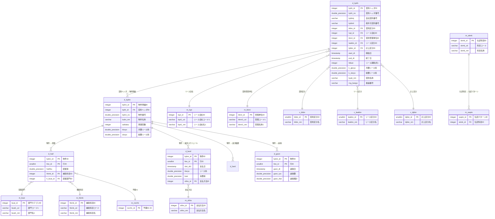
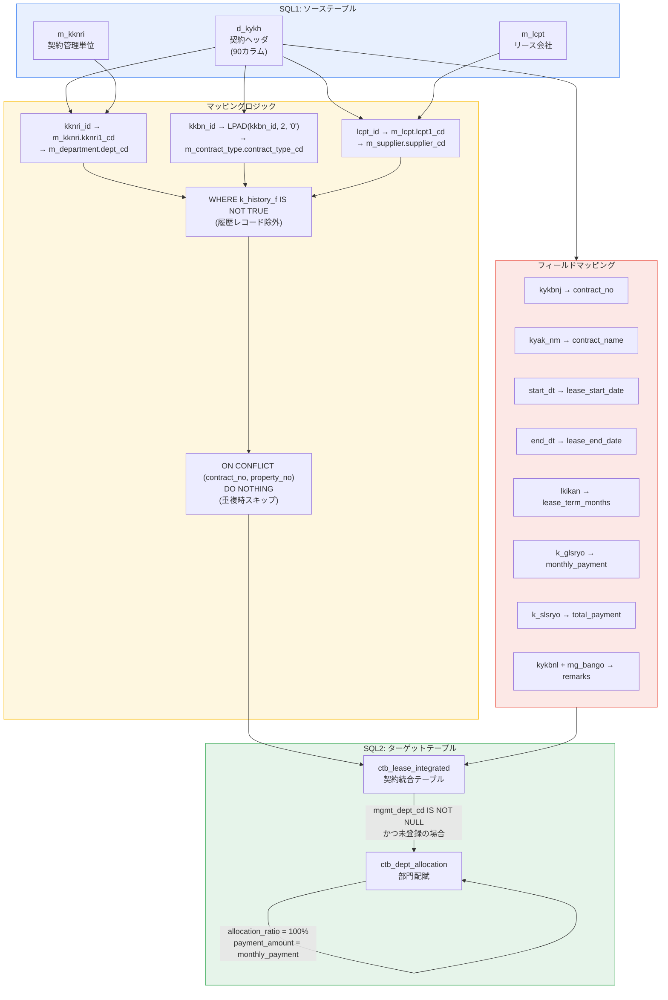
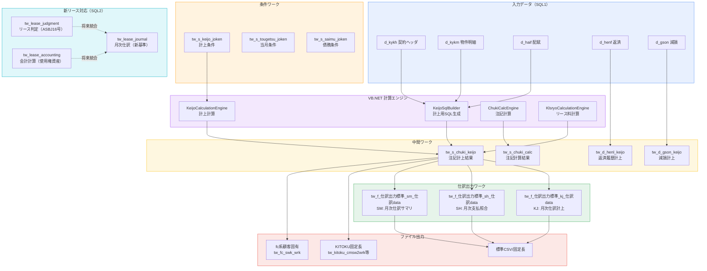

# ER図: SQL1/SQL2 テーブル関連図

## 1. SQL1 主要テーブル関連図（マイグレーション版）



## 2. SQL2 主要テーブル関連図（新リース対応版）

```mermaid
erDiagram
    tw_lease_contract ||--o| tw_lease_accounting : "契約 → 会計計算"
    tw_lease_contract ||--o| tw_lease_judgment : "契約 → リース判定"
    tw_lease_contract ||--o{ tw_lease_property : "契約 → 物件属性"
    tw_lease_contract ||--o{ tw_lease_party : "契約 → 関係者"
    tw_lease_contract ||--o{ tw_lease_schedule : "契約 → 支払スケジュール"
    tw_lease_contract ||--o{ tw_lease_initial : "契約 → 初回費用"
    tw_lease_contract ||--o| tw_lease_sublease : "契約 → 転貸"
    tw_lease_contract ||--o{ tw_lease_payment_actual : "契約 → 支払実績"
    tw_lease_contract ||--o{ tw_lease_journal : "契約 → 月次仕訳"

    tw_lease_initial }o--|| m_initial_cost_item : "初回費用項目"
    tw_lease_initial }o--|| m_acct_treatment : "会計処理区分"
    tw_lease_payment_actual }o--|| m_payment_method : "支払方法"

    ctb_lease_integrated ||--o{ ctb_dept_allocation : "統合 → 部門配賦"
    ctb_lease_integrated ||--o{ ctb_property : "統合 → 物件"
    ctb_lease_integrated }o--|| m_contract_type : "契約区分"
    ctb_lease_integrated }o--|| m_supplier : "リース会社"
    ctb_lease_integrated }o--|| m_department : "管理部門"

    ctb_dept_allocation }o--|| m_department : "配賦部門"

    ctb_property }o--|| m_asset_category : "資産カテゴリ"
    ctb_property ||--o{ ctb_property_attribute : "物件 → 属性値"
    ctb_property_attribute }o--|| m_property_attribute_def : "属性定義"
    m_property_attribute_def }o--|| m_asset_category : "カテゴリ別定義"

    tw_lease_contract {
        serial contract_id PK "契約ID"
        varchar contract_no UK "契約番号"
        varchar contract_name "契約名"
        date start_date "開始日"
        date end_date "終了日"
        integer contract_months "契約月数"
        varchar cancel_option "解約オプション"
        varchar extend_option "延長オプション"
    }

    tw_lease_judgment {
        serial judgment_id PK "判定ID"
        integer contract_id FK_UK "契約ID"
        boolean q1_result "Q1判定"
        boolean q2_result "Q2判定"
        boolean q3_result "Q3判定"
        boolean q4_result "Q4判定"
        boolean is_exempt_short "短期免除"
        boolean is_exempt_small "少額免除"
        varchar final_result "最終判定結果"
    }

    tw_lease_accounting {
        serial accounting_id PK "会計ID"
        integer contract_id FK_UK "契約ID"
        numeric discount_rate "割引率"
        numeric present_value "現在価値"
        numeric rou_asset "使用権資産"
        numeric lease_liability "リース負債"
        numeric lease_ratio "リース比率"
        numeric non_lease_ratio "非リース比率"
    }

    tw_lease_journal {
        serial journal_id PK "仕訳ID"
        integer contract_id FK "契約ID"
        varchar journal_ym "仕訳年月"
        varchar journal_type "仕訳種別"
        varchar debit_account_cd "借方科目コード"
        numeric debit_amount "借方金額"
        varchar credit_account_cd "貸方科目コード"
        numeric credit_amount "貸方金額"
        varchar asbj_reference "ASBJ参照"
    }

    tw_lease_schedule {
        serial schedule_id PK "スケジュールID"
        integer contract_id FK "契約ID"
        varchar schedule_type "種別"
        numeric payment_amount "支払額"
        date first_payment_date "初回支払日"
        varchar payment_interval "支払間隔"
        integer total_count "総回数"
    }

    ctb_lease_integrated {
        serial ctb_id PK "CTB ID"
        varchar contract_no "契約番号"
        integer property_no "物件番号"
        varchar contract_type_cd FK "契約区分コード"
        varchar supplier_cd FK "リース会社コード"
        varchar mgmt_dept_cd FK "管理部門コード"
        date lease_start_date "開始日"
        date lease_end_date "終了日"
        numeric monthly_payment "月額支払"
        numeric total_payment "総額支払"
        varchar split_status "分割状態"
    }

    ctb_dept_allocation {
        serial allocation_id PK "配賦ID"
        integer ctb_id FK "CTB ID"
        varchar dept_cd FK "部門コード"
        numeric allocation_ratio "配賦率"
        numeric payment_amount "配賦金額"
    }

    ctb_property {
        serial property_id PK "物件ID"
        integer ctb_id FK "CTB ID"
        integer property_no "物件連番"
        varchar asset_category_cd FK "資産カテゴリ"
        varchar asset_no "資産番号"
        varchar asset_name "資産名称"
    }

    ctb_property_attribute {
        serial prop_attr_id PK "属性値ID"
        integer property_id FK "物件ID"
        integer attr_def_id FK "属性定義ID"
        text attribute_value "属性値"
    }

    m_department {
        varchar dept_cd PK "部門コード"
        varchar dept_nm "部門名"
    }

    m_supplier {
        varchar supplier_cd PK "リース会社コード"
        varchar supplier_nm "リース会社名"
    }

    m_contract_type {
        varchar contract_type_cd PK "契約区分コード"
        varchar contract_type_nm "契約区分名"
    }

    m_company {
        varchar company_cd PK "法人コード"
        varchar company_nm "法人名"
    }

    m_asset_category {
        varchar asset_category_cd PK "カテゴリコード"
        varchar asset_category_nm "カテゴリ名"
    }

    m_property_attribute_def {
        serial attr_def_id PK "定義ID"
        varchar asset_category_cd FK "カテゴリコード"
        varchar attr_cd "属性コード"
        varchar attr_nm "属性名"
        varchar data_type "データ型"
        varchar display_type "表示種別"
    }

    m_payment_method {
        varchar payment_method_cd PK "支払方法コード"
        varchar payment_method_nm "支払方法名"
    }

    m_initial_cost_item {
        varchar cost_item_cd PK "費用項目コード"
        varchar cost_item_nm "費用項目名"
    }

    m_acct_treatment {
        varchar acct_treatment_cd PK "会計処理コード"
        varchar acct_treatment_nm "会計処理名"
    }
```

## 3. 重複マスタ対応関係図

```mermaid
erDiagram
    m_bcat ||--|| m_department : "部門: bcat1_cd ≒ dept_cd"
    m_lcpt ||--|| m_supplier : "リース会社: lcpt1_cd ≒ supplier_cd"
    c_kkbn ||--|| m_contract_type : "契約区分: LPAD(kkbn_id,2) = contract_type_cd"
    m_corp ||--|| m_company : "法人: 構造同等"
    sec_user ||--|| tm_USER : "ユーザー: 権限モデル異なる"
    m_shho ||--|| m_payment_method : "支払方法: コード体系異なる"
    m_koza ||--|| m_bank_account : "口座: 構造簡略化"

    m_bcat {
        integer bcat_id PK "SQL1:部門カテゴリID"
        varchar bcat1_cd "部門コード1"
        varchar bcat1_nm "部門名1"
        varchar bcat2_cd "部門コード2"
        varchar bcat2_nm "部門名2"
        varchar bcat3_cd "部門コード3"
        varchar bcat3_nm "部門名3"
    }

    m_department {
        varchar dept_cd PK "SQL2:部門コード"
        varchar dept_nm "部門名"
        varchar dept_cd2 "部門コード2"
        varchar dept_nm2 "部門名2"
        varchar dept_cd3 "部門コード3"
        varchar dept_nm3 "部門名3"
    }

    m_lcpt {
        integer lcpt_id PK "SQL1:リース会社ID"
        varchar lcpt1_cd "リース会社コード1"
        varchar lcpt1_nm "リース会社名1"
    }

    m_supplier {
        varchar supplier_cd PK "SQL2:リース会社コード"
        varchar supplier_nm "リース会社名"
        smallint row1_contract_closing_day "締日1"
    }

    c_kkbn {
        smallint kkbn_id PK "SQL1:契約区分ID(1,2,3,4)"
        varchar kkbn_nm "契約区分名"
    }

    m_contract_type {
        varchar contract_type_cd PK "SQL2:契約区分コード(01,02,03,04)"
        varchar contract_type_nm "契約区分名"
    }

    m_corp {
        integer corp_id PK "SQL1:法人ID"
    }

    m_company {
        varchar company_cd PK "SQL2:法人コード"
        varchar company_nm "法人名"
    }

    sec_user {
        integer user_id PK "SQL1:ユーザーID"
    }

    tm_USER {
        serial user_id PK "SQL2:ユーザーID"
        varchar login_id "ログインID"
        varchar role "ロール"
    }

    m_shho {
        integer shho_id PK "SQL1:支払方法ID"
        varchar shho_nm "支払方法名"
    }

    m_payment_method {
        varchar payment_method_cd PK "SQL2:支払方法コード"
        varchar payment_method_nm "支払方法名"
    }

    m_koza {
        integer koza_id PK "SQL1:口座ID"
    }

    m_bank_account {
        varchar bank_account_cd PK "SQL2:口座コード"
        varchar bank_account_nm "口座名"
    }
```



## 4. migrate_d_kykh_to_ctb データフロー図



## 5. 仕訳パイプライン全体フロー図


