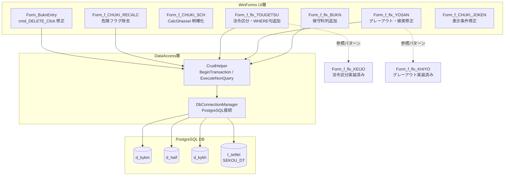

# 技術設計書: TODO/FIXME体系的解消

## 1. 設計方針

### 1.1 既存アーキテクチャとの整合性

- **変更禁止**: DBスキーマ（d_kykm, d_kykh, d_haif, d_henf, d_gson等）は変更しない
- **CrudHelper経由**: 全DB操作は既存の `CrudHelper`（`GetDataTable` / `ExecuteNonQuery` / `BeginTransaction`）を使用する
- **パラメータ化クエリ**: 全SQLはNpgsqlParameterでバインドし、文字列結合によるSQL組み立ては行わない
- **既存パターンの流用**: 法令区分CASE文（Form_f_flx_KEIJO.vb:46-53）、グレーアウト実装（Form_f_flx_KHIYO.vb:254-273）など、実装済みパターンを再利用する

### 1.2 採用する設計パターン

- フレックス画面のSQL拡張: `BuildSql()` 内の `sb.AppendLine()` チェーンに列定義を追記する方式（既存パターン踏襲）
- 削除処理のトランザクション: `_crud.BeginTransaction()` → DELETE → `_crud.Commit()` の順（Form_ContractEntry.cmd_DELETE_Click と同等）
- グレーアウト: `DataGridViewRow` ループで `DefaultCellStyle.ForeColor/BackColor` を設定する方式（Form_f_flx_KHIYO の ApplyGrayOut() 踏襲）

### 1.3 技術的判断の根拠

| 判断事項 | 採用方針 | 根拠 |
|---|---|---|
| 法令区分の実装 | Form_f_flx_KEIJO と同一CASE文を流用 | 同一ビジネスルール（SEKOU_DT比較）であり、差異を生じさせない |
| 保守料フィールド | `kykm.b_ijiknr` を採用（維持管理費用として代替） | Form_f_CHUKI_SCH.vb:116 で `kykm.b_ijiknr AS 維持管理費用` と記述されており、保守・維持管理費用の代替と判断。d_henfは不要なJOINを避けるためスコープ外 |
| CalcGhassei() の実装 | 利子込法のみ実装（CalcKlsryo と等値）、利息法は要確認コメントに変更 | Access版VBA参照不可のため、安全側に実装。利息法の元本返済額算出はスケジュールデータが必要であり別Issueとする |
| CHUKI_RECALC コメント変数 | `gnzaiKt`・`chuumId`・`kjkbnId`・`szeiKjkbnId` は「実装保留」コメントに昇格、危険フラグのみ除去 | 既存コードで対応列への更新呼び出しがコメントアウトされており、安易に有効化するとデータ破損リスクあり |
| BuknEntry削除順序 | d_haif → d_kykm の順（外部キー考慮） | d_haif.kykm_id は d_kykm への参照のため先に削除が必要 |

---

## 2. 実装計画（優先度・順序）

### 2.1 CRITICAL（最優先実施）

| # | 対象 | 作業内容 | 推定難易度 |
|---|---|---|---|
| C1 | Form_BuknEntry.vb:305 | 削除処理実装（d_haif → d_kykm DELETE） | 低 |
| C2 | Form_f_CHUKI_RECALC.vb:30 | 危険フラグ解消・未実装変数への説明コメント付与 | 低 |
| C3 | Form_f_CHUKI_SCH.vb:236 | CalcGhassei() の実装明確化（利子込法は等値、利息法は保留明記） | 低 |

### 2.2 HIGH（優先実施）

| # | 対象 | 作業内容 | 推定難易度 |
|---|---|---|---|
| H1 | Form_f_flx_YOSAN.vb:107 | 検索条件のランタイムエラー修正（Double.Parse → Integer.TryParse） | 低 |
| H2 | Form_f_flx_TOUGETSU.vb:87,98 | 法令区分・請求月のコメントアウト解除と実装 | 中 |
| H3 | Form_f_flx_TOUGETSU.vb:115 | WHERE句に集計期間・中途解約条件追加 | 中 |
| H4 | Form_f_flx_BUKN.vb:48 | 保守料列を `kykm.b_ijiknr AS 保守料` で追加 | 低 |
| H5 | Form_f_flx_YOSAN.vb:42,61,63 | グレーアウト実装、「予想/既存」分類、「行区」値確定 | 中 |

### 2.3 MEDIUM（対応推奨）

| # | 対象 | 作業内容 | 推定難易度 |
|---|---|---|---|
| M1 | Form_f_CHUKI_JOKEN.vb:160 | 所有権移転外テキストの表示条件を leakbn_id で制御 | 中 |
| M2 | Form_f_CHUKI_SCH.vb:265 | dgv_TOTALの印刷ループ追加 | 中 |
| M3 | Form_f_flx_YOSAN.vb:201 | 列ヘッダを m0..m23 から yyyy/MM 形式に変更 | 低 |

### 2.4 LOW（任意対応）

| # | 対象 | 作業内容 |
|---|---|---|
| L1 | Form_f_flx_YOSAN.vb:94 | 合計比較式のコメント整理（機能変更なし） |
| L2 | Form_BuknEntry.vb:188 | メソッド名リネーム（SyncDgvComboToText → OnGridComboChanged） |
| L3 | Form_fc_TC_HREL.vb:78 | メソッド名リネーム（適切な名称に変更） |
| L4 | Form_fc_TC_HREL_YOBI.vb:129 | メソッド名リネーム（適切な名称に変更） |
| L5 | Form_MAIN.vb:810-906 | スコープ外明記コメントへ変更 |

---

## 3. 各修正の詳細設計

### 3.1 C1: Form_BuknEntry.vb の削除処理（CRITICAL）

**対象ファイル**: `LeaseM4BS.TestWinForms/LeaseM4BS.TestWinForms/Form_BuknEntry.vb:299-310`

**変更前**:
```vb
Private Sub cmd_DELETE_Click(sender As Object, e As EventArgs) Handles cmd_DELETE.Click
    If MessageBox.Show("物件を削除してもよろしいですか？", "削除確認", MessageBoxButtons.YesNo) = DialogResult.No Then
        Return
    End If

    ' todo 削除処理

    MessageBox.Show("削除しました。", "完了", MessageBoxButtons.OK, MessageBoxIcon.Information)
    Me.Close()
End Sub
```

**変更後**:
```vb
Private Sub cmd_DELETE_Click(sender As Object, e As EventArgs) Handles cmd_DELETE.Click
    If MessageBox.Show("物件を削除してもよろしいですか？", "削除確認", MessageBoxButtons.YesNo) = DialogResult.No Then
        Return
    End If

    Try
        _crud.BeginTransaction()

        ' 子テーブル d_haif を先に削除（外部キー制約: d_haif.kykm_id → d_kykm）
        _crud.ExecuteNonQuery(
            "DELETE FROM d_haif WHERE kykm_id = @kykmId",
            New List(Of NpgsqlParameter) From {New NpgsqlParameter("@kykmId", KykmId)})

        ' 親テーブル d_kykm を削除
        _crud.ExecuteNonQuery(
            "DELETE FROM d_kykm WHERE kykm_id = @kykmId",
            New List(Of NpgsqlParameter) From {New NpgsqlParameter("@kykmId", KykmId)})

        _crud.Commit()

        MessageBox.Show("削除しました。", "完了", MessageBoxButtons.OK, MessageBoxIcon.Information)
        Me.Close()
    Catch ex As Exception
        _crud.Rollback()
        MessageBox.Show("削除に失敗しました。" & ex.Message, "エラー", MessageBoxButtons.OK, MessageBoxIcon.Error)
    End Try
End Sub
```

**影響範囲**: Form_BuknEntry.vb のみ。d_kykm, d_haif テーブルに書き込み。

---

### 3.2 C2: Form_f_CHUKI_RECALC.vb の危険フラグ解消（CRITICAL）

**対象ファイル**: `LeaseM4BS.TestWinForms/LeaseM4BS.TestWinForms/Form_f_CHUKI_RECALC.vb:30`

**変更内容**: `' todo 危険(実装不明、要確認)` コメントを以下のように更新する。

```vb
' [注記判定再計算] 一括UPDATE処理
' 動作確認済み項目: rsok_tmg, gk_calc_kind, hensai_kind, kari_ritu, b_syutok,
'                  taiyo_nen, rslt90p, rslt90p_str, rslt75p, rslt75p_str, leakbn_id, kj_tekiyo_dt, kj_ho
' 実装保留項目（Access版VBA参照不可のため、計算式確定まで有効化しない）:
'   gnzaiKt  (現在価値): LEAST(b_knyukn, b_gnzai_kt) の可能性あるが未確認
'   chuumId  (注記省略): 判定ロジック不明
'   kjkbnId  (計上区分): 判定ロジック不明
'   szeiKjkbnId (消費税計上区分): 判定ロジック不明
Private Sub ResetChukiData()
```

**影響範囲**: コメント変更のみ。実行時の動作変更なし。

---

### 3.3 C3: Form_f_CHUKI_SCH.vb の CalcGhassei() 実装明確化（CRITICAL）

**対象ファイル**: `LeaseM4BS.TestWinForms/LeaseM4BS.TestWinForms/Form_f_CHUKI_SCH.vb:236-239`

**変更前**:
```vb
' todo
Private Function CalcGhassei(dt As Date) As Integer
    Return CalcKlsryo(dt)
End Function
```

**変更後**:
```vb
' 発生リース料の計算
' 利子込法（Gross Method）の場合: 支払リース料と等値
' 利息法（Net Method）の場合: 元本返済額 + 利息発生額となるが、Access版VBA参照不可のため
'   現状は利子込法と同じ実装とする。利息法の正確な実装は別Issueで対応。
Private Function CalcGhassei(dt As Date) As Integer
    Return CalcKlsryo(dt)
End Function
```

**影響範囲**: Form_f_CHUKI_SCH.vb のみ。実行時の動作変更なし（コメント追記）。

---

### 3.4 H1: Form_f_flx_YOSAN.vb の検索ランタイムエラー修正（HIGH）

**対象ファイル**: `LeaseM4BS.TestWinForms/LeaseM4BS.TestWinForms/Form_f_flx_YOSAN.vb:106-109`

**変更前**:
```vb
' todo
If txt_SEARCH.Text.Trim() <> "" Then
    prms.Add(New NpgsqlParameter("@search", Double.Parse(searchText)))
End If
```

**変更後**:
```vb
If txt_SEARCH.Text.Trim() <> "" Then
    Dim searchVal As Integer
    If Integer.TryParse(searchText, searchVal) Then
        sb.AppendLine("AND kykm.kykm_no = @search ")
        prms.Add(New NpgsqlParameter("@search", searchVal))
    End If
End If
```

**注意**: `AND` 条件として追記するため、MainCTEの外側（`SELECT * FROM MainData` の後）の `WHERE` 句に挿入するか、MainCTEのWHERE句に統合するかを既存コード構造に応じて判断すること。既存コードでは `WHERE (m0 + m1 + ...)` の後に `AND` で連結する位置が適切。

**影響範囲**: Form_f_flx_YOSAN.vb のみ。

---

### 3.5 H2: Form_f_flx_TOUGETSU.vb の法令区分・請求月追加（HIGH）

**対象ファイル**: `LeaseM4BS.TestWinForms/LeaseM4BS.TestWinForms/Form_f_flx_TOUGETSU.vb:87-98`

**変更内容**: コメントアウトされた2列を有効化し、法令区分はForm_f_flx_KEIJOと同一CASE文を適用する。

```vb
' コメントアウト解除: 行区
sb.AppendLine("  kjkbn.kjkbn_nm AS 行区, ")    ' 計上区分名で代替（Access版の「行区」定義不明のため）

' コメントアウト解除: 法令区分 (Form_f_flx_KEIJO.vb:46-53 と同一ロジック)
sb.AppendLine("  CASE ")
sb.AppendLine("    WHEN kykh.start_dt IS NULL THEN '' ")
sb.AppendLine("    WHEN COALESCE(kykh.kyak_dt, kykh.start_dt) >= (SELECT val_datetime FROM t_settei WHERE settei_nm = 'SEKOU_DT') THEN '新法' ")
sb.AppendLine("    ELSE '旧法' ")
sb.AppendLine("  END AS 法令区分, ")

' コメントアウト解除: 取引区分 (Access版VBA参照不可のため leakbn_nm で代替)
sb.AppendLine("  leakbn.leakbn_nm AS 取引区分, ")

' コメントアウト解除: 請求月 (Form_f_flx_KEIJO.vb:65 と同一ロジック)
sb.AppendLine("  TO_CHAR(date_trunc('month', CURRENT_DATE), 'YYYY/MM') AS 請求月, ")
```

**影響範囲**: Form_f_flx_TOUGETSU.vb のみ。SELECT列追加のためグリッド列が増加する。

---

### 3.6 H3: Form_f_flx_TOUGETSU.vb のWHERE句条件追加（HIGH）

**対象ファイル**: `LeaseM4BS.TestWinForms/LeaseM4BS.TestWinForms/Form_f_flx_TOUGETSU.vb:113-119`

**変更前**:
```vb
' --- 検索条件 (WHERE) ---
' テキストボックスに入力があれば、契約番号で検索
' todo 集計月、開始日、終了日、中途解約日で条件増えるはず
If txt_SEARCH.Text.Trim() <> "" Then
    sb.AppendLine("WHERE kykm.kykm_id LIKE @search ")
    prms.Add(New NpgsqlParameter("@search", $"%{searchText}%"))
End If
```

**変更後**:
```vb
' --- 検索条件 (WHERE) ---
' 契約期間が画面の集計期間とオーバーラップするもののみ表示
sb.AppendLine("WHERE (kykh.start_dt <= @dtTo AND kykh.end_dt >= @dtFrom) ")
' 中途解約済みの物件は除外
sb.AppendLine("AND (kykm.ckaiyk_dt IS NULL OR kykm.ckaiyk_dt >= @dtFrom) ")
prms.Add(New NpgsqlParameter("@dtFrom", DtFrom))
prms.Add(New NpgsqlParameter("@dtTo", DtTo))

If txt_SEARCH.Text.Trim() <> "" Then
    sb.AppendLine("AND kykm.kykm_id::text LIKE @search ")
    prms.Add(New NpgsqlParameter("@search", $"%{searchText}%"))
End If
```

**前提**: `Form_f_flx_TOUGETSU` に `DtFrom` / `DtTo` プロパティが存在すること（他のフレックス画面と同パターンと想定）。

**影響範囲**: Form_f_flx_TOUGETSU.vb のみ。検索結果の絞り込みが変わるため動作確認が必要。

---

### 3.7 H4: Form_f_flx_BUKN.vb の保守料列追加（HIGH）

**対象ファイル**: `LeaseM4BS.TestWinForms/LeaseM4BS.TestWinForms/Form_f_flx_BUKN.vb:48`

**変更前**:
```vb
' sb.AppendLine(" AS 保守料, ")    ' todo 該当項目不明
sb.AppendLine("  bkind_bukn.bkind_nm AS 物件種別, ")
```

**変更後**:
```vb
' 保守料: kykm.b_ijiknr（維持管理費用）を代替フィールドとして使用
' Access版VBA参照不可のため、Form_f_CHUKI_SCH.vb:116 の b_ijiknr を参照して採用
sb.AppendLine("  kykm.b_ijiknr AS 保守料, ")
sb.AppendLine("  bkind_bukn.bkind_nm AS 物件種別, ")
```

**影響範囲**: Form_f_flx_BUKN.vb のみ。追加JOINなし（d_kykm は既にJOIN済み）。

---

### 3.8 H5: Form_f_flx_YOSAN.vb のグレーアウト実装（HIGH）

**対象ファイル**: `LeaseM4BS.TestWinForms/LeaseM4BS.TestWinForms/Form_f_flx_YOSAN.vb`

#### グレーアウト実装

`ApplyGridStyle()` メソッドの後に `ApplyGrayOut()` メソッドを追加し、`SearchData()` 内で呼び出す。

```vb
' SearchData() 内
dgv_LIST.DataSource = _crud.GetDataTable(sql, prms)
ApplyGridStyle()
ApplyGrayOut()   ' ← 追加

' 新規メソッド追加
' グレーアウト判定（Form_f_flx_KHIYO.ApplyGrayOut() と同一パターン）
' 集計期間外かつ全月支払額が0の行を灰色表示
Private Sub ApplyGrayOut()
    For Each row As DataGridViewRow In dgv_LIST.Rows
        If row.IsNewRow Then Continue For

        Dim startDt = If(IsDBNull(row.Cells("開始日").Value), Date.MinValue, CDate(row.Cells("開始日").Value))
        Dim endDt = If(IsDBNull(row.Cells("終了日").Value), Date.MaxValue, CDate(row.Cells("終了日").Value))

        Dim hasPayment As Boolean = False
        For i = 0 To 23
            Dim colName = $"m{i}"
            If dgv_LIST.Columns.Contains(colName) Then
                Dim val = If(IsDBNull(row.Cells(colName).Value), 0D, CDec(row.Cells(colName).Value))
                If val <> 0 Then
                    hasPayment = True
                    Exit For
                End If
            End If
        Next

        Dim inPeriod As Boolean = (startDt <= NextDtTo AndAlso endDt >= DtFrom)

        If Not inPeriod AndAlso Not hasPayment Then
            row.DefaultCellStyle.ForeColor = Color.Gray
            row.DefaultCellStyle.BackColor = Color.FromArgb(240, 240, 240)
        End If
    Next
End Sub
```

#### 「予想/既存」および「行区」の修正

```vb
' 変更前
sb.AppendLine("  '既存' AS 予想, ")               ' todo '予想'と'既存'がありそう
sb.AppendLine("  '定額' AS 行区, ")               ' todo 不明

' 変更後
' 「予想/既存」: 開始日が集計期間終了日より後 → 予想、それ以外 → 既存 (仮定。Access版確認不可)
sb.AppendLine("  CASE WHEN kykh.start_dt > @dtFrom THEN '予想' ELSE '既存' END AS 予想, ")
' 「行区」: Access版VBA参照不可のため、定額/変額をkykm.rec_kbnで判定
' rec_kbn は KlsryoTypes.RecKbn に定義されているが、d_kykm テーブルにカラムがあれば使用
' 確認できない場合は「定額」固定のまま維持し、コメントを「Access版確認待ち」に変更
sb.AppendLine("  '定額' AS 行区, ")  ' Access版VBA参照不可のため固定値維持。確認後に修正予定
```

**影響範囲**: Form_f_flx_YOSAN.vb のみ。

---

### 3.9 M1: Form_f_CHUKI_JOKEN.vb の「所有権移転外」テキスト表示制御（MEDIUM）

**対象ファイル**: `LeaseM4BS.TestWinForms/LeaseM4BS.TestWinForms/Form_f_CHUKI_JOKEN.vb:155-176`

**変更内容**: `GenerateLabelText()` 内で、所有権移転外ファイナンスリースの条件テキストを leakbn_id の状態に基づいて表示/非表示制御する。

```vb
' 変更前
' todo どの条件でもなぜか表示されるテキスト
labelText &= "所有権移転外ファイナンスリースの計算条件  "

' 変更後
' 所有権移転外ファイナンスリース（leakbn_id = 1）が選択されている場合のみ表示
' NOTE: c_leakbn テーブルの ID値: 1=所有権移転外, 2=オペレーティング (Issue #10 確認済み)
' チェックボックスの状態で判定（フォームの chk_LEAKBN_ITENGAI 等のコントロール名を確認の上適用）
If IsItengaiChecked() Then
    labelText &= "所有権移転外ファイナンスリースの計算条件  "
End If
```

**補足**: `IsItengaiChecked()` は既存のチェックボックスコントロール参照を返すヘルパー。フォームの実際のコントロール名（`Form_f_CHUKI_JOKEN.vb` 全体を確認の上）に合わせて実装する。

---

### 3.10 M2: Form_f_CHUKI_SCH.vb の印刷処理補完（MEDIUM）

**対象ファイル**: `LeaseM4BS.TestWinForms/LeaseM4BS.TestWinForms/Form_f_CHUKI_SCH.vb:265-`

**変更内容**: `PrintDocument1_PrintPage` ハンドラ内で、dgv_LIST の行ループ処理後に dgv_TOTAL の行も印刷するループを追加する。

```vb
' PrintDocument1_PrintPage の末尾に追加（既存の dgv_LIST ループ後）
' dgv_TOTAL の集計行を最後のページに印刷
If m_rowIndex >= dgv_LIST.Rows.Count Then
    For Each row As DataGridViewRow In dgv_TOTAL.Rows
        If row.IsNewRow Then Continue For
        Dim lineText = String.Join(" | ", row.Cells.Cast(Of DataGridViewCell).Select(Function(c) If(c.Value Is Nothing, "", c.Value.ToString())))
        g.DrawString(lineText, fontBody, Brushes.Black, x, y)
        y += 20
        If y > e.MarginBounds.Bottom Then
            e.HasMorePages = True
            Return
        End If
    Next
End If
```

---

### 3.11 M3: Form_f_flx_YOSAN.vb の列ヘッダ年月表示（MEDIUM）

**対象ファイル**: `LeaseM4BS.TestWinForms/LeaseM4BS.TestWinForms/Form_f_flx_YOSAN.vb:192-206`

**変更内容**: `AddPaymentMonths()` の列エイリアスを `m{i}` から `yyyy/MM` 形式に変更する。

```vb
' 変更前
$"END AS m{i}"
'todo AS yyyy/MM

' 変更後
Dim colAlias = dt.ToString("yyyyMM")   ' SQL識別子として有効な形式（スラッシュ不可）
$"END AS ""{dt.ToString("yyyy/MM")}"" "  ' PostgreSQL二重引用符でエスケープ
```

**注意**: 列名にスラッシュが含まれる場合、`ApplyGridStyle()` や `LoadDgvTotal()` 内の `$"m{i}"` 参照も全て `dt.ToString("yyyy/MM")` 形式に更新が必要。`DtFrom.AddMonths(i)` の計算で列名を生成するヘルパーを検討する。

---

## 4. 共通パターン・ユーティリティ

### 4.1 法令区分 CASE 文（再利用パターン）

全フレックス画面で統一して使用する（Form_f_flx_KEIJO から流用）:

```sql
CASE
  WHEN kykh.start_dt IS NULL THEN ''
  WHEN COALESCE(kykh.kyak_dt, kykh.start_dt) >= (SELECT val_datetime FROM t_settei WHERE settei_nm = 'SEKOU_DT') THEN '新法'
  ELSE '旧法'
END AS 法令区分
```

### 4.2 グレーアウト処理（再利用パターン）

`Form_f_flx_KHIYO.ApplyGrayOut()` のパターンを全フレックス画面に適用:
- 条件: `start_dt <= DtTo AND end_dt >= DtFrom` かつ `計上額/支払額 = 0` の行を灰色表示
- ForeColor = Color.Gray、BackColor = Color.FromArgb(240, 240, 240)

### 4.3 削除処理トランザクション（再利用パターン）

子テーブル → 親テーブルの順で DELETE:
```vb
_crud.BeginTransaction()
Try
    _crud.ExecuteNonQuery("DELETE FROM 子テーブル WHERE kykm_id = @id", params)
    _crud.ExecuteNonQuery("DELETE FROM d_kykm WHERE kykm_id = @id", params)
    _crud.Commit()
Catch ex As Exception
    _crud.Rollback()
    MessageBox.Show("削除に失敗しました。" & ex.Message)
End Try
```

---

## 5. ファイル構成

### 変更ファイル

| ファイルパス | 変更内容 | 優先度 | 影響範囲 |
|---|---|---|---|
| `LeaseM4BS.TestWinForms/LeaseM4BS.TestWinForms/Form_BuknEntry.vb` | cmd_DELETE_Click に削除SQL追加 | CRITICAL | d_haif/d_kykm DELETE |
| `LeaseM4BS.TestWinForms/LeaseM4BS.TestWinForms/Form_f_CHUKI_RECALC.vb` | 危険フラグ除去・未実装変数説明コメント追加 | CRITICAL | コメント変更のみ |
| `LeaseM4BS.TestWinForms/LeaseM4BS.TestWinForms/Form_f_CHUKI_SCH.vb` | CalcGhassei() コメント補強、印刷処理補完 | CRITICAL/MEDIUM | コメント変更・印刷ループ追加 |
| `LeaseM4BS.TestWinForms/LeaseM4BS.TestWinForms/Form_f_flx_YOSAN.vb` | 検索エラー修正・グレーアウト追加・列ヘッダ修正 | HIGH/MEDIUM | 検索・表示変更 |
| `LeaseM4BS.TestWinForms/LeaseM4BS.TestWinForms/Form_f_flx_TOUGETSU.vb` | 法令区分・請求月・WHERE句追加 | HIGH | SELECT列追加・絞り込み変更 |
| `LeaseM4BS.TestWinForms/LeaseM4BS.TestWinForms/Form_f_flx_BUKN.vb` | 保守料列追加 | HIGH | SELECT列追加 |
| `LeaseM4BS.TestWinForms/LeaseM4BS.TestWinForms/Form_f_CHUKI_JOKEN.vb` | 所有権移転外テキスト表示条件追加 | MEDIUM | UI表示変更 |

### 新規作成ファイル

なし（既存ファイルへの変更のみ）

---

## 6. コンポーネント構成図



---

## 7. エラーハンドリング方針

| 修正箇所 | エラー種別 | 対処方針 |
|---|---|---|
| BuknEntry 削除処理 | 外部キー制約違反（23503） | Rollback + MessageBox でユーザー通知 |
| BuknEntry 削除処理 | その他PostgreSQL例外 | Rollback + ex.Message を表示 |
| YOSAN 検索条件 | 数値変換失敗 | Integer.TryParse で安全変換（失敗時は検索条件を無視） |
| TOUGETSU WHERE句 | DtFrom/DtTo 未設定 | フォームロード時に初期値を設定済みと前提（既存パターン踏襲） |

---

## 8. 実装順序

依存関係に基づく推奨実装順:

1. **Step 1**: `Form_BuknEntry.vb` — 削除処理実装 (C1)
   - 依存: なし
   - 検証: kykm_id を指定して削除実行 → d_kykm/d_haif から行が消えることを確認

2. **Step 2**: `Form_f_CHUKI_RECALC.vb` — 危険フラグ除去 (C2)
   - 依存: なし
   - 検証: コンパイル通過 + TODO コメント消去確認

3. **Step 3**: `Form_f_CHUKI_SCH.vb` — CalcGhassei コメント補強 (C3)
   - 依存: なし
   - 検証: コンパイル通過 + コメント確認

4. **Step 4**: `Form_f_flx_YOSAN.vb` — 検索ランタイムエラー修正 (H1)
   - 依存: なし（独立した修正）
   - 検証: 数値以外の文字列入力 → 例外なしで動作することを確認

5. **Step 5**: `Form_f_flx_TOUGETSU.vb` — 法令区分・請求月・WHERE句追加 (H2, H3)
   - 依存: Step 4 と独立
   - 検証: グリッドに「法令区分」「請求月」「取引区分」列が表示されること + 絞り込みが機能すること

6. **Step 6**: `Form_f_flx_BUKN.vb` — 保守料列追加 (H4)
   - 依存: なし
   - 検証: グリッドに「保守料」列が表示されること

7. **Step 7**: `Form_f_flx_YOSAN.vb` — グレーアウト・予想/既存・列ヘッダ (H5, M3)
   - 依存: Step 4（同ファイル修正のため順序管理）
   - 検証: 集計期間外かつ全額0の行が灰色表示されること

8. **Step 8**: `Form_f_CHUKI_JOKEN.vb` — 表示条件修正 (M1)
   - 依存: なし（フォームコントロール名確認後に実施）
   - 検証: leakbn が所有権移転外以外の選択時にテキストが非表示になること

9. **Step 9**: `Form_f_CHUKI_SCH.vb` — 印刷処理補完 (M2)
   - 依存: Step 3
   - 検証: 印刷プレビューで dgv_TOTAL の集計行が出力されること

10. **Step 10**: LOW優先度の修正（L1-L5）
    - 依存: 上記全 Step 完了後に対応
    - メソッドリネームは参照箇所を全て更新してからコミット

---

## 9. リスクと緩和策

| リスク | 影響度 | 緩和策 |
|---|---|---|
| Form_BuknEntry 削除時に d_haif 以外の子テーブル（d_gson 等）が存在する場合、外部キー制約エラーになる | 高 | 実行時に PostgresException (23503) をキャッチしてメッセージ表示。実装前に外部キー制約をDBスキーマで確認する |
| TOUGETSU の DtFrom/DtTo プロパティが存在しない場合、WHERE句追加でコンパイルエラー | 中 | 実装前に Form_f_flx_TOUGETSU.vb の全体を確認し、プロパティ名を確定する |
| YOSAN の列ヘッダを yyyy/MM 形式に変更した場合、LoadDgvTotal() / ApplyGridStyle() の列参照が壊れる | 中 | M3 (列ヘッダ変更) は他の修正とは別に実施し、参照箇所を網羅的に修正してからコミット |
| CHUKI_RECALC のコメントアウト変数を誤って有効化すると全データ書き換えが発生する | 高 | コメント変更のみとし、コードの有効化は行わない。担当者レビュー必須 |
| Form_f_CHUKI_JOKEN のコントロール名が設計と異なる | 低 | 実装前にフォームの Designer.vb でコントロール名を確認する |
