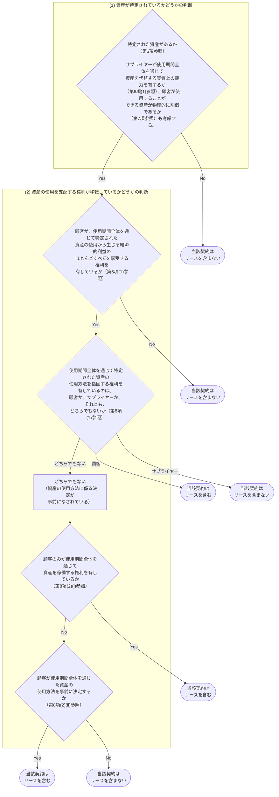

# リースの識別に関するフローチャート

- 出典: ASBJ リース会計基準 設例1

```mermaid
flowchart TD
  subgraph S1["(1) 資産が特定されているかどうかの判断"]
    Q1{"特定された資産があるか（第6項参照）\n\nサプライヤーが使用期間全体を通じて\n資産を代替する実質上の能力を有するか\n（第6項(1)参照）、顧客が使用することが\nできる資産が物理的に別個であるか\n（第7項参照）も考慮する。"}
  end

  subgraph S2["(2) 資産の使用を支配する権利が移転しているかどうかの判断"]
    Q2{"顧客が、使用期間全体を通じて特定された\n資産の使用から生じる経済的利益の\nほとんどすべてを享受する権利を\n有しているか（第5項(1)参照）"}
    Q3{"使用期間全体を通じて特定された資産の\n使用方法を指図する権利を有しているのは、\n顧客か、サプライヤーか、それとも、\nどちらでもないか（第8項(1)参照）"}
    NOTE["どちらでもない\n（資産の使用方法に係る決定が\n事前になされている）"]
    Q4{"顧客のみが使用期間全体を通じて\n資産を稼働する権利を有しているか\n（第8項(2)(i)参照）"}
    Q5{"顧客が使用期間全体を通じた資産の\n使用方法を事前に決定するか\n（第8項(2)(ii)参照）"}
  end

  Q1 -->|Yes| Q2
  Q1 -->|No| E1(["当該契約は\nリースを含まない"])
  Q2 -->|Yes| Q3
  Q2 -->|No| E2(["当該契約は\nリースを含まない"])
  Q3 -->|顧客| E3(["当該契約は\nリースを含む"])
  Q3 -->|"サプライヤー"| E7(["当該契約は\nリースを含まない"])
  Q3 -->|"どちらでもない"| NOTE
  NOTE --> Q4
  Q4 -->|Yes| E4(["当該契約は\nリースを含む"])
  Q4 -->|No| Q5
  Q5 -->|Yes| E5(["当該契約は\nリースを含む"])
  Q5 -->|No| E6(["当該契約は\nリースを含まない"])
```
