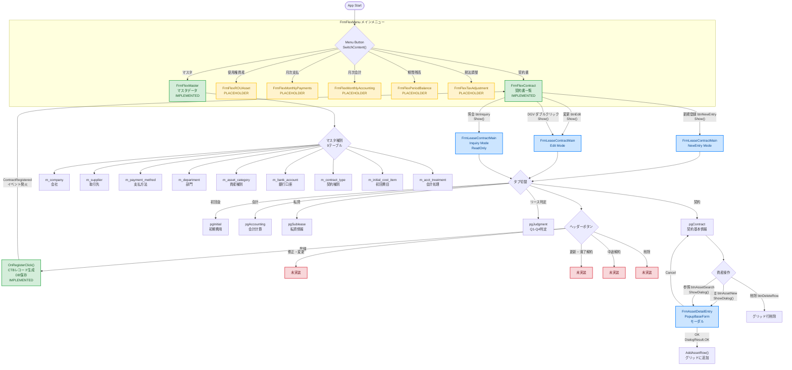

# 画面フローチャート AsIs（現状の実装）

> **作成日:** 2026-03-11
> **対象プロジェクト:** LeaseM4BS（リース会計管理システム）
> **対象:** LeaseM4BS.TestWinForms
> **ToBe版:** [画面フローチャート_ToBe.md](画面フローチャート_ToBe.md)

---

## 1. 全体画面遷移図

```
┌─────────────────────────────────────────────────────────────────────┐
│                     アプリケーション起動                              │
└───────────────────────────┬─────────────────────────────────────────┘
                            ▼
┌─────────────────────────────────────────────────────────────────────┐
│                    FrmFlexMenu（メインメニュー）                      │
│  ┌───────────────────────────────────────────────────────────────┐  │
│  │  メニューボタン群                                               │  │
│  │  ┌──────────┐ ┌──────────┐ ┌──────────┐ ┌──────────┐        │  │
│  │  │ 契約書    │ │使用権資産│ │ 月次支払  │ │ 月次会計  │        │  │
│  │  │ ★実装済  │ │ 未実装   │ │ 未実装    │ │ 未実装    │        │  │
│  │  └────┬─────┘ └──────────┘ └──────────┘ └──────────┘        │  │
│  │  ┌──────────┐ ┌──────────┐ ┌──────────┐                      │  │
│  │  │ 期間残高  │ │ 税法調整  │ │ マスタ   │                      │  │
│  │  │ 未実装    │ │ 未実装    │ │ ★実装済 │                      │  │
│  │  └──────────┘ └──────────┘ └────┬─────┘                      │  │
│  └─────────────────────────────────┼────────────────────────────┘  │
│                                    ▼                                │
│  ┌───────────────────────────────────────────────────────────────┐  │
│  │  pnlContent（コンテンツ表示エリア）                             │  │
│  │  ※ 選択されたメニューに応じてUserControlを動的に切り替え         │  │
│  └───────────────────────────────────────────────────────────────┘  │
└─────────────────────────────────────────────────────────────────────┘
```

---

## 2. メニュー → 各画面の対応表

| メニューボタン | クラス名 | 実装状態 |
|---|---|---|
| 契約書 | `FrmFlexContract` | **実装済み** |
| 使用権資産 | `FrmFlexROUAsset` | プレースホルダ |
| 月次支払 | `FrmFlexMonthlyPayments` | プレースホルダ |
| 月次会計 | `FrmFlexMonthlyAccounting` | プレースホルダ |
| 期間残高 | `FrmFlexPeriodBalance` | プレースホルダ |
| 税法調整 | `FrmFlexTaxAdjustment` | プレースホルダ |
| マスタ | `FrmFlexMaster` | **実装済み** |

> **動作仕様:** メニューボタン押下時、`SwitchContent()` メソッドにより `pnlContent` 内の UserControl を切り替える。同時に表示されるのは1画面のみ（前の画面は Dispose される）。

---

## 3. 契約書画面の詳細フロー（実装済み）

```
FrmFlexContract（契約書一覧 UserControl）
│
├─ [新規登録] ボタン ──────────────────┐
│                                       ▼
├─ [編集] ボタン ──────────────► FrmLeaseContractMain（契約管理フォーム）
│                                 │  ※ Show() で非モーダル表示
├─ [照会] ボタン ──────────────► │  モード: NewEntry / Edit / Inquiry
│                                 │
├─ DataGridView ダブルクリック ──► │
│                                 │
│                                 ├─ タブ構成
│                                 │   ├─ pgContract（契約基本情報）
│                                 │   ├─ pgInitial（初期費用）
│                                 │   ├─ pgAccounting（会計計算）
│                                 │   ├─ pgSublease（転貸情報）
│                                 │   └─ pgJudgment（Q1-Q4 リース判定）
│                                 │
│                                 ├─ ヘッダーボタン
│                                 │   ├─ [登録] ──► OnRegisterClick()
│                                 │   │              CTBレコード生成 → DB保存
│                                 │   │              ContractRegistered イベント発火
│                                 │   ├─ [修正・変更]    ※未実装
│                                 │   ├─ [更新・満了解約] ※未実装
│                                 │   ├─ [中途解約]      ※未実装
│                                 │   └─ [削除]          ※未実装
│                                 │
│                                 ├─ [資産追加] ボタン ──────┐
│                                 │                           ▼
│                                 ├─ [資産参照] ボタン ► FrmAssetDetailEntry
│                                 │                     （資産詳細ダイアログ）
│                                 ├─ [資産削除] ボタン    ※ ShowDialog() でモーダル表示
│                                 │   └─ グリッド行削除    ※ PopupBaseForm を継承
│                                 │                           │
│                                 │                     ┌─────┴─────┐
│                                 │                     │           │
│                                 │                   [OK]      [Cancel]
│                                 │                     │           │
│                                 │                     ▼           ▼
│                                 │               AddAssetRow()  キャンセル
│                                 │               グリッドに追加  (親画面へ)
│                                 │
│                                 ├─ [保存] ボタン → 契約データ保存
│                                 └─ [閉じる] → フォームを閉じる
│
└─ 契約一覧表示（DataGridView）
```

---

## 4. 契約管理フォームの動作モード

```
FrmLeaseContractMain
├── NewEntry モード（新規登録）
│   ├── 契約番号: 自動採番
│   ├── 全フィールド: 入力可能
│   └── 保存時: 新規レコード作成
│
├── Edit モード（編集）
│   ├── 契約番号: 読み取り専用
│   ├── その他フィールド: 入力可能
│   └── 保存時: 既存レコード更新
│
└── Inquiry モード（照会）
    ├── 全フィールド: 読み取り専用
    └── 保存ボタン: 非表示 / 無効
```

---

## 5. マスタ管理画面の構成（実装済み）

```
FrmFlexMaster（マスタデータ管理 UserControl）
│
├── マスタ種別選択（9テーブル）
│   ├── m_company（会社）
│   ├── m_supplier（取引先）
│   ├── m_payment_method（支払方法）
│   ├── m_department（部門）
│   ├── m_asset_category（資産種別）
│   ├── m_bank_account（銀行口座）
│   ├── m_contract_type（契約種別）
│   ├── m_initial_cost_item（初回費目）
│   └── m_acct_treatment（会計処理）
│
└── CRUD 操作
    ├── 一覧表示（DataGridView）
    ├── 新規登録
    ├── 編集
    └── 削除
```

---

## 6. フォーム階層構造

```
System.Windows.Forms.Form
├── FrmFlexMenu                    メインウィンドウ（起動フォーム）
├── FrmLeaseContractMain           契約管理フォーム（非モーダル）
└── PopupBaseForm                  ポップアップ基底クラス
    └── FrmAssetDetailEntry        資産詳細ダイアログ（モーダル）

System.Windows.Forms.UserControl
├── FrmFlexContract                契約書画面        【実装済み】
├── FrmFlexROUAsset                使用権資産画面    【プレースホルダ】
├── FrmFlexMonthlyPayments         月次支払画面      【プレースホルダ】
├── FrmFlexMonthlyAccounting       月次会計画面      【プレースホルダ】
├── FrmFlexPeriodBalance           期間残高画面      【プレースホルダ】
├── FrmFlexTaxAdjustment           税法調整画面      【プレースホルダ】
└── FrmFlexMaster                  マスタ管理画面    【実装済み】
```

---

## 7. 画面遷移のパターン

| パターン | 表示方式 | 用途 | 例 |
|---|---|---|---|
| メニュー切替 | `SwitchContent()` | メイン画面内のコンテンツ切替 | メニューボタン → UserControl |
| 非モーダル表示 | `Form.Show()` | 独立したウィンドウを開く | 契約一覧 → 契約管理 |
| モーダルダイアログ | `Form.ShowDialog()` | 親画面をブロックして入力を受ける | 契約管理 → 資産詳細 |

---

## 8. 未実装画面（プレースホルダ）一覧

以下の5画面は UserControl として存在するが、内部ロジックは未実装：

1. **FrmFlexROUAsset** — 使用権資産管理
2. **FrmFlexMonthlyPayments** — 月次リース料支払管理
3. **FrmFlexMonthlyAccounting** — 月次会計仕訳処理
4. **FrmFlexPeriodBalance** — 期間残高照会・管理
5. **FrmFlexTaxAdjustment** — 税法調整（税務・会計差異処理）

---

## フロー図（mermaid）


