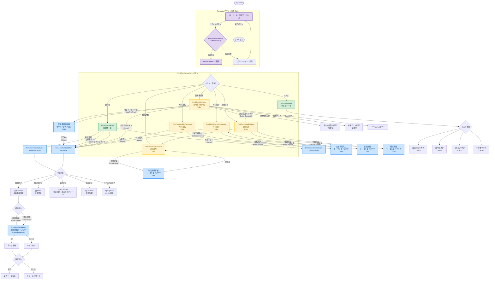

# 画面フローチャート ToBe（将来の画面遷移図）

> **作成日:** 2026-03-11
> **更新日:** 2026-03-11
> **対象プロジェクト:** LeaseM4BS（リース会計管理システム）
> **対象:** LeaseM4BS 全画面（実装済み + ToBe）
> **AsIs版:** [画面フローチャート_AsIs.md](画面フローチャート_AsIs.md)
> **ログイン画面検討:** [ログイン画面_検討資料.md](ログイン画面_検討資料.md)

---

## 1. 全体画面遷移図

```
┌─────────────────────────────────────────────────────────────────────┐
│                     アプリケーション起動                              │
└───────────────────────────┬─────────────────────────────────────────┘
                            ▼
┌─────────────────────────────────────────────────────────────────────┐
│                    FrmLogin（ログイン画面）★ToBe新規                  │
│  ┌───────────────────────────────────────────────────────────────┐  │
│  │  ユーザーID: [____________]                                    │  │
│  │  パスワード: [____________]                                    │  │
│  │  [ログイン]  [終了]                                            │  │
│  └───────────────────────────────────────────────────────────────┘  │
│  ※ AuthorizationService.Authenticate() で tm_USER テーブルと照合    │
│  ├─ 認証成功 → FrmFlexMenu（権限に応じたメニュー制御）               │
│  └─ 認証失敗 → エラーメッセージ表示                                  │
└───────────────────────────┬─────────────────────────────────────────┘
                            ▼ （認証成功時）
┌─────────────────────────────────────────────────────────────────────┐
│                    FrmFlexMenu（メインメニュー）                      │
│  ┌───────────────────────────────────────────────────────────────┐  │
│  │  メニューボタン群                                               │  │
│  │  ┌──────────┐ ┌──────────┐ ┌──────────┐ ┌──────────┐        │  │
│  │  │ 契約書    │ │使用権資産│ │ 月次支払  │ │ 月次会計  │        │  │
│  │  │ 既存拡張  │ │ ★新規   │ │ ★新規    │ │ ★新規    │        │  │
│  │  └────┬─────┘ └────┬─────┘ └────┬─────┘ └────┬─────┘        │  │
│  │  ┌──────────┐ ┌──────────┐ ┌──────────┐                      │  │
│  │  │ 期間残高  │ │ 税法調整  │ │ マスタ   │                      │  │
│  │  │ ★新規    │ │ ★新規    │ │ 変更なし │                      │  │
│  │  └────┬─────┘ └────┬─────┘ └────┬─────┘                      │  │
│  └───────┼──────────┼──────────┼──────────┼──────────────────────┘  │
│          ▼          ▼          ▼          ▼                          │
│  ┌───────────────────────────────────────────────────────────────┐  │
│  │  pnlContent（コンテンツ表示エリア）                             │  │
│  │  ※ 選択されたメニューに応じてUserControlを動的に切り替え         │  │
│  └───────────────────────────────────────────────────────────────┘  │
└─────────────────────────────────────────────────────────────────────┘
```

---

## 2. メニュー → 各画面の対応表

| 画面 | クラス名 | ToBe 計画 |
|---|---|---|
| **ログイン** | `FrmLogin` | **★新規実装** |
| 契約書 | `FrmFlexContract` | 既存を拡張 |
| 使用権資産 | `FrmFlexROUAsset` | **新規実装** |
| 月次支払 | `FrmFlexMonthlyPayments` | **新規実装** |
| 月次会計 | `FrmFlexMonthlyAccounting` | **新規実装** |
| 期間残高 | `FrmFlexPeriodBalance` | **新規実装** |
| 税法調整 | `FrmFlexTaxAdjustment` | **新規実装** |
| マスタ | `FrmFlexMaster` | 変更なし |

> **動作仕様:** メニューボタン押下時、`SwitchContent()` メソッドにより `pnlContent` 内の UserControl を切り替える。同時に表示されるのは1画面のみ（前の画面は Dispose される）。

---

## 3. 契約書画面の詳細フロー（既存を拡張）

```
FrmFlexContract（契約書一覧 UserControl）
│
├─ [新規登録] ボタン ──────────────────┐
│                                       ▼
├─ [編集] ボタン ──────────────► FrmLeaseContractMain（契約管理フォーム）
│                                 │  ※ Show() で非モーダル表示
├─ [照会] ボタン ──────────────► │  モード: NewEntry / Edit / Inquiry
│                                 │
├─ DataGridView ダブルクリック ──► │
│                                 │
│                                 ├─ タブ構成
│                                 │   ├─ pgContract（契約基本情報）
│                                 │   ├─ pgInitial（初期費用）
│                                 │   ├─ pgAccounting（会計計算・返済スケジュール）
│                                 │   ├─ pgSublease（転貸情報）
│                                 │   └─ pgJudgment（Q1-Q4 リース判定）
│                                 │
│                                 ├─ [資産追加] ボタン ──────┐
│                                 │                           ▼
│                                 ├─ [資産参照] ボタン ► FrmAssetDetailEntry
│                                 │                     （資産詳細ダイアログ）
│                                 │                      ※ ShowDialog() でモーダル表示
│                                 │                      ※ PopupBaseForm を継承
│                                 │                           │
│                                 │                     ┌─────┴─────┐
│                                 │                     │           │
│                                 │                   [OK]      [Cancel]
│                                 │                     │           │
│                                 │                     ▼           ▼
│                                 │               データ反映    キャンセル
│                                 │               (親画面へ)   (親画面へ)
│                                 │
│                                 ├─ [保存] ボタン → 契約データ保存
│                                 └─ [閉じる] → フォームを閉じる
│
└─ 契約一覧表示（DataGridView）
```

---

## 4. 新規画面の詳細フロー

### 4-1. 使用権資産画面（FrmFlexROUAsset）

```
FrmFlexROUAsset（使用権資産一覧 UserControl）
│
├─ DataGridView ダブルクリック ──► 使用権資産詳細（モーダルダイアログ）
│                                   │  ※ ShowDialog()
│                                   ├─ [元契約へ] ──► FrmLeaseContractMain (Edit)
│                                   └─ [閉じる]   ──► 一覧へ戻る
│
├─ [元契約へ] ボタン ──────────► FrmLeaseContractMain (Edit)
│                                   ※ Show() で非モーダル表示
│
├─ [期間残高へ] ボタン ────────► FrmFlexPeriodBalance
│                                   ※ SwitchContent() でメニュー内切替
│
├─ [減価償却実行] ──────────── 月次減価償却処理 → 一覧更新
├─ [減損テスト]   ──────────── 減損テスト処理   → 一覧更新
└─ [Excel出力]    ──────────── Excel エクスポート
```

### 4-2. 月次支払画面（FrmFlexMonthlyPayments）

```
FrmFlexMonthlyPayments（月次支払一覧 UserControl）
│
├─ [支払登録] ──────────────► 支払実績入力（モーダルダイアログ）
│                               ※ ShowDialog()
│                               ├─ [OK]     → 一覧へ戻る
│                               └─ [Cancel] → 一覧へ戻る
│
└─ [元契約へ] ボタン ──────► FrmLeaseContractMain (Edit)
```

### 4-3. 月次会計画面（FrmFlexMonthlyAccounting）

```
FrmFlexMonthlyAccounting（月次会計一覧 UserControl）
│
├─ [仕訳詳細] ──────────────► 仕訳詳細（モーダルダイアログ）
│                               ※ ShowDialog()
│                               └─ [閉じる] → 一覧へ戻る
│
└─ [元契約へ] ボタン ──────► FrmLeaseContractMain (Edit)
```

### 4-4. 期間残高画面（FrmFlexPeriodBalance）

```
FrmFlexPeriodBalance（期間残高一覧 UserControl）
│
├─ [明細照会] ──────────────► 残高明細（モーダルダイアログ）
│                               ※ ShowDialog()
│                               └─ [閉じる] → 一覧へ戻る
│
└─ [税法調整へ] ボタン ────► FrmFlexTaxAdjustment
                               ※ SwitchContent() でメニュー内切替
```

### 4-5. 税法調整画面（FrmFlexTaxAdjustment）

```
FrmFlexTaxAdjustment（税法調整一覧 UserControl）
│
└─ [調整詳細] ──────────────► 税法調整詳細（モーダルダイアログ）
                               ※ ShowDialog()
                               └─ [閉じる] → 一覧へ戻る
```

---

## 5. フォーム階層構造

```
System.Windows.Forms.Form
├── FrmLogin                       ログイン画面（起動フォーム）【★新規実装】
├── FrmFlexMenu                    メインウィンドウ（ログイン成功後に表示）
├── FrmLeaseContractMain           契約管理フォーム（非モーダル）
└── PopupBaseForm                  ポップアップ基底クラス
    └── FrmAssetDetailEntry        資産詳細ダイアログ（モーダル）

System.Windows.Forms.UserControl
├── FrmFlexContract                契約書画面        【既存拡張】
├── FrmFlexROUAsset                使用権資産画面    【★新規実装】
├── FrmFlexMonthlyPayments         月次支払画面      【★新規実装】
├── FrmFlexMonthlyAccounting       月次会計画面      【★新規実装】
├── FrmFlexPeriodBalance           期間残高画面      【★新規実装】
├── FrmFlexTaxAdjustment           税法調整画面      【★新規実装】
└── FrmFlexMaster                  マスタ管理画面    【変更なし】
```

---

## 6. 画面遷移のパターン

| パターン | 表示方式 | 用途 | 例 |
|---|---|---|---|
| メニュー切替 | `SwitchContent()` | メイン画面内のコンテンツ切替 | メニューボタン → UserControl |
| 非モーダル表示 | `Form.Show()` | 独立したウィンドウを開く | 契約一覧 → 契約管理 |
| モーダルダイアログ | `Form.ShowDialog()` | 親画面をブロックして入力を受ける | 契約管理 → 資産詳細 |

---

## 7. 画面間ナビゲーション

ToBe では画面間の相互遷移が追加される：

```
FrmFlexContract ──Show()──► FrmLeaseContractMain
       ▲                            ▲
       │                            │ Show() (元契約へ)
       │                            │
FrmFlexROUAsset ─SwitchContent()─► FrmFlexPeriodBalance
       │                            │
       │                            │ SwitchContent() (税法調整へ)
       │                            ▼
       │                     FrmFlexTaxAdjustment
       │
FrmFlexMonthlyPayments ──Show()──► FrmLeaseContractMain
FrmFlexMonthlyAccounting ─Show()─► FrmLeaseContractMain
```

> **ポイント:** ToBe 画面はすべて「元契約へ」ボタンで `FrmLeaseContractMain` (Edit) へ遷移可能。画面間の SwitchContent() による切替も追加。

---

## フロー図（mermaid）


