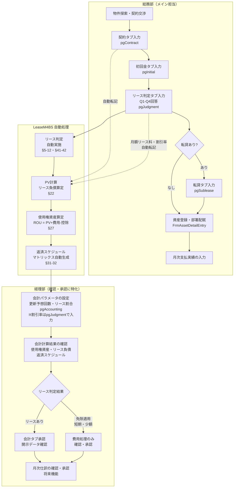
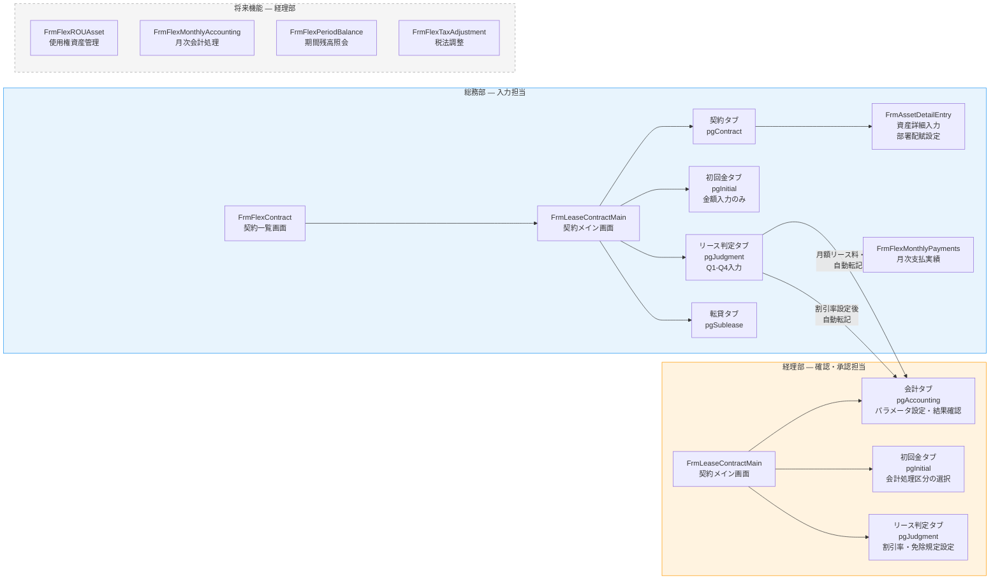

# 総務部と経理部の業務分担ガイド — LeaseM4BS

**対象バージョン**: LeaseM4BS v1.x
**準拠基準**: ASBJ第34号「リースに関する会計基準」（2024年9月）
**作成日**: 2026年3月11日

---

## 1. 本ドキュメントの目的

本ドキュメントは、LeaseM4BSを導入した組織において、**誰が何をするか**を明確にするための業務分担ガイドです。

### 読み方ガイド

| 読者 | 読むべきセクション |
|---|---|
| **総務部 担当者** | §3（全体像）→ §4（総務の業務詳細）→ §8（画面マップ） |
| **経理部 担当者** | §3（全体像）→ §5（経理の業務詳細）→ §6（自動化の範囲）→ §8（画面マップ） |
| **導入PM・管理職** | §2（製品コンセプト）→ §3（全体像）→ §7（導入メリット）→ §9（権限設計） |

### 背景: ASBJ第34号への対応

2024年9月に改訂されたASBJ第34号「リースに関する会計基準」は、2027年3月期（早期適用は2025年3月期）から強制適用されます。同基準は、従来オフバランス処理されていたオペレーティング・リースを含む多くのリース契約について、**使用権資産とリース負債のオンバランス計上**を義務付けます。

この対応は経理業務単独では完結しません。リース契約の実態把握（Q1〜Q4の識別判定、契約期間・支払条件の正確な入力）は、契約交渉を直接担う**総務部の協力が不可欠**です。LeaseM4BSは、この部門間連携を効率化するために設計されています。

---

## 2. 製品コンセプト: 経理の業務を最小限にする

### LeaseM4BSの設計思想 — 経理負担の最小化

> **「総務が入力すれば、経理は承認するだけ」**

これがLeaseM4BSの一番の強みです。

従来型のリース会計処理では、経理部がリース判定・PV計算・仕訳作成・資産台帳管理を一手に担っていました。しかしASBJ第34号の適用により管理対象契約が急増する中、経理がすべてを担うモデルは限界を迎えます。

LeaseM4BSの設計思想は、**現場（総務）が契約実態を入力し、経理は会計パラメータの確認と計算結果の承認に特化する**という明確な役割分担にあります。

| 処理 | 従来（経理が全担当） | LeaseM4BSの対応 |
|---|---|---|
| 契約情報の台帳化 | 経理が契約書を収集・Excel台帳を作成 | 総務がLeaseM4BSに直接入力 |
| リース判定（Q1-Q4） | 経理が基準書を参照して個別判断・記録 | 総務がQ1-Q4に回答、アプリが自動判定 |
| PV・使用権資産計算 | 経理がExcelで契約ごとに手計算 | パラメータ入力のみ、アプリが全自動計算 |
| 返済スケジュール | 経理がExcelでリース期間分を作成 | アプリがマトリックスを自動生成 |
| 消費税計算 | 経理が費目ごとに手計算 | アプリが費目ごとに自動計算 |

この設計の根拠は、ASBJ第34号§22（リース負債: 将来リース料の現在価値）および§27（使用権資産: PV + 初期直接費用 + 原状回復費用 - インセンティブ）の計算をシステムが全自動で実施することにあります。経理部が担うのは、計算に使用するパラメータ（割引率・更新予想回数・リース割合等）の確認と、計算結果の承認のみです。

---

## 3. 業務分担の全体像

### 3.1 業務フロー図



### 3.2 分担マトリックス

| 業務項目 | 対応画面 | 総務 | 経理 | アプリ自動 | ASBJ条文 |
|---|---|:---:|:---:|:---:|---|
| 物件選定・契約交渉 | — | 主担当 | — | — | — |
| 契約番号・名称・種類の登録 | 契約タブ (pgContract) | 主担当 | — | 採番自動 | — |
| 取引先・管理部署の登録 | 契約タブ (pgContract) | 主担当 | — | — | §13前提 |
| 契約期間・無償期間の入力 | 契約タブ (pgContract) | 主担当 | — | 期間月数自動計算 | §17 |
| 月額支払明細の入力 | 契約タブ (dgvMonthlyPayments) | 主担当 | — | 消費税自動計算 | — |
| 初回費用（敷金・礼金・仲介）の入力 | 初回金タブ (pgInitial) | 主担当 | — | 消費税自動計算 | — |
| 原状回復費用見積の入力 | 初回金タブ (numRestorationCost) | 入力 | 確認 | — | §29 |
| 初回費用の会計処理区分の選択 | 初回金タブ (AcctTreatment列) | — | 主担当 | — | §28-30 |
| 初期直接費用・インセンティブの認識 | 初回金タブ (numInitialDirectCost 等) | — | 主担当 | — | §28・§30 |
| リース判定Q1-Q4の実施 | リース判定タブ (pgJudgment) | 主担当 | — | 判定自動表示 | §5-12 |
| 延長・解約オプション確実性の評価 | リース判定タブ (cboExtCertainty) | 入力 | 確認 | — | §17 |
| 割引率（追加借入利子率）の設定 | リース判定タブ (numDiscountRate) | — | 主担当 | — | §22 |
| 免除規定適用の判断 | リース判定タブ (chkApplyExemption) | — | 主担当 | 短期・少額自動判定 | §41-42 |
| 実務的便法（非リース分離なし）の選択 | リース判定タブ (chkServiceComponent) | — | 主担当 | — | §13 |
| 転貸情報の入力 | 転貸タブ (pgSublease) | 主担当 | — | — | — |
| 資産登録・設置場所・種別情報の入力 | FrmAssetDetailEntry | 主担当 | — | — | — |
| 費用負担部署・配賦率の設定 | FrmAssetDetailEntry (dgvDeptAllocation) | 入力 | 確認 | 合計100%検証自動 | §13 |
| 更新予想回数の設定 | 会計タブ (txtSchRenewalForecastCount) | — | 主担当 | — | §17 |
| リース割合・非リース割合の設定 | 会計タブ (txtSchLeaseRatio 等) | — | 主担当 | — | §13 |
| PV（現在価値）計算 | 会計タブ (txtSchPresentValue) | — | — | 全自動 | §22 |
| 使用権資産の算定 | 会計タブ (txtSchRouBegin〜End) | — | — | 全自動 | §27 |
| リース負債の算定 | 会計タブ (txtSchLiabBegin〜End) | — | — | 全自動 | §22 |
| 返済スケジュールマトリックスの生成 | 会計タブ | — | — | 全自動 | §31-32 |
| 会計計算結果の確認・承認 | 会計タブ (pgAccounting) | — | 主担当 | — | §22・§27 |
| 月次支払実績の入力 | FrmFlexMonthlyPayments | 主担当 | — | — | — |
| 月次仕訳の確認・承認 | FrmFlexMonthlyAccounting（将来） | — | 主担当 | 仕訳自動生成（将来） | §31-32 |
| 期末開示データの確認 | FrmFlexPeriodBalance（将来） | — | 主担当 | — | §45-46 |
| 税法調整 | FrmFlexTaxAdjustment（将来） | — | 主担当 | — | — |

---

## 4. 総務部の業務（メイン担当）

### 4.1 契約情報の登録・管理（契約タブ）

**対応画面**: `FrmLeaseContractMain` > 契約タブ (pgContract)
**対応DBテーブル**: `tw_lease_contract`, `tw_lease_property`, `tw_lease_party`

総務部は、リース契約の基本情報をシステムに直接登録します。これが以降の全自動計算の起点となります。

**主な入力項目**:

| コントロール名 | 入力内容 | 備考 |
|---|---|---|
| `txtContractNo` | 契約番号 | 自動採番（手動変更可） |
| `txtContractName` | 契約名称 | 例: 「〇〇ビル 3F賃貸」 |
| `cmbContractType` | 契約種類 | 普通賃貸借 / 定期賃貸借 |
| `cmbSupplier` / `txtSupplierName` | 取引先（貸主・リース会社） | — |
| `cmbMgmtDeptCode` / `txtMgmtDeptName` | 契約管理部署 | `tw_lease_contract.mgmt_dept` に保存 |
| `dtpStartDate` / `dtpEndDate` | 契約開始日・終了日 | リース期間の自動計算に使用 |
| `numFreePeriod` | 無償期間（フリーレント月数） | — |
| `cmbAssetCategory` | 資産種類 | 不動産 / 車両 / OA機器 |
| `dgvMonthlyPayments` | 月額支払明細 | 科目・支払額(税抜)・振込先・支払方法・支払日 |

**ASBJ根拠**: `mgmt_dept`（管理部署）と `cost_dept`（費用負担部署）の区分は、コスト配分の前提となります（§13 構成要素区分の適用）。

> **注記**: 管理部署（`mgmt_dept`）は「誰が契約を管理するか」であり、通常は総務部です。費用負担部署（`cost_dept`）は「誰がコストを負担するか」であり、資産の使用部署が異なる場合は §4.5 の部署配賦で設定します。

### 4.2 初回費用の登録（初回金タブ）

**対応画面**: `FrmLeaseContractMain` > 初回金タブ (pgInitial)
**対応DBテーブル**: `tw_lease_initial`

契約締結時に発生する初回費用を登録します。金額（税抜）を入力すると、消費税（敷金は0%、その他は10%）が自動計算されます。

**主な入力項目**:

| コントロール名 | 入力内容 | 担当 | ASBJ根拠 |
|---|---|---|---|
| `dgvInitialCosts`（費目列） | 敷金・敷金償却額・礼金・仲介手数料 | 総務（金額入力） | — |
| `dgvInitialCosts`（会計処理列） | 資産計上/費用処理/繰延処理/預り金処理 | **経理が選択** | §28-30 |
| `numRestorationCost` | 原状回復費用見積 | 総務（見積入力）・経理（計上判断確認） | §29 |
| `numInitialDirectCost` | 初期直接費用 | **経理** | §28 |
| `numLeaseIncentive` | リース・インセンティブ | **経理** | §30 |

> **総務の役割**: 敷金・礼金・仲介手数料の**金額**と、原状回復費用の**見積額**を入力します。
> **経理の役割**: 各費目の**会計処理区分**（どの会計科目で処理するか）を決定します。初期直接費用とリース・インセンティブは経理が直接入力します。

### 4.3 リース判定の実施（リース判定タブ Q1-Q4）

**対応画面**: `FrmLeaseContractMain` > リース判定タブ (pgJudgment)
**対応DBテーブル**: `tw_lease_judgment`

ASBJ第34号§5〜12「リースの識別」に基づく判定を実施します。総務部は、**契約書の文言・実態を確認しながらQ1〜Q4にラジオボタンで回答**します。システムが判定フローを自動実行し、リース該当/非該当を自動表示します。

**Q1-Q4 判定項目**:

| 設問 | コントロール | 確認内容 | 判定継続条件 | 総務判断の可否 |
|---|---|---|---|---|
| Q1: リースの存在 | `rbQ1Yes` / `rbQ1No` | 契約が、特定された資産の使用を支配する権利を一定期間移転するか | Yes → Q2へ | 可（契約書の文言確認） |
| Q2: サプライヤーの実質的代替権 | `rbQ2Yes` / `rbQ2No` | サプライヤーが資産を代替する実質的な権利を有するか | **No（代替権なし）→ Q3へ** | 可（契約書でサプライヤーの代替可否を確認） |
| Q3: 経済的便益 | `rbQ3Yes` / `rbQ3No` | 資産の使用から生じる経済的便益のほとんどすべてを得る権利があるか | Yes → Q4へ | 可（専用使用か否かの確認） |
| Q4: 使用の指図 | `rbQ4Yes` / `rbQ4No` | 資産の使用を指図する権利を有するか | Yes → リース該当 | 可（契約実態の確認） |

> **Q2の判定ロジック補足**: Q2は「サプライヤーに代替権がある（Yes）」場合にリース**非**該当となります。代替権がない（No）場合にQ3へ進みます。これはASBJ第34号§7-8の判定に対応します。

**期間・免除関連の入力**:

| コントロール | 入力内容 | 担当 |
|---|---|---|
| `dtpJudgeStart` / `dtpJudgeEnd` | 開始日・終了日 | 総務 |
| `chkExtOption` + `numExtMonths` | 延長オプションあり・延長月数 | 総務（有無・月数）|
| `cboExtCertainty` | 延長オプション行使の確実性（低い/高い） | 総務（入力）、経理（確認）— §17「合理的に確実」の会計判断 |
| `chkTerminateOption` | 解約オプションあり | 総務（有無）、確実性評価は経理確認 |
| `numAssetValue` | 資産取得価額（少額判定用） | 総務 |
| `numMonthlyRentJudge` | 月額リース料 | 総務（契約書から読み取り） |
| `numDiscountRate` | 割引率（追加借入利子率） | **経理** |
| `chkApplyExemption` | 免除規定の適用 | **経理**（会計方針の選択） |
| `chkServiceComponent` | 非リース構成要素を分離しない（実務的便法） | **経理**（会計方針の選択） |

**ASBJ根拠**: §5-12（リースの識別）、§41（短期リース免除: 12ヶ月以内）、§42（少額リース免除）

> **自動判定**: 判定結果は `lblResultText` / `lblResultBadge` / `lblResultReason` に自動表示されます。また、月額リース料と割引率は会計タブへ自動転記（読取専用）されます。

### 4.4 転貸情報の管理（転貸タブ）

**対応画面**: `FrmLeaseContractMain` > 転貸タブ (pgSublease)
**対応DBテーブル**: `tw_lease_sublease`

借りたスペースの一部を第三者に転貸（サブリース）している場合のみ使用します。

| コントロール | 入力内容 |
|---|---|
| `chkSublease` | 転貸あり（チェックで入力欄を有効化） |
| `txtSublesseeName` | 転貸先名称 |
| `txtSubleaseArea` | 転貸面積（㎡） |
| `dtpSubleaseStart` / `dtpSubleaseEnd` | 転貸開始日・終了日 |
| `dgvSubleaseIncome` | 転貸料受取テーブル（科目・月額受取額・消費税・税込合計） |

### 4.5 資産登録・部署配分の設定（資産入力画面）

**対応画面**: `FrmAssetDetailEntry`（契約タブの資産一覧 `dgvAssets` からアクセス）
**対応DBテーブル**: `tw_lease_property`（資産詳細）、`ctb_dept_allocation`（部署配分）

資産の種別（不動産・車両・OA機器）に応じた詳細情報を入力します。

**共通入力項目**:

| コントロール | 入力内容 |
|---|---|
| `txtAssetNo` | 資産番号（自動採番） |
| `txtAssetName` | 資産名 |
| `txtInstallLocation` | 設置場所 |
| `cmbCompany` | 会社名（本社/大阪支店/名古屋支店） |

**種別固有の入力項目（抜粋）**:

| 資産種別 | 主な固有項目 |
|---|---|
| 不動産 | 構造・面積・間取り・竣工日・貸主名・仲介会社・使用制限 |
| 車両 | 車台番号・登録番号・車種・車検日・走行距離制限 |
| OA機器 | 型番・シリアル番号・保守期限日・保守契約内容 |

**費用負担部署・配賦率の設定** (`dgvDeptAllocation`):

1つの資産を複数部署で使用する場合、費用を按分します。総務部が部署と配賦率を入力し、経理部が内容を確認します。

```
例: OA機器を総務部50%・経理部50%で使用する場合
  → ctb_dept_allocation に2レコード作成
  → DeptCd: 総務部コード, AllocationRatio: 50.00
  → DeptCd: 経理部コード, AllocationRatio: 50.00
```

> **バリデーション**: 配賦率の合計が100%でない場合は登録エラーになります（`UpdateAllocationTotal()` でリアルタイム検証）。

**ASBJ根拠**: コスト配分の前提となる構成要素区分（§13）。

### 4.6 月次支払実績の入力（月次支払画面）

**対応画面**: `FrmFlexMonthlyPayments`
**対応DBテーブル**: `tw_lease_payment_actual`

毎月の支払が実施された後、総務部が支払実績を入力します。この情報は経理部の月次会計処理（将来機能）の入力データとなります。

---

## 5. 経理部の業務（最小限）

### 5.1 割引率の確認・設定

**対応画面**: `FrmLeaseContractMain` > リース判定タブ (pgJudgment) > `numDiscountRate`

割引率（追加借入利子率）はリース負債の現在価値計算における最重要パラメータです。ASBJ第34号§22では「リース開始日現在の追加借入利子率」を使用することとされており、財務・経理の専門知識が必要です。

**割引率決定の「3ステップ・アプローチ」**（業界標準）:

1. **ベースレート設定**: リスクフリーレートや市場金利（国債利回り等）を基準とする
2. **信用スプレッド追加**: 自社の信用リスクを加味する
3. **リース特有調整**: 担保・期間・通貨などの要素を考慮する

> **注意**: 割引率の決定には会計部門だけでなく財務部門の協力が必要なケースがあります（外部調査・業界ベストプラクティス）。

入力後、割引率は会計タブ（`txtSchDiscountRate`）へ自動転記され、以降の計算には手入力不要です。

### 5.2 会計計算結果の確認・承認（会計タブ）

**対応画面**: `FrmLeaseContractMain` > 会計タブ (pgAccounting)

経理部は会計タブで以下のパラメータを設定し、自動計算結果を確認・承認します。

**経理が設定するパラメータ**:

| コントロール | 設定内容 | ASBJ根拠 |
|---|---|---|
| `txtSchRenewalForecastCount` | 更新予想回数（合理的に確実な延長回数） | §17 |
| `txtSchRenewalRent` | 更新時月額賃料 | §17 |
| `txtSchLeaseRatio` | リース割合（構成要素区分） | §13 |
| `txtSchNonLeaseRatio` | 非リース割合（構成要素区分） | §13 |
| `txtSchMaintenanceCost` | 維持管理費用（非リース構成要素） | §13 |

**経理が確認する自動計算結果（読取専用）**:

| 表示項目 | 内容 | ASBJ根拠 |
|---|---|---|
| 会計期間月数 | 基本期間 + 更新予想回数 × 更新月数 | §17 |
| 算定総額 | 月額賃料 × 会計期間月数 | §22 |
| リース配分額 | 算定総額 × リース割合 / (リース割合 + 非リース割合) | §13 |
| 現在価値 (PV) | 年金現価公式による自動計算 | §22 |
| 使用権資産（期首〜期末） | 当初認識額から減価償却後の残高 | §27・§37 |
| リース負債（期首〜期末） | 元本返済後の残高（利息法） | §22・§31 |

> **経理の主な作業**: パラメータを設定し、計算結果が会計基準に照らして合理的かどうかを確認することです。Excelでの手計算は不要です。

### 5.3 月次仕訳の確認・承認（月次会計画面）

**対応画面**: `FrmFlexMonthlyAccounting`（将来機能）
**対応DBテーブル**: `tw_lease_journal`

将来機能として実装予定です。月次仕訳（利息費用・減価償却費・リース負債の元本返済）をシステムが自動生成し、経理部が内容を確認・承認します。承認後、会計システムへの連携が可能となります。

### 5.4 期末開示データの確認・税法調整

**対応画面**: `FrmFlexPeriodBalance`（将来機能）、`FrmFlexTaxAdjustment`（将来機能）

期末に、会計基準上の処理（オンバランス）と税務上の処理（損金算入額）の差異を確認・調整します。ASBJ第34号§45〜46に基づく開示データの最終確認も経理部が担います。

---

## 6. アプリによる自動化（経理負担の軽減ポイント）

### 6.1 自動計算項目一覧

| 自動計算項目 | 従来の経理作業 | LeaseM4BSの対応 | ASBJ根拠 |
|---|---|---|---|
| リース判定フロー（Q1-Q4） | 手動で基準書を参照し判断・記録 | ラジオボタン回答→自動判定・表示 | §5-12 |
| 短期・少額リース免除判定 | 手動で12ヶ月チェック・少額チェック | 期間・取得価額入力→自動判定表示 | §41-42 |
| リース期間の月数算出 | 開始日〜終了日を手動計算 | 日付入力→自動計算 | §17 |
| 会計期間の算出 | 更新予想も含めてExcelで計算 | 更新予想回数入力→自動計算 | §17 |
| リース/非リース配分額 | 手動按分計算 | 割合入力→自動配分 | §13 |
| 現在価値 (PV) 計算 | ExcelのPV関数または手計算 | 割引率・月額入力→自動計算 | §22 |
| 使用権資産の当初認識額 | 各費用を手動で合算 | 各費用入力→自動合算 | §27 |
| 返済スケジュールマトリックス | Excelでリース期間分を作成 | 全期間分を自動生成 | §31-32 |
| 消費税額の計算 | 費目ごとに手動計算 | 費目ごとに税率を自動適用 | — |

### 6.2 自動計算の詳細式

計算エンジン（`UpdateAccountingTabValues`、`FrmLeaseContractMain.vb:1447-1561`）が以下の順序で自動計算します。

```
Step 1: 会計期間月数 = 基本期間月数 + 更新予想回数 × 更新月数  ← §17
Step 2: 賃料総額    = 月額賃料 × 基本期間月数
Step 3: 算定総額    = 月額賃料 × 会計期間月数
Step 4: リース配分額 = 算定総額 × リース割合 / (リース割合 + 非リース割合)  ← §13
        ※ 割合がともに0の場合 → 算定総額全額をリース配分（ゼロ割フォールバック）
Step 5: PV = (リース配分額 / n) × (1 - (1 + r)^(-n)) / r  ← §22（年金現価公式）
        ※ n: 会計期間月数、r: 月次割引率
Step 6: 使用権資産 = PV + 初期直接費用 + 原状回復費用 - リース・インセンティブ  ← §27
Step 7: リース負債  = PV  ← §22
```

### 6.3 返済スケジュールマトリックスの自動生成

```
リース負債 (Liab) — 利息法 §31
  Liab期首[i] = Liab期末[i-1]（i=1の場合: PV）
  利息費用[i] = Liab期首[i] × 月次割引率 × 月数
  元本返済[i] = 月額支払 × 月数 - 利息費用[i]
  Liab期末[i] = Liab期首[i] - 元本返済[i]

使用権資産 (ROU) — 定額法 §37
  ROU期首[i] = ROU期末[i-1]（i=1の場合: 当初認識額）
  減価償却[i] = ROU当初認識額 / min(リース期間, 耐用年数) × 月数
  ROU期末[i] = ROU期首[i] - 減価償却[i]
```

### 6.4 ASBJ根拠条文の自動付与

会計タブの各計算値は、対応するASBJ第34号の条文番号と紐付けて管理されています。経理部は計算根拠をシステムから確認できるため、監査対応の工数も削減できます。

---

## 7. 導入メリット（経理工数削減効果）

### 7.1 導入前 vs 導入後の比較表

| 業務 | 導入前（主に経理担当） | 導入後（総務担当・システム自動） | 経理の変化 |
|---|---|---|---|
| 契約情報の台帳化 | 経理が契約書を収集・Excel台帳を手作成 | **総務**がLeaseM4BSに直接入力 | 作業不要 |
| リース判定（Q1-Q4） | 経理が基準書を参照して個別判断・記録 | **総務**がQ1-Q4に回答、**システム**が自動判定 | 結果確認のみ |
| 免除規定の確認 | 経理が手動で12ヶ月・少額チェック | **システム**が自動判定・表示 | 適用判断のみ |
| PV（現在価値）計算 | 経理がExcelで契約ごとに手計算 | **システム**が自動計算 | 確認のみ |
| 使用権資産の算定 | 経理がExcelで各費用を手動合算 | **システム**が自動合算 | 確認のみ |
| 返済スケジュール作成 | 経理がExcelでリース期間分を全作成 | **システム**がマトリックスを自動生成 | 確認のみ |
| 消費税計算 | 経理が費目ごとに手動計算 | **システム**が費目ごとに自動計算 | 不要 |
| 部署配賦の管理 | 経理が按分計算・Excel管理 | **総務**がシステムに入力、経理は確認 | 確認のみ |

### 7.2 想定削減効果

業界調査（ZEEM・プロシップ等）では、リース管理システムの導入により管理工数の**大幅削減**が報告されています。

| 工数比較 | 導入前 | 導入後 | 削減効果 |
|---|---|---|---|
| 1契約あたりの経理処理時間 | Excelでの手計算・台帳管理含む | 会計パラメータ確認・承認のみ | 大幅削減（※） |
| 新基準適用による増加工数 | 全契約のオンバランス計算が必要 | 自動計算により追加工数を最小化 | 大幅抑制 |
| 月次処理工数 | 返済スケジュール参照・仕訳手作成 | 自動生成仕訳の確認のみ（将来機能） | 大幅削減（将来） |

> **※ 注意**: 具体的な削減時間（X時間→Y分）は実運用データがないため現時点では定量化していません。**導入後に実計測して本ドキュメントを更新**してください。

### 7.3 総務部の役割拡大について

LeaseM4BSでは、総務部がより多くの入力作業を担います。これは総務部の負担増加ではなく、**総務部が元来保有している契約実態の知識を、会計処理に直接活用する**仕組みです。

- 総務部はすでに契約書の管理・更新交渉を担当しており、Q1-Q4の判定に必要な情報を最も正確に把握しています
- システムへの入力は、従来の「Excelや紙台帳への転記」に相当する作業を置き換えるものです
- 総務部の入力によって、経理部の会計処理が自動化されます

---

## 8. 画面対応マップ（担当者ごとの操作画面）



**凡例**:
- 青色（実線）: 総務部が主に操作する画面
- オレンジ色（実線）: 経理部が主に操作する画面
- グレー（破線）: 将来実装予定の画面

---

## 9. 権限設計（将来拡張）

### 現在の実装状況

現時点では、ユーザー認証・権限管理機能は未実装です。`tw_m_user` テーブル（ユーザーマスタ）および `m_department` テーブル（部署マスタ）は設計済みですが、UIとの接続は今後の実装事項となっています。

現状では、本ドキュメントに記載の業務分担は**運用ルール**によって実現することを前提としています。

### 将来の権限設計方向性

| ロール | 想定権限 | 主な操作画面 |
|---|---|---|
| 総務部担当者 | 入力・編集（会計タブは読取専用） | 契約タブ・初回金タブ（金額）・リース判定タブ（Q1-Q4）・転貸タブ・資産入力 |
| 総務部管理者 | 総務部担当者権限 + 削除 | 上記全画面（会計タブは読取専用） |
| 経理部担当者 | 全タブ閲覧 + 会計タブ・初回金タブ（会計処理区分）・リース判定タブ（割引率・免除）編集 | 全画面 |
| 経理部管理者 | 全権限 | 全画面 |
| システム管理者 | マスタ管理・ユーザー管理 | 管理画面（将来実装） |

> **実装方針（仮定）**: 「入力者と承認者を分ける」最低限のワークフロー（4eyes原則）を想定しています。具体的な実装方針は確定次第、本ドキュメントを更新してください。

---

## 付録: 用語定義

| 用語 | 定義 |
|---|---|
| 管理部署 (`mgmt_dept`) | リース契約の管理責任を持つ部署。契約交渉・更新手続きを行う。通常は総務部。`tw_lease_contract.mgmt_dept` カラム。 |
| 費用負担部署 (`cost_dept`) | リース費用を計上する部署。会計処理上の配賦先。`ctb_dept_allocation` テーブルで資産ごとに管理。 |
| 使用権資産 (ROU) | ASBJ第34号§27に基づき計上する資産。計算式: PV + 初期直接費用 + 原状回復費用 - リース・インセンティブ |
| リース負債 | ASBJ第34号§22に基づき計上する負債。将来リース料の現在価値（PV）。 |
| 追加借入利子率 | リース負債の割引率。リース判定タブの `numDiscountRate` で経理が入力。会計タブへ自動転記。 |
| 免除規定 | 短期リース（§41: リース期間12ヶ月以内）または少額リース（§42）は費用処理を選択可能。 |
| 部署配分 | `ctb_dept_allocation` テーブルで管理。1つの資産を複数部署へコスト按分する際の配賦率（合計100%必須）。 |
| 実務的便法 | §13の構成要素区分を行わず、リース料総額をリース構成要素として処理する会計方針の選択（`chkServiceComponent`）。 |
| ARO（資産除去債務） | 原状回復費用の引当。`txtSchAroBegin〜End` で管理。詳細計算は現在未実装。 |

---

## 付録: 仮定事項（確認が必要な事項）

1. **権限設計の実装方針**: 現在ユーザー認証は未実装。「総務部が入力、経理部が確認」のワークフローをアプリで強制するか、運用ルールで対応するかは未定。

2. **工数削減の定量値**: 導入前後の具体的な工数（時間数）は実績データがないため未記載。導入後に実計測して本ドキュメントを更新すること。

3. **費用負担部署の最終決定権**: `ctb_dept_allocation` の配賦率は総務部が入力する想定だが、コスト配分の最終決定権が経理部にある場合は「総務入力・経理承認」の運用ルールを設けることを推奨する。

4. **月次会計・減価償却の担当者**: `FrmFlexMonthlyAccounting` および `FrmFlexROUAsset` は現在プレースホルダ。将来実装時に「経理部が主担当」として設計する予定だが、画面設計が確定していないため担当割り当ては暫定。

5. **ARO（原状回復引当）の計算**: 現時点では期首〜期末の列定義のみ。増加額の詳細計算は未実装（今後の開発対象）。

---

*本ドキュメントの最終更新: 2026年3月11日*
*準拠: ASBJ第34号「リースに関する会計基準」（2024年9月）*
